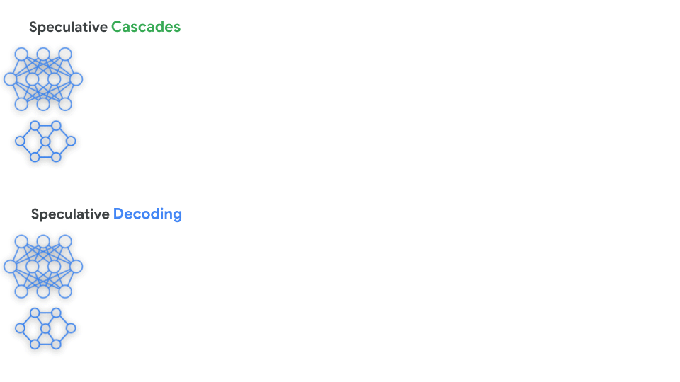

# 第 10 章：推理 — 模块 3：草案模型（推测解码、级联解码、推测级联）

> 📍 学习进度：第 10 章，第 3 / 3 模块
> 📅 生成时间：2026-05-25

---

## 学习目标

- 理解大小模型协作解决推理延迟问题的核心思路
- 掌握推测解码（Speculative Decoding）的"草案-验证-回滚"机制
- 掌握级联解码（Cascade Decoding）的"概率分布路由"机制
- 理解推测级联（Speculative Cascades）如何结合两者优势

---

## 核心思想：为什么需要大小模型协作？

大型 LLM 推理效果好但速度慢（每步解码都涉及海量参数的内存读写）。小模型速度快但质量不够。一个自然的想法：**能不能让小模型干大部分活，大模型只做"把关"？**

两种策略从不同角度解决这个问题：

| 策略 | 核心思路 | 一句话概括 |
|------|---------|----------|
| **推测解码** | 小模型批量生成候选 → 大模型并行验证 → 不一致就回滚 | "小模型先写草稿，大模型审稿" |
| **级联解码** | 小模型每步生成概率分布 → 大模型判断是否接受 → 不接受则大模型接管 | "小模型每次动笔前先问问大模型行不行" |

---

## 一、推测解码（Speculative Decoding）

### 核心机制："草案-验证-回滚"


**图 10.12 解读**：左侧是**推测解码**流程——小模型（Drafter）以自回归方式生成候选 block，大模型（Evaluator）对该 block 做**并行前向验证**，匹配成功的 token 保留，第一次不匹配的 token 位置回滚；右侧是**级联解码**流程——小模型和大模型同时输出概率分布，经由级联规则（Deferral Rule）融合出目标分布后采样。

推测解码的完整流程：

```
Step 1: 小模型起草
  输入: prefix
  小模型逐 token 生成: [T1, T2, T3, T4, T5] ← 一段候选序列（draft）

Step 2: 大模型并行验证
  大模型一次性验证整个 draft block:
  - 对每个位置 i，比较 小模型预测 和 大模型的概率分布
  - 如果小模型的 token 在大模型的 top-k 内 → 接受（accept）
  - 如果不在 → 拒绝（reject），此位置"回滚"

Step 3: 回滚处理
  假设 T1, T2 通过，T3 被拒绝:
  保留 [T1, T2] → 大模型从 T3 位置重新生成（不是小模型）
  小模型从新位置继续起草下一个 block

Step 4: 循环
  重复上述过程，直到生成终止符或达到最大长度
```

**关键细节**：

- 小模型不一定是"小很多"的模型——可以是用同一个模型的不同解码策略（如 greedy vs sampling）
- 大模型验证时是**并行**的——一次前向计算同时验证整个 block 的所有 token，比大模型逐个生成快得多
- 被拒绝的 token 不会输出给用户，因此**输出质量由大模型保证**（与大模型直接生成完全一致）

> 🌐 **补充（Web Search / Exa）**：NVIDIA 开发者博客指出，推测解码的小模型通常每次生成 **3-12 个候选 token**。更多 token → 一次验证的 batch 更大，但 rejection 概率也更高，存在最优的 draft block 长度。实际系统会根据接受率动态调整 draft 长度。

> 💡 **为什么推测解码能加速**：大模型 Decode 阶段每步只处理 1 个 token（算术强度 ≈ 1.0 FLOP/byte，memory-bound）。让小模型先把多个 token 生成了，大模型一次处理一个 block（B > 1），算术强度提升，GPU 算力利用率更高。本质上是用"批量化"把 memory-bound 操作变成更接近 compute-bound。

> 🌐 **补充（Web Search / Tavily）**：更先进的方法如 **EAGLE-3**（2025.3）通过训练时预测测试时的接受率，进一步提高 draft 生成质量。对于 MoE 模型，推测解码还需考虑专家激活的额外开销——如果大小模型激活的专家不同，验证步骤需要额外通信。

---

## 二、级联解码（Cascade Decoding）

### 核心机制："基于不确定性的路由"

与推测解码的"先猜再验"不同，级联解码在**生成每个 token 之前**就判断该步骤是否需要大模型：

```
级联解码流程：
┌─────────────────────┐
│  当前上下文 prefix   │
└──────┬──────────────┘
       ↓
┌──────────────┐     ┌──────────────┐
│ 小模型前向    │     │ 大模型前向    │
│ → 概率分布    │     │ → 概率分布    │
│ → 不确定性    │     │ → 置信度      │
└──────┬───────┘     └──────┬───────┘
       ↓                    ↓
       └────→ Deferral Rule ←────┘
              (级联规则/推迟规则)
                  ↓
        小模型不确定性 < 阈值？
         YES → 用小模型的分布采样
         NO  → 用大模型的分布采样（大模型接管）
                  ↓
             生成 token
                  ↓
            追加到 prefix，继续下一步
```

**关键指标——不确定性**：通常用小模型预测概率的**熵（entropy）**或**最大概率**来衡量。如果小模型对某个 token 的预测"非常确信"（最大概率 > 阈值），就用小模型的结果；如果"犹豫不决"（多个 token 概率接近），则交给大模型。

**级联解码 vs 推测解码的核心区别**：

| 维度 | 推测解码 | 级联解码 |
|------|---------|---------|
| 决策时机 | **生成后**验证（post-hoc） | **生成前**路由（pre-generation） |
| 处理对象 | 一个 **block**（多个 token） | 每步 1 个 **token** |
| 小模型职责 | 生成完整候选序列 | 提供概率分布供决策 |
| 大模型职责 | 并行验证 → 接受/拒绝 | 并行输出分布 → 根据阈值决定是否接管 |
| 质量保证 | 输出与大模型完全一致 | 输出可能包含小模型直接生成的 token |
| 延迟特征 | 减少了串行解码步数 | 减少了大模型调用频率，但每次决策有额外开销 |

> 一句话总结：推测解码通过"并行验证生成 token 的一致性"来减少大模型的串行解码步数；级联解码通过"基于 token 分布的不确定性进行风险感知路由"来减少大模型的调用频率。

---

## 三、推测级联（Speculative Cascades）

Google 团队分析发现：**推测解码的"匹配验证"过于严格**——只要小模型的 token 和大模型的分布不完全一致就回滚，但很多"不一致"的 token 其实质量也可以接受。级联解码用"置信度阈值"更灵活，但缺乏推测解码的批量验证效率。

于是提出了**推测级联**——结合两者：

### 核心机制："批量草稿 + 置信度验证 + 递延升级"


**图 10.14 解读**：横轴为延迟，纵轴为任务质量（左：GSM8K 数学推理的 match 分数，右：文本摘要的 ROUGE-L 分数）。蓝色和橙色曲线是推测级联的两个变体（TopTokens 和 DiffTV），绿色星是标准推测解码。关键发现：
- 标准推测解码只存在于低延迟区间（质量 20.2），无法覆盖中等延迟场景
- 推测级联变体可以覆盖从低到高的宽延迟区间
- 相同延迟下，推测级联的质量显著高于标准推测解码
- TopTokens 变体的质量随延迟升高的下降最平缓，是最优方案

**推测级联的完整流程**：

```
Step 1: 小模型起草 block
  小模型自回归生成候选 block: [T1, T2, ..., Tk]

Step 2: 大模型并行评估可接受性
  大模型对整个 block 做单次前向计算:
  - 判断每个位置的 token 是否满足接受条件（通常是置信度阈值）
  - 不是简单的"匹配/不匹配"，而是"质量是否够好"

Step 3: 递延规则（Deferral Rule）判定
  - 接受（Accept）: block 质量达标 → 全部接受，小模型继续生成下一个 block
  - 拒绝（Reject）: block 质量不达标 → 丢弃该 block，升级由更大模型重新生成

Step 4: 级联升级
  如果 2B 模型的 block 被拒绝:
  → 升级到 8B 模型重新生成
  → 如果 8B 也被拒绝 → 升级到 27B（最大模型）兜底
```

**与推测解码和级联解码的关系**：

| | 推测解码 | 级联解码 | 推测级联 |
|---|---|---|---|
| 处理对象 | block | token | **block** |
| 验证方式 | 严格匹配（token 一致性） | 置信度阈值 | **置信度阈值（可接受性）** |
| 拒绝后 | 回滚到该位置，大模型接管 | 大模型重新生成该 token | **升级到更大模型，重新生成 block** |
| 模型数量 | 2（小+大） | 2（小+大） | **多个（渐进升级的级联）** |




*动画演示：对 GSM8K 数学题（"玛丽一共有30只羊..."），推测级联（左）和推测解码（右）的对比。黄色=草稿 token，红色=验证通过的 token。推测级联得出了正确答案且速度更快。*

**推测级联的核心优势**：

1. **质量由最大模型兜底**：最终输出质量保证不低于最大模型
2. **最大化小模型利用**：可接受的就接受（比推测解码更灵活），不必要的才升级
3. **递延规则可定制**：可根据场景调整阈值——关键任务保守（频繁升级），非关键任务激进（多接受小模型）
4. **宽延迟覆盖**：通过调整阈值可以覆盖从低延迟到高延迟的不同场景

> 🌐 **补充（Web Search / Tavily + Exa 交叉验证）**：推测级联论文 "Faster Cascades via Speculative Decoding"（Harikrishna Narasimhan et al., Google Research）发表于 **ICLR 2025 Oral**。实验表明，在数学推理和文本摘要任务中，推测级联变体（TopTokens）在相同延迟下质量显著优于标准推测解码。

---

## 四、三种策略的本质对比

```
策略对比（以多个模型协作完成写作类比）：

推测解码（Speculative Decoding）:
  实习生写一段草稿(block)
  → 主编逐字核对，第一个写错的字就重写
  → 输出 = 主编的标准
  → 加速来源: 主编不用一个字一个字写了

级联解码（Cascade Decoding）:
  实习生每写一个字，先自评: "我有把握吗?"
  → 有把握 → 直接用 → 主编休息
  → 没把握 → 请主编亲自写
  → 加速来源: 主编需要写的字数减少了

推测级联（Speculative Cascades）:
  初级实习生写一段，中级编辑审
  → 通过了 → 继续
  → 没通过 → 升级给中级编辑写，高级主编审
  → 加速来源: 多级流水线，质量层层把关
```

---

## 🧠 本模块问题

请在下方回答以下问题后，输入 `提交作业` 提交。

**Q1**：推测解码中，大模型验证小模型的 draft block 时是**并行**计算的。请结合模块 1 中学到的算术强度概念，解释为什么并行验证能比大模型逐个生成更快。

**Q2**：推测解码保证输出质量与大模型完全一致（不匹配就回滚），而级联解码可能接受小模型直接生成的 token。为什么级联解码不采用推测解码的"回滚"机制？两者的设计取舍有什么不同？

**Q3**：推测级联引入了**多级模型级联**（如 2B → 8B → 27B）。如果只用 2 个模型（如 2B → 27B，不加中间层），会有什么问题？请结合"递延规则"和"延迟适应性"两点分析。

---

<!-- 学习者作答区（请在此处填写你的答案） -->

**A1**：

算术强度计算公式是  FLOPs / Bytes，即 计算量 除以 存储容量
则对于矩阵运算，如果对于 B * D 矩阵 和 D * F 矩阵的矩阵乘法运算，有
计算量 = 2BDF
存储量 = 2(BD + DF + BF)
所以算术强度 = BDF / (BD + DF + BF)
如果使用并行计算增加 batch，即 B 增加 N 倍
则 并行计算的算术强度 = BDF / (BD + BF + DF/N)

即 N 越大，算数强度越高，能从 memory-bound 向 compute-bound 靠近

**A2**：

推测解码使用 draft-verify-block 机制，要求小模型预测结果必须与大模型一模一样。
而 级联解码 使用 topk 或者 置信度阈值 的方式，结果较为宽松，但是也是 按照 block 来计算，一旦 block 内有置信度不满足或者 topk 以外的部分，直接丢弃用大模型生成。

两者设计模式都是基于 block，但是级联使用的是 置信度来衡量，要求更宽泛，而且不需要 解码得到准确的 token 步骤，一旦错误重新生成 block。推测解码也是基于 block，但是要求结果更准确，一旦有token不一致，会从该位置直接用大模型生成该 token，然后加入 prefix后继续用小模型生成下一个 block。


**A3**：

直观上是因为 模型尺寸相差过大，性能相差较远，命中率会显著下降。
而用相对小的模型来级联，在小模型和大模型中间穿插一个中间模型，能取得性能和命中率之间的权衡，即使在小模型命中率较低的复杂任务下，也可以用中间模型进行过渡，提高大模型的命中率。

---

<!-- 教师批改区（提交作业后由导师填写，请勿手动修改） -->

### 📝 批改结果

**Q1 批改**：从算术强度切入的思路正确——增大 B 确实能提升算术强度、向 compute-bound 靠近。但公式推导有误：`DF/N` 这个写法不对，权重矩阵 W 的读取量是固定的 DF（一次读入），不是 DF/N。正确理解是：串行模式 B=1，每步都要重新读一遍权重（K 步读 K 次 DF）；并行模式 B=K，权重只读 1 次，分摊到 K 个 token，所以总数据搬运大幅减少。核心结论（算术强度提升）是对的，但公式推导需要修正。 — 得分：**6/10**

<details>
<summary>📖 Q1 参考答案</summary>

推测解码的核心加速原理来自模块 1 的算术强度分析。

**串行模式（大模型逐 token 生成）**：
每步 B=1，算术强度 I ≈ 1.0 FLOP/byte，是严重的 memory-bound。生成 K 个 token 需要 K 次独立前向传播，每次都要读取完整的模型权重 W。权重被读了 K 遍。

**并行模式（大模型验证 draft block）**：
一次验证整个 block 的 K 个 token，等效 batch size = K。假设 K=5：

| | 串行（B=1, 重复5次） | 并行（B=5, 1次） |
|---|---|---|
| 总 FLOPs | 5 × 2×1×D×F = 10DF | 1 × 2×5×D×F = 10DF（相同） |
| 读 W 次数 | 5 次（重复读权重） | 1 次（权重读一次分摊给 5 个 token） |
| 读 X 总量 | 5 × 2D | 10D（相同） |
| 写 Y 总量 | 5 × 2F | 10F（相同） |
| 算术强度 | ≈ 1.0（单步） | > 1.0（权重只读一次） |

**本质**：推测解码不是减少了总计算量（FLOPs 基本一样），而是减少了权重矩阵的重复读取次数——把 K 个 memory-bound 的单步操作合并成 1 个算术强度更高的批量操作。

**数值示例**（Llama2-7B: D=4096, F=11008, K=5）：
```
串行（K次，每次B=1）：总 Bytes = 5 × 90,207,744 = 451,038,720
并行（1次，B=5）：   总 Bytes = 2×(5×4096 + 4096×11008 + 5×11008) = 90,336,256
→ 数据搬运减少约 80%
```

</details>

---

**Q2 批改**：对推测解码的描述正确，但有一个关键混淆：**级联解码不是按 block 计算的**。级联解码是逐 token 做决策——每步评估小模型的不确定性，决定是用小模型还是大模型。处理的是 token 级别，不是 block 级别。你把推测级联（block 级别 + 置信度）和级联解码（token 级别 + 路由）搞混了。 — 得分：**4/10**

<details>
<summary>📖 Q2 参考答案</summary>

级联解码不采用"回滚"机制的根本原因在于**设计目标不同**：

**推测解码的设计目标**：在**绝对不降低输出质量**的前提下加速。因此必须"逐 token 验证 + 不匹配就回滚"，保证最终输出与大模型完全一致。代价是：回滚导致小模型白干了，且 draft block 越长回滚损失越大。

**级联解码的设计目标**：在**可接受的轻微质量损失**下最大化速度。它接受这种 tradeoff——有时用小模型直接生成质量稍差的 token，但省掉了回滚开销。不采用回滚是因为：
- 回滚的代价是"小模型的白费工作"，级联解码压根不生成 draft block，所以不需要回滚
- 级联解码在生成前就做了决策（路由），不是生成后才发现不对
- 如果对小模型的不确定性判断准确，绕过回滚带来的延迟节省大于偶尔接受质量稍低的 token

**设计取舍总结**：

| | 推测解码 | 级联解码 |
|---|---|---|
| 质量目标 | 与大模型完全一致 | 可接受轻微损失 |
| 决策时机 | 生成后验证 | 生成前路由 |
| 加速原理 | 批量并行验证 | 减少大模型调用次数 |
| 失败代价 | 回滚（白费 draft） | 接受稍差的 token（无回滚成本） |
| 适用场景 | 质量敏感（代码生成、专业文档） | 延迟敏感、可容忍变体（闲聊、润色） |

</details>

---

**Q3 批改**：命中率下降的直觉是对的——2B 和 27B 的能力差距太大，2B 生成的 block 被 27B 接受的概率很低，导致频繁升级，小模型形同虚设。但缺少"延迟适应性"的分析：两级模型只提供 2 个质量和延迟的操作点，而多级模型级联可以通过选择不同的升级路径覆盖连续的延迟-质量谱。 — 得分：**6/10**

<details>
<summary>📖 Q3 参考答案</summary>

**问题 1：递延规则失去灵活性（命中率问题）**

递延规则基于"当前模型的 block 是否被下一级模型接受"。如果只有 2B 和 27B：
- 2B 的 block 质量与 27B 差距太大 → 接受率极低 → 几乎每次都被拒绝
- 结果：27B 几乎承担了全部工作，2B 形同虚设，延迟没有改善

而 2B → 8B → 27B 的三级级联中：
- 2B 的 block 先由 8B 验证（能力差距较小）→ 接受率高
- 8B 的 block 再由 27B 验证（能力差距也很小）→ 接受率高
- 大部分工作在前两级完成，27B 只在极少数情况下兜底

**问题 2：延迟适应性缺失（操作点问题）**

推理系统需要在不同场景下提供不同的延迟-质量权衡：
- 紧急场景：最快速度，质量可以一般
- 普通场景：平衡速度和质量
- 关键场景：最高质量，速度可以慢

两级模型只提供 2 个操作点（2B 和 27B）。而多级级联通过调整每级的递延阈值，可以生成连续的操作点谱：
- 2B 自回归 → 最快（几乎小模型全做）
- 2B → 8B → 27B 平衡模式 → 中等
- 27B 直接生成 → 最慢（几乎大模型全做）

**实际效果**（来自推测级联论文）：推测级联变体（TopTokens）能在数学推理和文本摘要任务中覆盖宽延迟区间，而标准推测解码（2 模型）仅存在于一个低延迟角落。

</details>

---

**综合评价**：Q1 思路方向对但公式推导有偏差；Q2 对级联解码的理解存在关键混淆（block vs token 级别），建议回看模块 3 第二节中关于级联解码"每步 1 个 token"的描述；Q3 直觉正确但分析不够完整。本章三个模块全部完成，就学习质量而言，模块 1 掌握最好，模块 2/3 的前沿内容理解上还需要加强。

**批改时间**：2026-05-25
