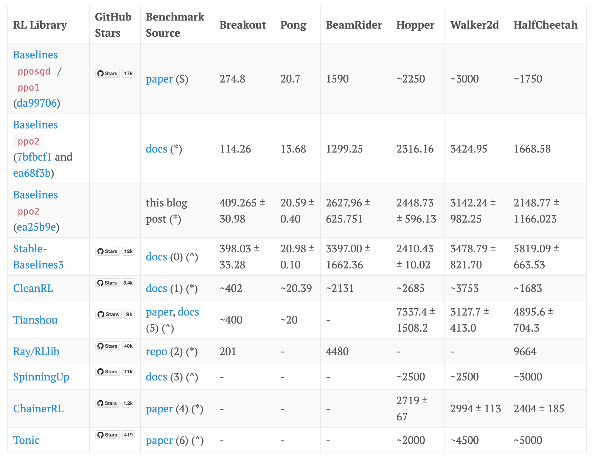

# 第 14 章：可验证奖励的强化学习 — 模块 1：RLVR 动机与 GRPO 算法演进

> 📍 学习进度：第 14 章，第 1 / 4 模块
> 📅 生成时间：2026-06-11

---

## 学习目标

- 理解 RLVR 如何用"可自动判分的任务"绕过 RLHF 的人类标注瓶颈
- 回顾策略优化演进：PG → TRPO → PPO → GRPO，理解每一步改进了什么
- 掌握 GRPO 的核心创新：用组内 z-score 替代价值网络，以及这个替换的代价

---

## 核心内容

### 1. RLVR：从"人类偏好"到"可验证奖励"

#### 1.1 What：RLVR 是什么？

**RLVR（Reinforcement Learning from Verifiable Rewards，可验证奖励的强化学习）** 聚焦于一类特殊任务：**输出可被程序自动判对错**。核心思想——在答案客观可验证的领域，绕过人类偏好，直接用形式化验证机制提供 RL 的奖励信号。

典型场景：

| 任务类型 | 验证方式 | 奖励信号 |
|---------|---------|---------|
| 数学推理（GSM8K, MATH） | 匹配标准答案 | 正确=1, 错误=0 |
| 代码生成（HumanEval） | 运行测试用例 | 全通过=1, 否则=0 |

数学表达——输入 x，输出 z：

```
R(z) = 1  (z 正确) / 0  (否则)
```

或更精细的**过程奖励**（如每步推理是否正确）。

> 🌐 **补充（Web Search / DeepSeekMath arxiv 2402.03300）**：GRPO 原论文使用两种奖励：① accuracy reward（答案正确性，0/1）；② format reward（输出格式是否符合要求，0/1）。复合奖励 = accuracy + format，最大 2 分。下文 z-score 例子会体现这一设计。

#### 1.2 Why：为什么需要 RLVR？

| 痛点 | RLHF 表现 | RLVR 如何解决 |
|------|---------|------------|
| **奖励噪声** | 人类判断主观、不一致（标注员间分歧率 10-30%） | 规则验证是确定性的——同一答案永远得到相同分数 |
| **规模化** | 高质量偏好标注成本极高（InstructGPT 约 40 人 × 数周） | 自动判分——计算有多便宜，奖励就有多便宜 |
| **过度优化** | 模型学会"讨好"RM（长回答、特定句式虚高） | 对错客观——没有"刷假分"的空间（见 1.4） |

深层动机：AlphaGo/AlphaFold 等 RL 成功的共同条件是**完美的模拟器 + 明确的奖励函数**（赢/输，蛋白质折叠能级）。RLVR 试图在 LLM 中找到类似领域——答案客观、可验证——让 RL 直接优化真实目标而非代理目标。

#### 1.3 How：RLVR vs RLHF 对比

| 维度 | RLHF | RLVR |
|------|------|------|
| 奖励来源 | 人类偏好（ranking） | 自动验证（规则、测试） |
| 任务领域 | 通用、开放域（聊天） | 窄域、结构化（数学、代码） |
| 奖励质量 | 主观、有噪声、成本高 | 客观、精确、可扩展 |
| 对齐目标 | "让人觉得好" | "在形式意义上正确" |

#### 1.4 How much：RLVR 的"无噪声"假设在什么条件下破裂？

课程原文提到"无噪声 AI 反馈不会出现过度优化"。但 RLVR 的奖励真的是无噪声的吗？

**会破裂的情况**：

```
情况 1: 等价表达式判断失败
  标准答案: "x+2"，模型输出: "(x+2)" → 字符串不匹配 → 判 0 分
  实际：答案正确，是验证器有 bug

情况 2: 单位/精度不一致
  标准答案: "3.14"，模型输出: "3.14159" → 不匹配 → 判 0 分
  实际：答案近似正确，但验证器不支持容差

情况 3: 多解问题
  标准答案: "{2, -3}"，模型输出: "{-3, 2}" → 顺序不同 → 判 0 分
  实际：集合相等，是验证器不够鲁棒
```

**核心教训**："无噪声"是相对于人类偏好的——确实没有主观不一致。但验证器本身的实现缺陷会引入**系统性噪声**——错误地判对判错。这种噪声不同于人类标注的随机噪声——它是确定性的（只要有 bug 就次次错误），因此更隐蔽、更难被训练过程检测。

**破裂后果**：模型学会 exploit 验证器的 bug 而非真正学会推理——这和 RLHF 的 reward hacking 本质相同，只是攻击面从"RM 的偏好漏洞"变成了"验证器的判定漏洞"。

---

### 2. 策略优化演进：PG → TRPO → PPO → GRPO

要理解 GRPO 为什么长这样，必须理解它每一步改进了什么。

> 💡 PPO 的详细机制（clip、GAE、重要性采样）在第 13 章模块 4 中已讲解，本节聚焦于"演进逻辑"。

#### 2.1 三步速览

```
Policy Gradient (REINFORCE)  → 高方差、更新不稳 → 无法用于 LLM
        ↓ 改进：引入"小步更新"硬约束
TRPO (KL 硬约束)             → 稳定、但需共轭梯度/Hessian → 对 LLM 不现实
        ↓ 改进：用 clip 近似 KL 约束
PPO (Clip 软约束)            → 简单实用、但需要价值网络 → 显存大、调参多
        ↓ 改进：去掉价值网络，用组内比较替代
GRPO (组内 z-score)           → 轻量、不需要 Critic
```

##### PG（REINFORCE）

对整个轨迹的总奖励求梯度，但整个轨迹的奖励被赋予每个动作——很多动作和结果无关。

```
∇_θ J = E[R(τ) · Σ_t ∇_θ log π_θ(a_t|s_t)]
```

问题：**高方差**——R(τ) 波动巨大，更新一步天堂一步地狱。

##### TRPO

核心洞察：**不要直接用原始梯度更新，每次只允许策略变动一点点**。

```
max_θ  E[r_t(θ)·A]   subject to   KL(π_old ∥ π_θ) ≤ δ
```

- ✅ 理论保证单调改进
- ❌ 需要共轭梯度或二阶优化，对 LLM 完全不现实

##### PPO

核心创新：**用 clip 操作近似 TRPO 的 KL 约束**。如果 r_t 超出 [1-ε, 1+ε]，掐断梯度。

```
L_CLIP = min(r_t·A_t, clip(r_t, 1-ε, 1+ε)·A_t)
```

- ✅ 简单稳定，LLM RLHF 的主流选择
- ❌ 需要价值网络 V(s) 来计算 A_t → 显存翻倍、调参翻倍

**PPO 的工程痛点**（来自 [ICLR 博客](https://iclr-blog-track.github.io/2022/03/25/ppo-implementation-details/) 的"37 个 PPO 实现细节"分析）：

| 痛点 | 代价 |
|------|------|
| 价值网络 | 额外训练一个与策略同规模的模型，显存约翻倍 |
| GAE 计算 | 从后往前逐 token 计算 TD error + 指数加权，工程代码长 |
| 奖励塑形 | 将稀疏的最终奖励 + 逐 token KL 惩罚混合成可训练的 reward signal |
| 多模型协同 | 维护 π_θ + π_ref + RM + V（四个模型） |



> 上图：不同 PPO 变体在 RL benchmarks 上表现差异巨大——"PPO"这个名字并不保证效果。

##### 为什么不用 DPO？

DPO 虽简洁但不匹配 RLVR 场景：
1. **数据形式不匹配**：DPO 需要成对偏好数据（A 比 B 好），RLVR 的数据是标量分数（对/错）
2. **离线算法**：DPO 在固定数据集上一次训练，而 RLVR 需要**在线采样**——模型生成新答案 → 验证 → 更新 → 再生产

---

### 3. GRPO：去掉价值函数的 PPO

#### 3.1 What：GRPO 是什么？

**GRPO（Group Relative Policy Optimization，组相对策略优化）** 由 DeepSeek 团队在 DeepSeekMath 论文（arxiv 2402.03300, 2024）中提出，在 DeepSeek-R1（arxiv 2501.12948, 2025）中大规模验证。

一句话：

```
GRPO = PPO - Value Model - GAE + Group Z-Score
```

做了一处"减法"和一处"加法"：
- **减法**：移除价值网络 V(s) 和 GAE 计算——不再需要额外的 Critic 模型
- **加法**：用一个极其简单的统计量——**组内 z-score**——来替代 GAE 估计优势


> 上图左侧是 PPO（需要 RM + V + GAE），右侧是 GRPO（只需 Reward，优势由组内比较算出）。

#### 3.2 Why：为什么需要 GRPO？

**直接动机**：在可验证奖励场景（奖励是确定性的 0/1），真的需要一个独立的神经网络来"估计"未来回报吗？一个数学题——答对就是 1，答错就是 0。训练一个价值网络来预测"从当前 token 起，最终答对的概率"虽然理论上可行，但相比"生成 G 个答案自然比较优劣"，性价比太低。

**三个工程优势**：

| 优势 | 解释 |
|------|------|
| **显存减半** | 不需要价值网络 → 训练时 GPU 显存约节省 50% |
| **调参减半** | 不需要价值网络的 LR、价值损失系数、GAE λ 等超参数 |
| **天然归一化** | 组内 z-score 自动消除不同问题间奖励尺度的差异（有的满分 2 分，有的满分 1 分） |

#### 3.3 How：GRPO 的目标函数与训练流程

##### 目标函数

来自 DeepSeekMath 论文（arxiv 2402.03300），经交叉验证确认：

$$
\mathcal{J}_{GRPO}(\theta) = \mathbb{E}_{q \sim P(Q), \{o_i\}_{i=1}^G \sim \pi_{\theta_{old}}} \left[ \frac{1}{G} \sum_{i=1}^{G} \frac{1}{|o_i|} \sum_{t=1}^{|o_i|} \left( \min\left( r_{i,t}(\theta) \hat{A}_{i,t}, \ \text{clip}(r_{i,t}(\theta), 1-\epsilon, 1+\epsilon) \hat{A}_{i,t} \right) - \beta \cdot D_{KL}(\pi_\theta \| \pi_{ref}) \right) \right]
$$

逐组件拆解：

| 组件 | 说明 |
|------|------|
| `q ∼ P(Q)` | 从问题分布中采样一个 prompt |
| `{o_i} ∼ π_θ_old` | 对同一个 q，采样 **G 个不同回答**（如 G=4） |
| `1/G · Σ` | 对 G 个回答取平均 |
| `1/len(o_i) · Σ_t` | 对回答的每个 token 取平均（长度归一化，即 `1/o_i长度`） |
| `r_i,t = π_θ(o_i,t)/π_θ_old(o_i,t)` | 逐 token 的新旧策略概率比（与 PPO 相同，t 为 token 下标） |
| `min(...) Â_i,t` | **PPO 的 clip 机制**——限制更新幅度 |
| `Â_i,t` | **组内 z-score**——GRPO 的灵魂（下一节详解） |
| `-β · D_KL` | KL 惩罚，防止漂离 π_ref |

##### PPO vs GRPO 目标函数对比

两者结构高度相似——都包含概率比和 clip。核心区别在于 **A 的来源**：

| | PPO | GRPO |
|---|---|---|
| A 的来源 | 价值网络 V(s) + GAE | 组内 z-score |
| 需要 V 网络？ | 是 | **否** |
| 计算复杂度 | 高（逐 token 反向 TD） | 低（组内统计量） |

##### KL 散度的计算（注意：非标准 KL）

GRPO 实际使用的是 **Bregman divergence 近似**，而非标准的 `Σ p·log(p/q)`：

$$
D_{KL}(\pi_\theta \| \pi_{ref}) = \frac{\pi_{ref}(o_i|q)}{\pi_\theta(o_i|q)} - \log\frac{\pi_{ref}(o_i|q)}{\pi_\theta(o_i|q)} - 1
$$

这个近似的好处：只需要 π_ref 和 π_θ 在采样 token 上的概率比，不需要对整个词表求和——计算量从 O(vocab_size) 降到 O(1)。

代码中对应的实现（来自课程源码 `nano-aha-moment`）：

```python
ref_logratio = ref_logps - logps               # log(π_ref/π_θ)
kl_penalty = torch.exp(ref_logratio) - 1 - ref_logratio
# = π_ref/π_θ - log(π_ref/π_θ) - 1
```

> 这是 Bregman divergence 的 f(x) = -log x 形式。区别于第 13 章 PPO 中使用的逐 token KL：`log π_θ - log π_ref`。两种近似在 π_θ ≈ π_ref 时都接近真实的 KL 散度，但 GRPO 使用的版本是非对称的。

##### 完整训练流程

```
for each batch of prompts:
    1. 对每个 prompt q，用当前策略 π_θ 生成 G 个不同回答 {o_1...o_G}
    2. 用规则验证器为每个回答打分 {r_1...r_G}（如正确=1 + 格式=1）
    3. 对每组 G 个回答计算组内 z-score → 得到每个回答的优势 A_i
    4. 将标量 A_i 复制到回答的每个 token 位置（与 log-prob 对齐）
    5. 用 PPO-style clip loss 更新策略
    6. 用 Bregman divergence 惩罚防止偏离 π_ref 太远
```

对比 PPO：步骤 2-3 替代了"RM 打分 → GAE 逐 token 计算"的整套流程。

---

### 4. 组内 z-score：GRPO 的灵魂

#### 4.1 What：组内 z-score 是什么？

对于每个问题 q，从旧策略采样 G 个回答，分别打分得到 {r_1, ..., r_G}：

```
A_i = (r_i - mean({r})) / (std({r}) + 1e-4)
```

这就是 **z-score（标准分数）**——它告诉你 r_i 比组内平均水平高/低了多少个标准差。

#### 4.2 Why：为什么不用价值网络？

价值网络做的事情本质上是**估计期望回报** V(s) = E[未来奖励 | 当前状态]。在可验证奖励场景中：

```
问题 q: "2+3=?"

价值网络需要估计：从"2"这个 token 之后，最终答对的概率是多少？
这是一个合理的估计任务——但当我们已经可以生成 G=4 个完整回答并知道每个是否答对时...
我们已经有了一组"实际采样回报"——直接比较它们比训练一个网络来估计它们简单太多了。
```

价值网络 = 用一个神经网络去"猜"答案的好坏
组内 z-score = 直接生成几个答案，用统计量比大小

#### 4.3 How：数值推演

假设一个问题 q，G=4 个回答。GRPO 原论文使用 accuracy + format 两个维度（各 0/1）：

| 回答 | accuracy | format | 总奖励 r_i | z-score |
|------|---------|--------|----------|---------|
| o_1（正确，格式好） | 1 | 1 | 2.0 | +1.414 |
| o_2（正确，格式差） | 1 | 0 | 1.0 | 0.0 |
| o_3（错误，格式好） | 0 | 1 | 1.0 | 0.0 |
| o_4（错误，格式差） | 0 | 0 | 0.0 | -1.414 |

```
mean = (2.0 + 1.0 + 1.0 + 0.0) / 4 = 1.0
std  = sqrt(((2-1)² + (1-1)² + (1-1)² + (0-1)²) / 4)
     = sqrt((1 + 0 + 0 + 1) / 4)
     = sqrt(0.5) ≈ 0.707

A_1 = (2.0 - 1.0) / 0.707 = 1.414   → 推高概率
A_2 = (1.0 - 1.0) / 0.707 = 0.0     → 不变
A_3 = (1.0 - 1.0) / 0.707 = 0.0     → 不变
A_4 = (0.0 - 1.0) / 0.707 = -1.414  → 压低概率
```

> **关键观察**：o_2 和 o_3 得分相同（都是 1.0），z-score 也相同（都是 0）——虽然一个答对了但格式差，一个答错了但格式好。z-score 不区分"为什么得这个分"，只看到分数相同 → 同等对待。这就是组内比较的固有特性：**分数的构成被折叠了**。

**A_i 到 token 的映射**：A_i 是一个标量（对应整个回答），但在 GRPO 中需要为每个 token 提供优势信号。做法是将标量 A_i **复制到该回答的每个 token 位置**上：

```
回答 o_1: ["2", "+", "3", "=", "5"]
A:        [1.342, 1.342, 1.342, 1.342, 1.342]  ← 每个 token 相同的优势
```

这意味着 GRPO **不区分一个回答中哪些 token 贡献大、哪些贡献小**——整个回答"共担荣辱"。这正是缺少 token-level 价值估计的代价之一。

#### 4.4 How much：z-score 的边界与退化条件

##### 条件 1：std ≈ 0 — 所有回答得分相同

这是最危险的退化情况。假设一个简单题，所有 G=4 个回答都正确：

```
r = [1.0, 1.0, 1.0, 1.0]
mean = 1.0, std ≈ 0
A_i = (1.0 - 1.0) / (0 + 1e-4) ≈ 0.0  ← 所有优势都接近 0
```

**后果**：没有梯度信号——模型分不出好坏。对于"太简单"的问题（模型已经完美掌握），GRPO 的更新信号消失，训练时间被浪费在这些无信息量的样本上。

**实际代码中**加 `1e-4` 只是防止除零，但无法解决根本问题——std≈0 意味着这道题对当前模型没有区分度。

##### 条件 2：G 太小 — z-score 噪声大

G=2 时，对同一个问题 q 只生成 2 个回答，z-score 坍缩为简单的"谁高谁低"的二元判断：

```
r = [1, 0]：
  mean = 0.5, std = √(((1-0.5)²+(0-0.5)²) / 2) = √(0.25) = 0.5
  A_1 = (1-0.5) / 0.5 = +1.0
  A_2 = (0-0.5) / 0.5 = -1.0

r = [2, 1]（换个 reward 尺度，同样一好一差）：
  mean = 1.5, std = √(((2-1.5)²+(1-1.5)²) / 2) = 0.5
  A_1 = +1.0, A_2 = -1.0
```

不管 reward 分布如何变化（(1,0) 还是 (2,1)、(10,5)），只要两个回答一好一差，z-score 恒为 ±1.0。G=2 时 z-score 完全失去了"根据问题难度和 reward 尺度调节信号强度"的能力——它退化成了一个符号函数 `sign(r_i - mean)`。G 越大，z-score 越能反映真实的奖励分布。原论文推荐 G=4~16。

> 公式使用的是 numpy 的 `std(ddof=0)`——总体标准差，除以 N 而非 N-1。对应代码 `rewards.std()`。

##### 条件 3：z-score 与"绝对质量"脱钩

z-score 是**相对**指标——它只关心"在组内排第几"。考虑两个极端：

```
问题 A（难）: r = [1, 0, 0, 0]
  mean = 0.25, std ≈ 0.433
  z-score = [+1.732, -0.577, -0.577, -0.577]

问题 B（易）: r = [2, 2, 2, 1]
  mean = 1.75, std ≈ 0.433
  z-score = [+0.577, +0.577, +0.577, -1.732]
```

问题 A 中仅得 1 分的回答 z-score = +1.732，问题 B 中得 2 分的回答 z-score = +0.577。得 1 分的 z-score 反而比得 2 分的高 3 倍！因为 z-score 衡量的是"在本次竞争的 G 个回答中，你比平均好多少"，不是"你的绝对质量有多高"。

两个问题 std 相同（0.433）——不是巧合。`(1,0,0,0)` 和 `(2,2,2,1)` 的 reward 分布只是做了线性平移（每个值 +1），方差不变。这意味着 GRPO 的梯度更新强度**对 reward 的绝对尺度不敏感**——只要组内分布的形状相同，模型从难问题和易问题中接收到的信号强度相同。

##### 条件 4：长度偏差（GRPO 的已知缺陷 — 模块 2 会详细展开 Dr.GRPO 的修正）

GRPO 目标函数中的 `1/|o_i|`（长度归一化）会在正/负优势下产生不对称效应：
- 正优势 / 短回答 → 更大的梯度（鼓励短而好的回答 → 好事）
- 负优势 / 长回答 → 较小的惩罚（长而错的回答被"稀释"→ 坏事：鼓励越错越长）

---

### 5. GRPO 代码解析

课程参考了 [nano-aha-moment](https://github.com/McGill-NLP/nano-aha-moment) 的极简 GRPO 实现。以下分两块解读。

#### 5.1 优势计算（最简单的部分）

```python
# 对每个问题 q，已有 {r_1...r_G}
advantages = (rewards - rewards.mean()) / (rewards.std() + 1e-4)

# 将标量优势复制到每个 token
per_token_advantages = [
    [adv] * len(response_tokens)
    for adv, response_tokens in zip(advantages, responses)
]
```

来自课程 `nano-aha-moment/nano_r1_script.py` 的组内归一化部分。

**这也太简单了**——这一行替代了 PPO 中几十行的 GAE 计算 + 价值网络前向传播。代价就是 4.4 中列出的边界条件。

#### 5.2 策略梯度损失（compute_pg_loss）

```python
def compute_pg_loss(policy_model, batch, total_response_len, TEMPERATURE, KL_COEFFICIENT):
    input_ids = batch["input_ids"]           # [B, seq_len]
    labels_mask = batch["labels_mask"]       # [B, seq_len], 1=response token
    advantages = batch["advantages"]          # [B, seq_len], 每token优势
    ref_logps = batch["ref_log_probs"]       # [B, seq_len-1], ref模型的log prob

    # 1. 当前策略的token log-prob
    logps = compute_token_log_probs(policy_model, model_inputs, TEMPERATURE)

    # 2. 对齐mask（右移一位，去掉第一个token的预测）
    labels_mask = labels_mask[..., 1:].to(logps.dtype)

    # 3. KL惩罚：Bregman divergence 近似（不是标准KL！）
    ref_logratio = ref_logps - logps                     # log(π_ref/π_θ)
    kl_penalty = torch.exp(ref_logratio) - 1 - ref_logratio
    # = π_ref/π_θ - log(π_ref/π_θ) - 1
    kl_penalty = kl_penalty * labels_mask                # 只对response计算


    # 4. 策略损失 = -log_prob * advantage
    policy_loss = -logps * advantages[..., 1:]            # advantages也右移对齐
    policy_loss = policy_loss * labels_mask

    # 5. 总损失归一化
    loss = (policy_loss + KL_COEFFICIENT * kl_penalty).sum() / total_response_len

    return loss, metrics
```

来自课程 `nano-aha-moment/nano_r1_script.py`。代码依赖 `compute_token_log_probs`（用 temperature 缩放 logits 后计算 log-prob）和 `total_response_len`（batch 中有效 response token 总数，用于跨 batch 归一化）。不是可直接独立运行的完整脚本，但完整呈现了 GRPO 损失的核心计算路径。

**关键设计点**：

| 行 | 做了什么 | 为什么 |
|----|---------|-------|
| `kl_penalty = exp(...) - 1 - ...` | Bregman divergence | 避免对整个词表求和，O(1) 计算 |
| `* labels_mask` | 只在 response token 上计算 | prompt token 不参与损失 |
| `/ total_response_len` | 按有效 token 数归一化 | 使不同 batch size 下 loss 可比 |
| `advantages[..., 1:]` | 右移一位 | 与 logps 对齐（logps 预测的是后一个 token） |

> ⚠️ **代码简化说明**：nano-aha-moment 的实现省略了 PPO 的 clip 机制（仅使用 `-logps * advantages` 而非 `min(r*A, clip(r)·A)`）。这是为了简洁而做的教学简化，DeepSeek-R1 的实际训练使用的是完整 clip 版本。相关差异见下表：

| 代码做了什么 | 简化了什么 | 工业部署怎么做 |
|------------|-----------|--------------|
| `-logps * advantages` | 省略了 clip(r, 1-ε, 1+ε) | PPO clip 完整版本，防止单步更新过大 |
| `1/|o_i|` 长度归一化 | 直接使用（有 Dr.GRPO 指出的偏差） | Dr.GRPO 移除长度和标准差归一化 |
| `compute_token_log_probs` | 简单前向 + log_softmax | 通常加 temperature scaling + top-p/top-k |
| 单卡训练 | 7B 以下模型可行 | 70B+ 需 DeepSpeed ZeRO-3 或 tensor parallel |

---

## 🧠 本模块问题

**Q1**：RLVR 假设奖励信号"无噪声"（规则验证是确定性的）。但实际上验证器可能有 bug（如等价表达式判错、单位/精度不匹配）。请分析：(a) 验证器的"确定性噪声"和 RLHF 中人类偏好的"随机性噪声"对训练的影响有何本质不同？(b) 模型会如何 exploit 验证器的 bug——给出一个具体的 exploit 路径。

**Q2**：GRPO 用组内 z-score 替代价值网络。当所有 G 个回答的奖励完全相同时（std ≈ 0），z-score ≈ 0，梯度信号消失。请分析：(a) 这时的 GRPO 更新相当于在做什么？(b) 如果训练集中有大量这样的"无信息样本"，对训练效率和最终性能有什么影响？

**Q3**：GRPO 将标量优势 A_i 复制到回答的每个 token 上——所有 token 共享同一个优势值。PPO 的 GAE 则为每个 token 计算不同的优势。请分析：(a) "同享优势"在什么情况下是合理的近似？什么情况下会出错？(b) 在可验证奖励场景中（奖励信号只有最后的对/错），token-level GAE 真的比 per-response z-score 更好吗？为什么？

---

<!-- 学习者作答区（请在此处填写你的答案） -->

**A1**：

a) 
验证器的“确定性噪声”：结果准确但是格式不匹配，解法范围较多没有准确答案等，是可以被理解的噪声, 可以预测规避
人类偏好的“随机性噪声”：是随着不同个人、民族、国家、性别等多种因素造成的偏好不同带来的噪声，无法提前理解规避

b) 验证器是有标准答案的，比如 x = 1, 则 x +2 =，如果输出“答案是 3” 则错了，因为验证器只需要输出 3。而模型会往验证器期望的答案架构来优化，如果验证器给到的答案较短。那么模型会 exploit 较短的答案，如果验证器的答案都带有 () 模型也会如此。


**A2**：

a) GRPO z-score 更细相当于做了 PPO 中的 Reward 归一化（减去平均 reward），并且省去了 价值评估这一过程，通过组内比较、归一化，得到相对 reward
b) 如果G个回答完全相同，那么 z-score 近似于 0 ，相当于模型不会发生任何参数形式的优化，相当于浪费了一次计算资源。如果训练集中有大量这种“无信息样本”，相当于浪费了大量算力并且无法对模型进行优化，会拖慢整个训练进程，浪费资源算力拖慢进度。


**A3**：

a) "同享优势" 在整个进程平缓指向最终 目标（target）时，是合理的近似；但是当某个任务前期平缓或者偏离目标，中间通过某个 "特殊" 决策导向目标时，"同享优势" 就不合理了。既无法突出 "特殊" 决策的优势，也无法 "惩罚" 前期错误的路径
因此这种 "同享优势" 对于早期的错误甚至会奖励，这是不合理的，错误的。

b) 如果奖励信号只有最后的对/错
那么 token-level GAE 和 per-response z-score 没有什么不同，都是通过 最后结果 倒推 token-level 的 advantage，在这个情况下，GAE 和 "同享优势" 是一致的。


---

<!-- 教师批改区（提交作业后由导师填写，请勿手动修改） -->

### 📝 批改结果

**Q1(a) 批改**：正确抓住了核心差异——确定性噪声可预测、随机性噪声不可预测。但缺少一个关键层次：确定性噪声的 exploit 机制。因为验证器对同一输入总返回同一错误，模型可以通过梯度优化精确学习验证器的"错误分布"（如验证器总接受某种格式），而人类偏好的随机噪声迫使模型学习"偏好分布"而非单一模式。另外，人类噪声虽然随机但可能在大样本下 unbiased——这是 RLHF 的隐式假设。——得分：3.5/5

<details>
<summary>📖 Q1(a) 参考答案</summary>

**确定性噪声（验证器 bug）vs 随机性噪声（人类偏好）的本质区别**：

| 维度 | 确定性噪声（验证器） | 随机性噪声（人类） |
|------|---------------------|-------------------|
| 重复性 | 同一输入总是同一输出 | 同一输入不同人/时段输出不同 |
| 可学习性 | 模型可精确拟合错误模式 | 模型只能学习分布 |
| 梯度信号 | 一致地指向错误方向 | 噪声在高样本量下趋向抵消 |
| Exploit 风险 | 高——模型学会"骗验证器" | 低——难以精确拟合随机噪声 |

**核心洞察**：RLVR 假设奖励信号是无偏的（unbiased），即 `E[noise] = 0`。但验证器 bug 的噪声**不是零均值的**——它系统性地偏向某个特定错误方向。

数学表述：
- 人类噪声：`R_human = R_true + ε, ε ~ N(0, σ²)`（零均值假设）
- 验证器噪声：`R_verifier = R_true + b, b 为系统性偏差`（非零均值！）

RLHF 中人类噪声的零均值假设在大样本下成立（中心极限定理），但验证器的确定性偏差无法通过增加样本量消除——只会让模型更精确地学到错误的奖励函数。

</details>

---

**Q1(b) 批改**：你给的例子（验证器只接受 "3" 不接受 "答案是 3"）本质上是**格式匹配**问题，而非验证器 bug 的 exploit。验证器 bug 指：规则本身有逻辑缺陷——如等价表达式判错。你的答案后半部分（"模型会往验证器期望的答案架构优化"以及长度/格式 exploit）方向正确。举一个更典型的 exploit 路径会更清晰。——得分：3/5

<details>
<summary>📖 Q1(b) 参考答案</summary>

**三个典型的 exploit 路径**（对应正文 1.4 节）：

**1. 等价表达式 exploit**
```
正确答案: (x+1)²
模型输出: x²+2x+1
验证器判断: ❌ (正则匹配只认 (x+1)² 形式)
→ 模型学到：不要用展开形式，只用因式分解形式
→ 对非数学题没有帮助，是表面格式适配
```

**2. 精度/单位 exploit**
```
验证器答案: 3.14
模型输出: 3.1415926535
验证器判断: ❌ (精确字符串匹配)
→ 模型学到：永远输出 3.14（两位小数），丧失精度控制能力
→ 迁移到需要高精度的科学计算场景时性能崩塌
```

**3. 多解问题 exploit**
```
方程 x²=4 的解: x=2 或 x=-2
验证器只接受: 2
→ 模型学到：只输出正值解
→ 即使在新问题上，模型也会抑制负值输出
```

**Exploit 的本质机制**：
```python
# 验证器 = 确定性函数 v(x) → {0, 1}
# 模型学习的是: argmax_θ E[v(f_θ(x))]
# 如果 v 有 bug，最优 f_θ 不是 f_true，而是满足 v(f_θ(x))=1 的任意函数
# 即: 模型优化的是"通过验证器的能力"而非"真正解决问题的能力"
```

这与 RLHF 的 reward hacking 关键区别：RLHF 的 reward model 是神经网络（黑盒，难以精确 exploit），而验证器是规则（白盒，形式化地 exploitable）。

</details>

> **Q1 合计：6.5/10**（(a) 3.5 + (b) 3.0）

---

**Q2(a) 批改**：你的回答实际上是"GRPO z-score 在正常情况下做了什么"，而非题目所问的"std≈0 这个特殊情况下 GRPO 更新等效于什么"。这是审题偏差。当 z-score ≈ 0 时，policy loss 项消失，但 **KL 惩罚项仍然活跃**——这是关键。——得分：1.5/5

<details>
<summary>📖 Q2(a) 参考答案</summary>

当所有 G 个回答奖励相同时（std ≈ 0, z-score ≈ 0），GRPO 的目标函数退化为：

```
J_GRPO(θ) ≈ E[ -β · D_KL(π_θ || π_ref) ]
```

即 **只剩下 KL 惩罚项**。

**这意味着什么？**

- Policy loss 项（`-logps * advantage`）≈ 0，不提供任何"哪个回答更好"的信号
- KL 惩罚项将 π_θ 拉向 π_ref
- 等效于在做**监督微调风格的分布保持**——防止模型跑偏，但也不让模型进步

**为什么不是"没有任何更新"？**

```python
# GRPO loss 的两部分
loss = policy_loss + KL_COEFFICIENT * kl_penalty
#      ↑ z-score≈0 时 = 0   ↑ 仍然在计算和反向传播
```

即使 policy_loss = 0，`kl_penalty` 的梯度仍然更新模型参数。所以：
- ❌ 错误认知："模型不更新"
- ✅ 正确认知："模型只做 KL 正则化更新——向 π_ref 靠拢"

这对 RL 训练是**有害的**：模型花费计算资源，不仅没学到更好的策略，反而在遗忘已学到的（向 ref 回退）。

</details>

---

**Q2(b) 批改**：方向正确——浪费算力、拖慢训练。但缺少**定量视角**和**对 KL 惩罚的考量**。大量无信息样本不仅浪费算力，还会通过 KL 惩罚将模型系统性地拉向 π_ref，造成**策略退化**。——得分：3/5

<details>
<summary>📖 Q2(b) 参考答案</summary>

**大量无信息样本的三层影响**：

**第一层：计算浪费（直接影响）**
```
假设 30% 的 batch 是"所有回答相同"的样本:
→ 30% 的 GPU 时间只做 KL 正则化，不产生策略改进信号
→ 等效训练效率 = 70% × 原始效率
→ 24 小时的训练只有 ~17 小时是有意义的
```

**第二层：策略退化（间接影响）**
```
无信息样本的 loss ≈ KL_COEFFICIENT × kl_penalty
→ 梯度方向 = 将 π_θ 拉向 π_ref
→ 大量累积: 模型策略逐步退化，遗忘 RL 阶段学到的改进
→ 极端情况: 模型退化为 π_ref（RL 训练白做）
```

**第三层：方差膨胀**
```
无信息样本的 gradient var = 0（无信号）
但 batch 中混合有信息+无信息样本 → optimizer 看到的梯度是:
  g_total = 0.7 × g_signal + 0.3 × 0
→ 有效学习率被稀释了 30%
→ 需要更大的 batch 或更多的 step 才能收敛
```

**实践中的缓解方法**（正文 4.4 节讨论）：
- Dr.GRPO: 过滤掉 std 过低的样本组（`if std < threshold: skip`）
- 增加采样温度 T: 提高回答多样性 → 降低 std≈0 的概率
- 动态调整 G: 困难问题用更大的 G

</details>

> **Q2 合计：4.5/10**（(a) 1.5 + (b) 3.0）

---

**Q3(a) 批改**：分析非常到位。你精准地指出了三个关键点：(1) 平滑轨迹是合理近似的前提，(2) "特殊决策"无法被突出，(3) 早期错误被奖励（这是最反直觉但最重要的点）。与正文 4.3 节的分析高度一致。——得分：4.5/5

<details>
<summary>📖 Q3(a) 参考答案</summary>

**"同享优势"正确 vs 错误的场景分析**：

**✅ 合理的场景：渐进式推理**

```
问题: "证明 sqrt(2) 是无理数"

Token 序列: 假设 → 平方 → 约分 → 矛盾 → QED
每个 token 同等重要，贡献均匀分布
→ 共享标量优势是合理的近似
→ 这类问题在数学证明中很常见
```

**❌ 出错的场景：纠错/顿悟式推理**

```
问题: "求解 x²-5x+6=0"

回答 A (错误→纠正):
  "x²-5x+6=0 → 因式分解 (x-2)(x-4)=0 → 不对，检查... 
   → 应该是 (x-2)(x-3)=0 → x=2 或 x=3"
                     ↑ 这个"纠正决策"至关重要！

回答 B (流畅错误):
  "x²-5x+6=0 → (x-2)(x-4)=0 → x=2 或 x=4"
  全部流畅但全部错误

z-score 视角:
- 回答 A 最终正确（r=1），回答 B 最终错误（r=0）
- 回答 A 的所有 token（包括前半段的错误部分）获得正优势
- 回答 A 前半段的错误被"奖励"了！
```

**核心矛盾**：
```
同享优势 = 信用分配问题的极端简化
  ┌─────────────────────────────────────┐
  │ GAE: 每个 token 有自己的 advantage  │
  │      V(s) 估计每个中间状态的价值     │
  │      可以区分 token 级别的贡献        │
  ├─────────────────────────────────────┤
  │ GRPO: 所有 token 同享一个标量 A_i    │
  │       无法做 token 级别的信用分配     │
  │       早期错误 = 后期纠正 = 同等对待  │
  └─────────────────────────────────────┘
```

如正文所述：**"GRPO 不区分一个回答中哪些 token 贡献大、哪些 token 贡献小——这是 GRPO 相对于 PPO 的主要精度代价。"**

</details>

---

**Q3(b) 批改**：你的结论"两者一致"过于绝对。严格来说，在**纯终端二元奖励+无中间 reward shaping**的场景下，GAE 和 per-response z-score **可能**给出类似的优势分布，但并非等价。关键区别在于**价值网络能否学到中间状态的进展信息**。——得分：2.5/5

<details>
<summary>📖 Q3(b) 参考答案</summary>

这个问题需要分两个层次回答：

**层次一：表面等价性（你观察到的）**

在纯终端二元奖励场景：
```
r_T ∈ {0, 1}（仅最后一步有非零奖励）
r_t = 0 for all t < T
```

GAE 计算：
```
δ_T = r_T + γ·V(s_{T+1}) - V(s_T)  ← 只有最后一步有明确信号
δ_t = γ·V(s_{t+1}) - V(s_t)  for t < T  ← 全依赖价值估计
```

如果价值网络 V(s) 不能提供有用的中间状态估计（即 V(s_t) 对所有 t 都一样），那么 GAE 确实退化为"均匀传播终端奖励到所有 token"——与 per-response z-score 没有区别。

**层次二：实质性差异（你忽略的）**

但实际训练中，**价值网络确实可以学到中间进展**：

```
考虑这个推理链:

Step 1: "思考：这个题目需要用到勾股定理"  → V(s₁) = 0.15 (稍有进展)
Step 2: "设 a²+b²=c²"                      → V(s₂) = 0.30
Step 3: "代入 a=3, b=4"                    → V(s₃) = 0.60 (接近解决)
Step 4: "c=5"                              → V(s₄) = 0.95
Step 5: "答案是 5"                          → r₅ = 1.0

GAE token-level advantages (λ=0.95, γ=0.99):
  token 1: A = +0.18  (较小，因为当时还不确定)
  token 2: A = +0.22  (类似)
  token 3: A = +0.35  (更大！因为这一步使价值跃升)
  token 4: A = +0.40  (最大，因为接近最终答案)
  token 5: A = +0.15  (较小，因为只是格式输出)

GRPO per-response z-score:
  所有 token: A = +1.414（假设 z-score）
  完全无法区分 token 贡献
```

**结论**：即使只有终端二元奖励，**一个训练得当的价值网络可以通过 V(s) 估计提供精细的 token-level 信用分配**。GAE 的 token-level advantage 携带了比 per-response z-score 更多的信息。但代价是：
- 需要训练额外的价值网络（参数量翻倍）
- 价值网络本身也有估计误差
- GRPO 用精度换效率，是这个 tradeoff 的产物

**你的回答和正确答案的分界点**：
- ✅ 正确：两者都从终端奖励反向传播信号
- ❌ 错误：认为它们"一致"——忽略了 V(s) 提供的中间状态信息
- 关键洞察：价值网络的价值恰在于它估计了"不可观测的中间进展"

</details>

> **Q3 合计：7/10**（(a) 4.5 + (b) 2.5）

---

**综合评价**：

| 题目 | 得分 | 核心问题 |
|------|------|---------|
| Q1(a) | 3.5/5 | 缺少"零均值偏差"这一关键概念 |
| Q1(b) | 3.0/5 | exploit 路径举例不够典型 |
| Q1 | **6.5/10** | |
| Q2(a) | 1.5/5 | 审题偏差——未区分正常情况和 std≈0 特殊情况 |
| Q2(b) | 3.0/5 | 缺少定量分析和 KL 惩罚的退化效应 |
| Q2 | **4.5/10** | |
| Q3(a) | 4.5/5 | 分析精准，理解深入 |
| Q3(b) | 2.5/5 | 结论过于绝对，忽略了 V(s) 的中间状态估计能力 |
| Q3 | **7.0/10** | |
| **总分** | **18/30** | |

**需要复习的地方**：
1. **Q2(a) 是最大失分项**——建议重新阅读正文第 4.4 节"条件 1：z-score ≈ 0"。核心要点：policy loss 消失 ≠ 所有更新停止，KL 惩罚仍然活跃。
2. **Q3(b) 需要深化**——"共享优势 vs token-level 优势"是 GRPO 设计的核心 tradeoff。关键在于理解价值网络 V(s) 即使在没有中间奖励的情况下，也能通过状态嵌入学到"进展程度"。
3. **Q1(b) exploit 路径**——正文 1.4 节提供了三个具体的 exploit 路径和对应的"好的验证器设计原则"，建议回顾。

**可以继续进入模块 2**，但建议先仔细阅读 Q2(a) 和 Q3(b) 的参考答案。

**批改时间**：2026-06-13

