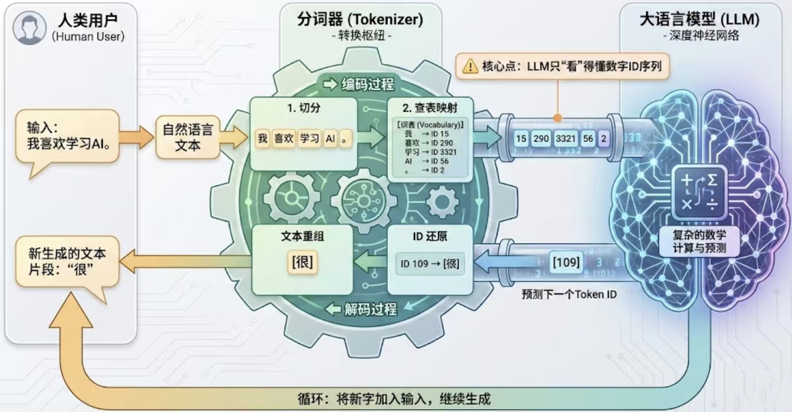
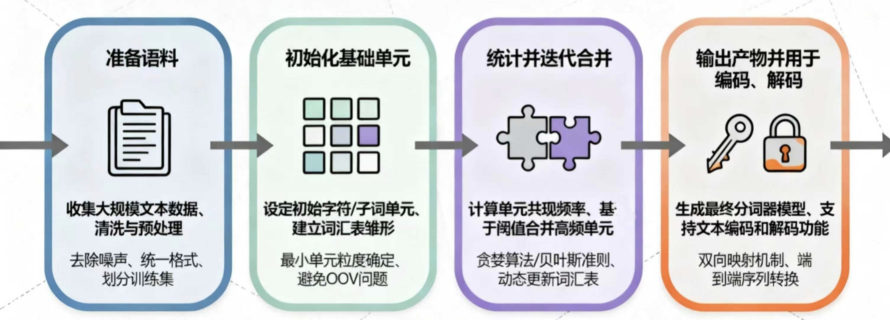
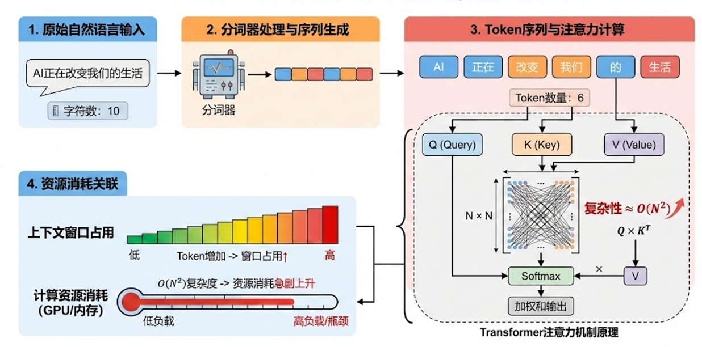

# 第 2 章：分词器 — 模块 1：分词器概述与数据准备

> 📍 学习进度：第 2 章，第 1 / 3 模块
> 📅 生成时间：2026-04-13

---

## 学习目标

- 理解分词器在 LLM 中的定位：独立训练却强耦合
- 掌握分词器训练的四步流程框架
- 了解数据准备阶段的核心工作：清洗、脱敏、多语言采样
- 理解三种预分词策略（空格/标点、Unicode 类别、字节级）的原理与取舍

---

## 核心内容

### 分词器是什么，为什么重要？



分词器是 LLM 的"翻译官"：它把人类的文字转换成模型能处理的数字序列（token ID），再把模型输出的数字还原回文字。

**关键认知**：分词器有**独立的训练生命周期**，不是随模型一起训练的，但两者强耦合——分词器的词表决定了模型的输入空间，一旦确定就不能轻易更换。

```
原始文本 → [分词器 encode] → token ID 序列 → [LLM] → token ID 序列 → [分词器 decode] → 输出文本
```

---

### 分词器训练的四步流程



```
准备语料 → 初始化基础单元 → 统计并迭代合并 → 输出产物（vocab + merges）
```

本模块覆盖前两步，后两步在模块 3 详解。

---

### 第一步：准备语料

#### 1. 语料多样性

要训练出泛化能力强的分词器，语料需要覆盖：
- **多风格文本**：小说、散文、代码、学术论文……
- **多语言**：中文、英文、法语、韩语……

#### 2. 数据清洗

- 去除无关元数据、乱码、非法字符
- 统一字符编码为 **UTF-8**
- 对近重复样本去重（防止统计偏移）

#### 3. 数据脱敏（含代码）

含姓名、电话、邮箱等敏感信息的语料必须脱敏，原因有二：
- **合规**：隐私保护要求
- **质量**：高基数个人信息（如手机号）在语料中几乎唯一出现，会干扰 BPE 等算法对高频 token 的统计效率

脱敏策略按确定性从高到低分三档：

```python
# 高确定性规则：手机号、邮箱（正则，几乎不误伤）
def mask_phone(text: str) -> str:
    return re.sub(r'1[3-9]\d{9}', '[PHONE]', text)

def mask_email(text: str) -> str:
    return re.sub(r'[A-Za-z0-9._%+-]+@[A-Za-z0-9.-]+\.[A-Za-z]{2,}', '[EMAIL]', text)

# 中确定性规则：地址（关键词上下文引导）
def mask_address(text: str) -> str:
    return re.sub(r'(居住于|现居住于)([\u4e00-\u9fa5A-Za-z0-9]+)', r'\1[PLACE]', text)

# 低确定性规则：姓名（NER 模型 + 正则兜底）
# 优先用深度学习 NER（ckiplab/bert-base-chinese-ner），再用正则补充
```

脱敏 Pipeline 设计为可组合的链式结构：

```python
class DesensitizationPipeline:
    def __init__(self):
        self.steps = []

    def add_step(self, func):
        self.steps.append(func)

    def run(self, text: str) -> str:
        for step in self.steps:
            text = step(text)
        return text

# 使用方式：高确定性 → 中确定性 → 低确定性（NER）
pipeline = DesensitizationPipeline()
pipeline.add_step(mask_phone)
pipeline.add_step(mask_email)
pipeline.add_step(mask_address)
pipeline.add_step(ner_mask)  # NER 最后跑，避免前面规则的占位符干扰
```

脱敏效果示例：
> 输入：`小明的邮箱是test111@gmail.com，电话是13312311111，现在居住于重庆两江新区的xxx小区。`
> 输出：`[NAME]的邮箱是[EMAIL]，电话是[PHONE]，现在居住于[PLACE]。`

> 💡 **补充资料（来源：Context7 / HuggingFace tokenizers）**
>
> 在实际工程中，数据清洗完成后通常直接用 HuggingFace `tokenizers` 库训练分词器，它内置了并行化处理，支持直接从多个文件训练：
> ```python
> from tokenizers import Tokenizer
> from tokenizers.models import BPE
> from tokenizers.trainers import BpeTrainer
>
> tokenizer = Tokenizer(BPE(unk_token="[UNK]"))
> trainer = BpeTrainer(vocab_size=30000, min_frequency=2,
>                      special_tokens=["[UNK]", "[PAD]", "[BOS]", "[EOS]"])
> tokenizer.train(["data/train.txt"], trainer)
> tokenizer.save("tokenizer.json")
> ```
> 这是生产环境的标准做法，手写 BPE 主要用于理解原理。

#### 4. 多语言均衡采样

多语言场景下，语料比例直接影响词表分配。典型问题：

| 语言 | 原始语料 | 问题 |
|------|---------|------|
| 中文 | 200 GB | 主导统计，高频中文 token 挤占词表 |
| 英文 | 150 GB | 同上 |
| 法语 | 10 GB | token 碎片化严重 |
| 韩文 | 5 GB | token 碎片化最严重 |

**解决方案**：按目标能力设定采样比例，例如调整为 `4:4:1:1`，对高资源语言下采样，对低资源语言过采样。

---

### 第二步：初始化基础单元（预分词）

预分词把原始文本切成可统计的最小单元，为后续合并算法提供输入。有三种策略：

#### 策略 1：基于空格和标点切分

```python
def part(text):
    text = re.sub(r'([.,!?;:()"\'\[\]{}])', r' \1 ', text)
    return text.split()

# "I like Datawhale." → ['I', 'like', 'Datawhale', '.']
```

适合大多数以空格为词边界的语言（英文等），简单高效。

#### 策略 2：Unicode 类别划分

```python
def get_char_category(ch):
    if '\u4e00' <= ch <= '\u9fff': return "CJK"
    if ch.isdigit():               return "DIGIT"
    if ch.isalpha():               return "ALPHA"
    if unicodedata.category(ch).startswith("P"): return "PUNCT"
    return "OTHER"
```

原则：**同一 token 内字符类型一致**。输入 `Hello👋👋，Datawhale成立于2018年！！！` 会切成：
`['Hello', '👋👋', '，', 'Datawhale', '成立于', '2018', '年', '！！！']`

天然适合中英文混合文本。

#### 策略 3：UTF-8 字节级切分



将每个字符拆为 UTF-8 字节（0x00-0xFF），词表固定为 256，彻底没有 OOV 问题：

```python
def tokenize_byte_level(text):
    tokens = []
    for ch in text:
        utf8_bytes = ch.encode("utf-8")
        tokens.extend([f"{b:02X}" for b in utf8_bytes])
    return tokens

# "All for learners！" → ['41','6C','6C','20','66','6F','72',...,'EF','BC','81']
# 注：全角感叹号！→ 3字节（EF BC 81）
```

**Unicode vs UTF-8 关系速记**：
- Unicode = 每个字符的"身份证号"（码点，如 A=U+0041）
- UTF-8 = 把码点写进内存的具体方式（英文 1 字节，中文 3 字节）
- UTF-8 向后兼容 ASCII，是最常用的编码格式

#### 三种策略对比

| 策略 | 词表大小 | OOV | 适用场景 | 现代 LLM |
|------|---------|-----|---------|---------|
| 空格/标点切分 | 依赖语料 | 有 | 英文单语 | 预处理阶段 |
| Unicode 类别 | 依赖语料 | 有 | 多语言混合 | 预处理阶段 |
| **UTF-8 字节级** | **256** | **无** | **通用** | **GPT-4、LLaMA** |

> 现代 LLM 普遍采用**字节级 BPE（BBPE）**：先字节级切分，再用 BPE 合并高频字节对——既无 OOV，又能获得语义压缩。

---

## 代码解析

`BPE_character_byte_level_word_segmentation_Comparison.py` 包含本章核心的三种分词器实现，以下是字节级和字符级 tokenizer 的核心逻辑：

```python
class ByteTokenizer:
    def encode(self, text: str):
        return list(text.encode("utf-8"))  # 每个字节 → 一个 token ID（0-255）

    def decode(self, indices):
        return bytes(indices).decode("utf-8")  # 字节序列 → 文本

class CharTokenizer:
    def encode(self, text: str):
        # 动态建词表：遇到新字符就分配新 ID
        for ch in text:
            if ch not in self.vocab:
                self.vocab[ch] = len(self.vocab)
        return [self.vocab[ch] for ch in text]
```

两者的关键差异：`ByteTokenizer` 词表固定（256），`CharTokenizer` 词表随语料动态扩充。

---

## 🧠 本模块问题

请在下方作答区填写答案，完成后输入 `提交作业` 提交。

**Q1**：为什么说分词器与 LLM 是"独立训练却强耦合"的？如果训练完模型后，发现分词器词表设计得不好，能直接换一个分词器吗？

**Q2**：现代 LLM（如 GPT-4、LLaMA）为什么普遍采用字节级切分作为预分词基础，而不是直接用字符级或词级？请从 OOV 问题和词表大小两个角度分析。

**Q3**：数据脱敏时为什么要"先处理手机号/邮箱，再处理姓名"？如果顺序反过来会有什么问题？

---

<!-- 学习者作答区（请在此处填写你的答案） -->

**A1**：LLM 的训练数据输入的"数字表征"是通过 分词器 encode 而得来的。因此，如果训练完模型后发现分词器词表设计得不好，无法换分词器。

**A2**：采用字节级切分能解决 OOV（out of vocabulary） 的问题，当新的词添加进来依然能处理。此外，字节级作为预分词基础，基础词表只有 256 个，能涵盖所有文字、符号。

**A3**：先处理符合要求的手机以及邮箱，是因为手机、邮箱数据较为特殊，用正则表达式提取确定性高，基本不会"误伤"。如果反过来可能造成邮箱等格式错误，中间的某些字符被处理掉。

---

<!-- 教师批改区（提交作业后由导师填写，请勿手动修改） -->

### 📝 批改结果

**Q1 批改**：✅ 正确，但可以更精确。分词器与模型的"强耦合"体现在：**词表决定了模型的 embedding 矩阵维度**（ vocab_size × hidden_size），更换词表意味着 embedding 矩阵的形状和内容全部失效，模型必须重新训练。历史上确实有尝试"跨词表迁移"的工作（如 embedding surgery），但效果远不如从头训练。换个角度补充：即便 embedding 矩阵能迁移，token ID 的语义分布也变了（同一 ID 指向不同 token），模型所有层的输入分布都会偏离训练时学到的规律——所以实践中几乎不可能换词表。 — 得分：**8/10**

**Q2 批改**：✅ 基本正确，OOV 和词表大小两个角度都抓住了。补充一点让答案更完整：字节级 + BPE 的组合（BBPE）是关键——纯字节级序列太长（中文 1 个字 = 3 个 token），BPE 再把高频字节组合合并成子词 token（如 `0xE4 0xBD → "中"`），这样既无 OOV（字节层面），又获得了语义压缩（BPE 层面），是 GPT-4 / LLaMA 采用的根本原因。 — 得分：**8/10**

**Q3 批改**：✅ 思路正确，高确定性优先是好的设计原则。补充具体风险：如果先跑姓名 NER 脱敏，NER 模型可能把邮箱地址里的 `@` 前后部分误识别为姓名（如 `test111@gmail.com` 中的 `test111`），替换后变成 `[NAME]@[NAME].com`，邮箱格式被破坏，再用正则匹配就匹配不到了。高确定性规则先清理，格式破坏后的字符串即使残留也无法再匹配，符合"先易后难"的工程原则。 — 得分：**9/10**

**综合评价**：三道题都理解了核心概念，Q3 答得最好（理解了工程设计原则）。Q1 和 Q2 可以更精确——Q1 补充"embedding 矩阵维度绑定"，Q2 补充"BBPE 的双层结构（字节级防 OOV + BPE 压缩）"。总体掌握扎实，可以继续。

**批改时间**：2026-04-13
