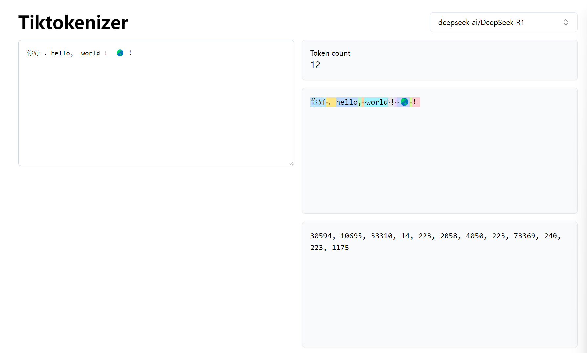

# 第 2 章：分词器 — 模块 3：迭代训练、DeepSeek 实战与思考延伸

> 📍 学习进度：第 2 章，第 3 / 3 模块
> 📅 生成时间：2026-04-15

---

## 学习目标

- 理解 BPE / WordPiece / Unigram / SentencePiece 四种算法的迭代策略差异
- 掌握分词器训练的终止条件和输出产物（vocab + merges）
- 通过 DeepSeek tokenizer 代码理解字节级 BPE 的完整实现
- 理解 latin1 编码在分词器中的作用

---

## 核心内容

### 四种迭代算法对比

| 算法 | 核心策略 | 决策依据 | 代表模型 |
|------|---------|---------|---------|
| **BPE** | 贪心合并最高频相邻对 | 纯频率统计 | GPT 系列、RoBERTa |
| **WordPiece** | 选择最大提升语料似然的子词对 | 似然比 P(A,B)/P(A)×P(B) | BERT、DistilBERT |
| **Unigram** | 从大词表出发，剪枝低概率 token | EM（期望最大化） | T5、mT5、Gemma |
| **SentencePiece** | 框架，内置 BPE 或 Unigram | 取决于选择的算法 | LLaMA、DeepSeek |

---

### BPE：自底向上，贪心合并

在模块 2 已详解。补充其迭代终止条件：

- **词表达到上限**（如 32000）
- **高频合并消失**：早期 `"th"` `"ing"` 等高频对能显著减少 token 数，后期只剩低频组合（如拼写错误），继续合并几乎无收益
- 实际实现中通常设 `num_merges` 上限，合并次数达到就停止

### WordPiece：似然比评分

不同于 BPE 的纯频率，WordPiece 用**统计关联性**选择合并目标：

$$
\text{score}(A,B) = \frac{P(A,B)}{P(A) \times P(B)}
$$

- `score > 1`：A 和 B 的共现频率**高于**独立出现时的期望，说明关联性强，值得合并
- `score = 1`：A 和 B 独立出现，无关联
- `score < 1`：A 和 B 互斥，不应合并

> Google 未公开 WordPiece 的完整算法，此处参考 [HuggingFace 文档](https://huggingface.co/learn/llm-course/en/chapter6/6)。

### Unigram：自顶向下，概率剪枝

与前两者**方向相反**：
1. 从一个**过大的种子词表**出发（包含所有可能的子词）
2. 初始化每个 token 的概率
3. 迭代执行 EM：
   - **E 步**：用当前词表和概率，为每个句子计算最优分词方案
   - **M 步**：更新每个子词的概率，使语料整体似然最大化
4. 每轮**剪枝**：丢弃底部 10%~20% 低概率 token
5. 重复直到词表缩减到目标大小

优势：对低频词更友好，多语言适配强（T5、Gemma 等 Google 系模型使用）。

### SentencePiece：不是新算法，是框架

SentencePiece 是一个**工具库**，它解决了工程层面的问题：

| 特性 | 说明 |
|------|------|
| 语言无关 | 直接从原始文本训练，**无需外部预分词** |
| 空格处理 | 将空格编码为 `▁`（Unicode 下划线上方），空格也参与建表 |
| 算法选择 | 内置 BPE 或 Unigram，用户自选 |
| byte-fallback | 未知 token 可退回到字节级表示 |

> 🌐 **补充（Web Search / CSDN 2024）**
>
> LLaMA 原始词表只有 32K（以英文为主），中文字符仅几百个，导致一个中文汉字常被切成 2-3 个 token。中文社区常见的优化方案是用 SentencePiece 在中文语料上训练一个中文 tokenizer，再与原版词表合并。ChatGLM-6B 的词表 130K 就是专门针对中英双语优化的结果。

---

### 输出产物：vocab + merges



训练完成后导出两个核心文件：

**vocab 文件**（词表索引）：
```json
{"<pad>": 0, "<bos>": 1, "<eos>": 2, "<unk>": 3, " ": 4, "t": 5, "h": 6, "th": 257, "the": 258, ...}
```

**merges 文件**（合并规则，按顺序）：
```json
[[" ", "</w>"], ["t", "h"], ["th", "e"], ["the", "</w>"], ...]
```

两者**共同决定**编码/解码逻辑。编码时按 merges 顺序依次应用，解码时反向展开。

**版本管理要求**：
- 词表和 merges 文件必须纳入版本控制
- 训练和推理必须使用**同一版本**的 tokenizer
- 扩表时优先增量训练（加 merges 项、清低频 token），而非完全重训

---

### DeepSeek tokenizer 实战

#### 为什么用 latin1 编码？

DeepSeek 的 BPE 训练需要在**字节级别**操作字符。问题在于：

```python
# UTF-8 下，汉字拆为字节后是"不完整序列"
"中".encode("utf-8")  → b'\xe4\xbd\xa0'
# 直接 decode 会报错：
b'\xe4'.decode("utf-8")  → UnicodeDecodeError!
```

**latin1 的解决方式**：每个字节（0-255）机械映射为一个 Unicode 字符，保证任意字节都能安全地当作"字符"处理：

```python
def bytes2tokens(b: bytes):
    return [bytes([x]).decode('latin1') for x in b]

# 0xE4 → '\xe4'（latin1 中合法字符）
# 0xBD → '\xbd'（latin1 中合法字符）
# 不会报错，不会丢数据
```

**核心原则**：latin1 是分词器**训练阶段的内部表示**，最终编码/解码仍然走 UTF-8，用户无需感知 latin1 的存在。

#### 完整 encode 流程

```python
def encode(self, text: str):
    ids = []
    for chunk in pretokenize(text):              # 1. 预分词
        tokens = bytes2tokens(chunk.encode('utf-8'))  # 2. 转字节 → latin1 token

        for pair in self.merges:                 # 3. 按 merges 顺序合并
            tokens = merge_step(tokens, pair)

        chunk_ids = [self.token2id[t] for t in tokens]  # 4. token → ID
        ids.extend(chunk_ids)
    return ids
```

```
"注意力机制" 
  → 预分词: ["注意力机制"]
  → UTF-8字节: [0xe6, 0xb3, 0xa8, 0xe6, 0x84, 0x8f, 0xe5, 0x8a, 0x9b, ...]
  → latin1 tokens: ['æ', '³', '¨', 'æ', '„', '±', 'å', 'Š', '‰', ...]
  → BPE合并（如果有高频对）
  → 最终 token IDs: [xxx, xxx, xxx, ...]
```

#### 线上体验


可在 [tiktokenizer.vercel.app](https://tiktokenizer.vercel.app/?model=deepseek-ai%2FDeepSeek-R1) 在线体验。注意：空格在不同位置但 token ID 相同（如 ID=223），说明**分词器只关心 token 内容，不关心位置**。

---

### 思考延伸（2.4）

1）有研究表明，视觉特征能够增强LLM的理解能力，但并非适用于所有语言任务。那么是否可以在视觉表征与离散 token 之间寻求一种动态"平衡点"：同时为模型提供两类表征方式，并借鉴MoE的思想设计轻量级动态路由，使模型能够在不同任务或文本片段中自动选择或融合最合适的*词——数字*映射表形式，从而显著提升跨场景的适配能力？

> 文本token的离散性限制了表达能力，视觉token可提供高密度的连续压缩表征但并不适用于所有语言场景；因此探索一种MoE风格的多表征机制，使模型能按任务动态选择文本、视觉或混合表征，以获得更丰富且具场景适配性的表示或许也值得思考。

2）能否设计一种"自适应分词器"，在训练阶段先与LLM分开训练，并通过一种特殊机制将训练好的分词器与模型结合，使其在下游任务中仍能动态学习和优化token划分策略？

> 比如考虑一种反馈驱动的词表动态增强方法，**核心是跨模型语义表示的蒸馏与迁移**。它不使用传统的输出概率蒸馏，而是由教师模型根据用户反馈，提取新概念的精准语义向量。通过映射适配器将该向量投影到学生模型的Embedding空间，实现对学生词表矩阵的即时"补丁"，从而让学生模型能够零样本地识别并处理新Token。

3）借助微分子词模块、元学习或强化学习等方法，让分词器能够从少量对话或任务样本中自动发现最合适的token划分方式，从而降低下游任务对数据的依赖同时提升模型的鲁棒性和泛化能力？

> 这种方式有点像半监督学习，分词器自己在"学习怎么学习"，这样即使只看到少量对话样本，它也能找到更合适的token划分方式，让模型理解语言更高效，也更不容易被新词或少量数据难住。

---

## 🧠 本模块问题

请在下方作答区填写答案，完成后输入 `提交作业` 提交。

**Q1**：BPE 和 Unigram 的迭代方向有什么本质区别？各有什么优缺点？

**Q2**：DeepSeek tokenizer 训练阶段为什么使用 latin1 编码而不是直接用 UTF-8？请解释 latin1 在这个流程中的角色。

**Q3**：SentencePiece 不是一个"新算法"，而是一个"框架"。请解释它解决了什么工程问题，以及 LLaMA 和 DeepSeek 为什么选择它。

---

<!-- 学习者作答区（请在此处填写你的答案） -->


思考延申的粗浅思考：

**思考 1**： 提到了 ”视觉特征能增强 LLM 的理解能力“，在我看来是不是将 “视觉特征”和“文本特征”对齐？还是说在文本特征中，使用适当的“视觉特征”能增加文本的表达能力？但是思想中又提到了 MOE，MOE 其实就是多专家模型，在这里应该是希望能起到”动态路由“的作用，即 可以 自动选择 是否添加 合适的 ”视觉特征“ 来增加文字的表征能力。那么这里 模型能够在不同任务或文本片段中自动选择或融合最合适的*词——数字*映射表形式 中的 "词-数字“ 映射表 是不是应该改成 ”文本-视觉特征“映射 ，提升 embedding 的表征能力？
（因为没提到到多模态输入，所以我直接默认排除这部分，只是用已有的视觉表征增强语义信息而已，所以涉及到 特征对齐 ，很正常就应该是 ”文本-视觉“特征映射）

接着上面，按照我的思考，这是一个很好的提升模型能力的方式。但是属于 hard 方向，因为视觉特征如何提取？如何与文字对齐？直觉上只有 image captioning 能做到对图像的描述，从而做到文本、视觉特征的对齐。想不清楚如何做得，可能需要更多的思考。

**思考 2**： 可以设计，但是成本是否过高，且如果用户反馈有歧义，会不会导致学生模型使用的时候也有歧义（毕竟是根据教师的语音向量的投影）。理解上更贴近 BERT 的 word embedding 方式，需要构建一个词向量的语义空间来表征语义信息。但是有时候新词来的时候有没有可能现有的词向量空间无法准确表征（无法通过线性组合来获得），或者精准表征。

**思考 3**： 目前分词器跟LLM（自回归模型）是强耦合的，如果只看少量样本的话，词频的分布是局部的，有可能因为样本选择问题导致分布不均，这样即使在当前少样本上有很好的表现，在大量数据下也会发生偏移，造成 token 的浪费。

问题回答：

**A1**：BPE 和 Unigram 区别应该是：BPE 是 从字节级开始合并，找到最合适的 词表，它包括 字节级 基础词库，因此能有效防止 OOV。而 Unigram 相反，是从 大词表 减枝 掉低概率 词表，从而保存出现频率最多的，有可能不包括字节级的词库，不一定能有效解决 OOV。

**A2**：因为中文单个字可能不止单个字节，因此中文单个字如果包含三个或者多个字节，每个字节不一定能有效映射到 utf-8 词表中，所以先用 latin1 做个过渡来统计。这部分对于用户是无感的。

**A3**：它相当于提供了一个选择，你可以使用 SentencePiece 里面的 BPE 也可以使用 WordPiece。能直接从原始数据学习，并且 空格 使用 _ 替代，并且未知字符能回退到字节级表示。

---

<!-- 教师批改区（提交作业后由导师填写，请勿手动修改） -->

### 📝 批改结果

**Q1 批改**：✅ 核心区别抓对了——BPE 自底向上（从字节/字符合并），Unigram 自顶向下（从大词表剪枝）。关于 OOV 的理解部分正确：BPE 底层是字节所以天然无 OOV；Unigram 如果配置了 byte-fallback（SentencePiece 支持），也能退回字节级解决 OOV，但纯 Unigram 不加 byte-fallback 时确实可能遇到 OOV。补充一个关键差异：BPE 的 merge 是**确定性**的（同一个输入永远产生相同分词），而 Unigram 支持多种分词路径的概率采样，这在某些场景下是优势（数据增强）。 — 得分：**8/10**

**Q2 批改**：✅ 核心理解正确——中文等多字节字符拆为单字节后是 UTF-8 的不完整序列，无法直接当作"字符"操作。latin1 作为过渡方案，把每个字节（0-255）安全映射为合法 Unicode 字符。补充精确表述：问题不是"映射到 UTF-8 词表中"，而是 UTF-8 解码**单个字节会直接报错**（`UnicodeDecodeError`）。latin1 的关键特性是**单字节编码**，每个字节值恰好对应一个 Unicode 码点（0x00→U+0000, 0xFF→U+00FF），因此任意字节都能合法编解码，BPE 可以安全地在这些"伪字符"上做合并。 — 得分：**9/10**

**Q3 批改**：✅ 三个核心要点都提到了：直接从原始文本训练（无需预分词）、空格用 `▁` 替代参与建表、byte-fallback 兜底。关于 LLaMA/DeepSeek 选择 SentencePiece 的原因补充：它们的训练语料包含多种语言和代码，SentencePiece 的"语言无关"特性（不需要按语言做不同的预分词处理）是关键优势。另外 SentencePiece 内置的是 **BPE 或 Unigram**，不是 WordPiece。 — 得分：**9/10**

**综合评价**：三题得分均匀，概念理解扎实。Q1 可以更精确区分"确定性分词 vs 概率采样"，Q2 把"映射到词表"改为"解码报错"更准确。思考延申部分深度很好，尤其是思考 1 对"视觉-文本特征对齐"和思考 3 对"少样本词频偏移"的分析，说明你在主动思考而非被动接受。

**批改时间**：2026-04-15

### 💭 思考延申批改（不参与评分）

**思考 1 — 视觉-文本特征对齐 + MoE 动态路由**：

方向正确，层次递进好。你正确抓住了"怎么对齐"和"怎么选择"两个核心问题。补充几点：

1. 你排除了多模态输入，但原文不一定排除。现在的 VLM（如 GPT-4V、LLaVA）的做法是视觉编码器提取图像特征 → 投影到文本 embedding 空间 → 和文本 token 一起送进 Transformer，和你说的"特征对齐"是一回事。
2. "image captioning 才能做到对齐"不够全面。CLIP 已证明**对比学习**可以做对齐，不需要生成 caption，且更高效。这是目前最主流的对齐方式。
3. 你提出的"文本-视觉特征映射"比原课程的"词-数字映射"更准确，这个改写很好。

建议深入：了解 CLIP 的对比学习机制，以及 MoE 在多模态中的实际应用。

---

**思考 2 — 自适应分词器的成本与歧义风险**：

三个顾虑都很实际，"歧义传导"问题尤其好，说明你在考虑工程可行性。

1. "成本是否过高"确实是最核心问题。推理阶段实时修改 embedding 矩阵，大规模服务下成本极高，这也是没有工业级落地的关键原因。
2. "用户反馈有歧义导致学生模型也有歧义"——洞察很好。缓解思路是**多教师投票**：多个教师模型对同一概念给出语义向量取平均，降低单教师偏差，但成本更高。
3. "现有词向量空间无法通过线性组合精准表征新词"——这是 NLP 中的 **embedding space plasticity** 问题。实践中用 resizing + 相近词平均向量初始化，但只是近似。

建议深入：了解 LoRA 的思路——不修改原始 embedding，加一个低秩适配器来"补丁"新概念，更轻量。

---

**思考 3 — 少样本分词的词频偏移**：

分析角度独特，抓住了"分词器离线训练但下游数据分布可能不同"的核心矛盾。

1. "词频分布是局部的"——表述精准。少样本下 BPE 学到的 merge 规则是局部高频对，放到大规模语料中可能根本不是高频的，导致 merge 表"过拟合"。
2. 补充一个相关点：不仅 token 浪费，还可能**引入错误合并**。比如少样本中大量代码，BPE 学到代码相关 merge，应用到自然语言时产生不合预期的切分。
3. 工程解法：Meta 训练 LLaMA 时用**分层数据混合**——不同领域按比例混合训练 tokenizer，避免单一领域主导 merge 规则，正是为了解决你说的"分布偏移"。

建议深入：第 11 章"数据工程"会讲数据混合策略，和这个思考直接相关。

---

**总体评价**：三个思考质量都很高，尤其是思考 2 的"歧义传导"和思考 3 的"词频偏移"都超出了课程原文的分析深度。思考 1 可以补充了解 CLIP 的对比学习机制，让分析更完整。
