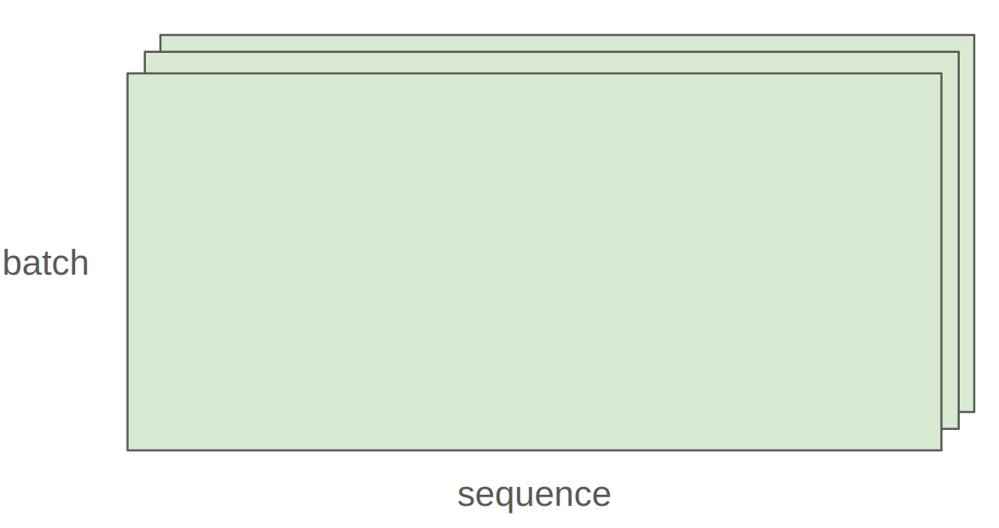

# 第 3 章：PyTorch 与资源核算 — 模块 1：资源核算思维与张量基础

> 📍 学习进度：第 3 章，第 1 / 3 模块
> 📅 生成时间：2026-04-18

---

## 学习目标

- 掌握 FLOPs 和内存的"餐巾纸计算"方法，能在几分钟内估算训练时间和资源需求
- 理解 PyTorch 张量的创建、视图操作（view/transpose/contiguous）和零拷贝机制
- 学会使用 einops 库简化张量维度操作（einsum、reduce、rearrange）

---

## 核心内容

### 一、为什么需要资源核算？（3.1）

训练大模型的资源消耗直接转化为时间和金钱。你需要掌握两种快速估算能力：

#### 1. 时间估算（FLOPs 方法）

核心公式：**总计算量 ≈ 6 × 参数量 × Token 数量**

- **6 倍系数的由来**：前向传播 2× + 反向传播 4×
- 计算步骤：总 FLOPs → 单卡算力（考虑 MFU）→ 多卡总算力 → 训练时间

> **实例**：70B 模型、15T tokens、1024 张 H100
> - 总计算量：6 × 70×10⁹ × 15×10¹² ≈ 6.3×10²⁴ FLOPs
> - 单卡实际算力：990 TFLOPS × 50% MFU ≈ 5×10¹⁴ FLOP/s
> - 1024 卡总算力：5×10¹⁷ FLOP/s
> - 训练时间：≈ 146 天

关于 MFU（Model FLOPs Utilization）：
- MFU = 实测 FLOP/s ÷ 硬件理论峰值 FLOP/s
- MFU ≥ 0.5 算优秀，接近 1.0 几乎不可能
- 实际估算通常取 30%–60%

#### 2. 内存估算

训练时每个参数的内存占用不只是参数本身，还包含：

| 组件 | FP32 字节数 | 说明 |
|------|-----------|------|
| 参数 | 4 bytes | 模型权重 |
| 梯度 | 4 bytes | 与参数同大小 |
| 优化器状态 | 8 bytes | Adam 的一阶矩 + 二阶矩 |
| **合计** | **16 bytes/参数** | |

> **实例**：8 张 H100（共 640GB），能训练多大模型？
> - 最大参数量 = 640GB ÷ 16 bytes ≈ **40B**（不是 160B！）
> - 注意：这还没算激活值内存

### 二、张量基础（3.2）

#### 1. 张量创建

```python
x = torch.tensor([[1., 2, 3], [4, 5, 6]])  # 从列表创建
x = torch.zeros(4, 8)   # 零矩阵
x = torch.randn(4, 8)   # 正态随机
x = torch.empty(4, 8)   # 未初始化（配合 nn.init.trunc_normal_ 使用）
```

#### 2. 视图操作（零拷贝）

关键理解：**view、transpose、slice 不复制数据，只修改 stride**。

```python
x = torch.tensor([[1., 2, 3], [4, 5, 6]])
y = x.view(3, 2)       # 不复制，共享存储
y = x.transpose(1, 0)  # 不复制，但变成非连续！

# 转置后不能直接 view，需要先 contiguous()
y = x.transpose(1, 0).contiguous().view(2, 3)  # contiguous() 会复制
```

> ⚠️ **坑点**：转置后的张量是非连续的（non-contiguous），不能直接 `.view()`。`.contiguous()` 会触发数据复制，消耗内存和时间。

#### 3. 逐元素操作与矩阵乘法

- 逐元素操作：`pow`, `sqrt`, `rsqrt`, 加减乘除 → 对每个元素独立运算
- **矩阵乘法**是深度学习的核心操作：`(B, D) @ (D, K) → (B, K)`
- FLOPs 公式：**2 × M × K × N**（矩阵乘法 A(M×K) @ B(K×N)）

#### 4. 因果注意力掩码（triu）

```python
x = torch.ones(3, 3).triu()  # 上三角矩阵
# [[1, 1, 1],
#  [0, 1, 1],
#  [0, 0, 1]]
```

M[i, j] 表示位置 i 对位置 j 的贡献，i > j 时贡献为 0（不能"偷看"未来信息）。

### 三、Einops 库（3.2.3）

Einops 让张量维度操作像写公式一样清晰。配合 jaxtyping 的维度命名使用：

#### 1. jaxtyping 命名维度

```python
from jaxtyping import Float
x: Float[torch.Tensor, "batch seq heads hidden"] = torch.ones(2, 2, 1, 3)
```

类型注解是文档性质的，不强制运行时校验，但能大幅提升代码可读性和 IDE 支持。

#### 2. einsum — 清晰的矩阵乘法

```python
from einops import einsum
# 传统写法
z = x @ y.transpose(-2, -1)
# Einops 写法：未出现在输出中的维度自动求和
z = einsum(x, y, "batch seq1 hidden, batch seq2 hidden -> batch seq1 seq2")
```

#### 3. reduce — 清晰的维度聚合

```python
from einops import reduce
y = reduce(x, "... hidden -> ...", "mean")  # 压缩 hidden 维度
```

#### 4. rearrange — 拆分/合并维度

```python
from einops import rearrange
# 拆分：total_hidden → heads × hidden1
x = rearrange(x, "... (heads hidden1) -> ... heads hidden1", heads=2)
# 合并：heads × hidden2 → total_hidden
x = rearrange(x, "... heads hidden2 -> ... (heads hidden2)")
```



> 🌐 **补充（Web Search）**：2025 年 PyTorch 生态中，`torch.compile()` 可以自动融合算子，进一步优化 einops 操作的执行效率。此外，`einops` 的 `pack`/`unpack` 功能在处理不等长序列时也非常实用。参考 [Einops Tutorial](https://einops.rocks/1-einops-basics/)。

> 🌐 **补充（Web Search）**：非连续张量（non-contiguous tensor）在实际中可能导致 GPU kernel 静默失败，2025 年有开发者报告了 encoder 权重冻结的 bug，根源就是写入了非连续内存。参考 [The Bug That Taught Me More About PyTorch](https://elanapearl.github.io/blog/2025/the-bug-that-taught-me-pytorch/)。

---

## 🧠 本模块问题

请在下方回答以下问题后，输入 `提交作业` 提交。

**Q1**：假设你要训练一个 7B（70 亿参数）的模型，数据量为 2T（2 万亿 tokens），使用 8 张 H100 GPU（每张 BF16 稠密峰值 990 TFLOPS，MFU 取 40%）。请估算训练需要多少天？请写出计算过程。

**Q2**：解释 PyTorch 中 `view` 和 `contiguous()` 的关系。为什么转置后的张量不能直接 `view`？`contiguous()` 做了什么？

**Q3**：使用 einops 的 `rearrange` 和 `einsum`，将以下传统 PyTorch 代码改写为更清晰的版本：

```python
# 传统写法
x = torch.randn(4, 8, 64)  # batch, seq, hidden
w = torch.randn(64, 32)     # hidden, out
x_reshaped = x.view(4, 8, 4, 16)  # 拆分 hidden 为 heads×head_dim
out = x_reshaped @ w.unsqueeze(0).unsqueeze(0).transpose(-2, -1)
# ... 很难看出在做什么
```

请用 einops 风格重写，让维度含义一目了然。

---

<!-- 学习者作答区（请在此处填写你的答案） -->

**A1**： 

7B 模型 = 7 * 10^9 Bytes
2T 数据量 = 2 * 10^12 Bytes
单张 GPU（H100）算力 = 990TFLOPS * 0.4 = 1000 * 10^12 * 0.4 = 400 * 10^12
所以  (6 * 7*10^9 * 2 * 10^12) / (400 * 10^12) = 21 * 10^7 / 3600 h = 241.6 Days

**A2**：
view() 相当于是改变了数据的 读取配置(slice, stride)，但是底层数据没有变化。
contiguous() 即保证数据连续性，因为有些操作可能会改变 tensor 底层数据的变化，比如 transpose，使用后底层数据会变得不连贯，如果不使用 contiguous() 则会造成一定问题。
contiguous() 相当于做了拷贝复制，让底层数据重新连贯。

**A3**：
使用 einops 重写
```python

传统的写法是不是有问题， w 和 x_reshaped 维度没对齐
# 

from einops import einsum
x = torch.randn(4, 8, 64)  # batch, seq, hidden
w = torch.randn(64, 32)     # hidden, out
# x_reshaped = x.view(4, 8, 4, 16)  # 拆分 hidden 为 heads×head_dim
# out = x_reshaped @ w.unsqueeze(0).unsqueeze(0).transpose(-2, -1)
# ... 很难看出在做什么
out = einsum(x, w, "batch seq (heads, head_dim), (heads, head_dim) out -> batch seq heads out", head_dim=16)
```
---

<!-- 教师批改区（提交作业后由导师填写，请勿手动修改） -->

### 📝 批改结果

**Q1 批改**：公式和思路正确，但有两个问题：

1. **忘了乘以 8 张卡**：你算出的 2.1×10⁷ 秒是单卡的结果，需要除以 8：
   - 总 FLOPs = 6 × 7×10⁹ × 2×10¹² = 8.4×10²² ✅
   - 单卡算力 ≈ 400×10¹² FLOP/s ✅
   - **8 卡总算力** = 400×10¹² × 8 = 3.2×10¹⁵ FLOP/s
   - 时间 = 8.4×10²² / 3.2×10¹⁵ ≈ 2.625×10⁷ 秒 ≈ **304 天**

2. **单位标注**："7×10⁹ Bytes" 应该是 "7×10⁹ 参数"，"2×10¹² Bytes" 应该是 "2×10¹² tokens"。FLOPs 公式里的参数量和 token 数量都是无量纲的计数，不是字节数。

计算过程未完成（留了 "= "），但公式框架是对的。 — 得分：**6/10**

**Q2 批改**：理解基本正确，核心要点都抓住了。补充一个更精确的解释：

`view()` 要求张量是连续的，因为它需要通过新的 stride 直接映射到原来的连续内存块。转置后 stride 不再是递减的顺序（比如从 (4,1) 变成 (1,4)），内存中的数据不再是"按顺序"排列的，所以无法用简单的 stride 映射来重排。`contiguous()` 重新分配一块连续内存并按当前逻辑顺序复制数据，之后就能正常 `view()` 了。 — 得分：**8/10**

**Q3 批改**：**你完全正确！** 原始代码确实有 bug：

```
x_reshaped: (4, 8, 4, 16)     # 最后两维是 heads×head_dim
w 转置后:    (1, 1, 32, 64)    # 最后两维是 out×hidden
矩阵乘法:    (4,16) @ (32,64) → 16 ≠ 32，维度不匹配！
```

这是出题时的疏忽，抱歉。你的 einops 重写是正确的：

```python
out = einsum(x, w, "batch seq (heads head_dim), (heads head_dim) out -> batch seq heads out", head_dim=16)
```

这把 w 的 64 维也拆成 (heads=4, head_dim=16)，做了 per-head 的线性变换（类似于多头注意力中的投影），语义清晰。输出形状 (4, 8, 4, 32)。

能主动发现题目 bug 并给出合理方案，说明你对张量维度和 einops 的理解很扎实。 — 得分：**9/10**

**综合评价**：资源核算的公式思路正确，但要注意多卡场景和单位标注。张量和 einops 的理解到位，能发现维度不匹配问题非常好。建议重新算一遍 Q1 的完整计算，加深对多卡估算的印象。可以继续模块 2。

**批改时间**：2026-04-18
