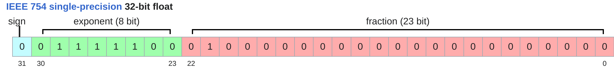
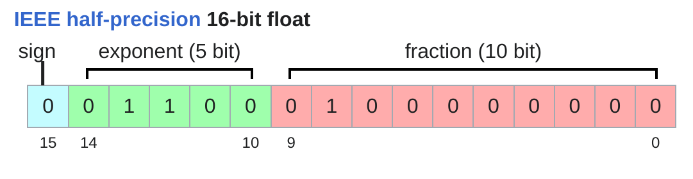
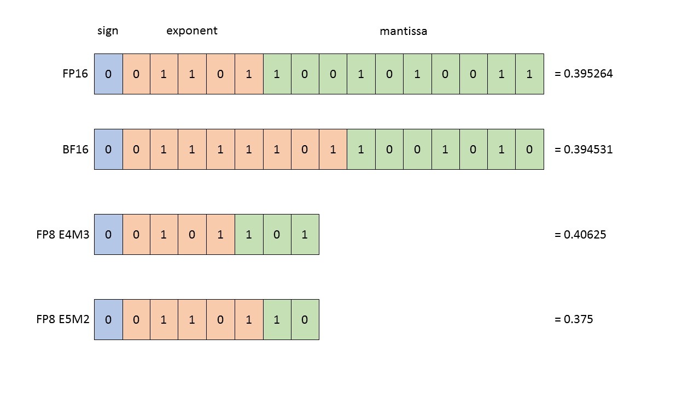
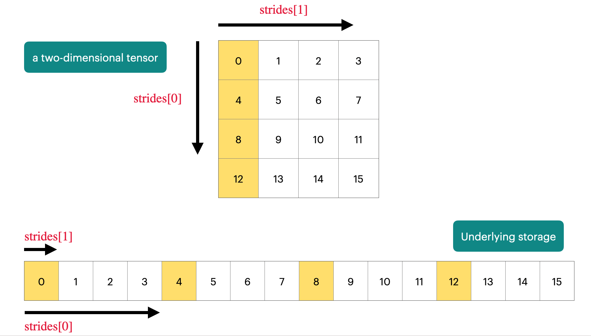
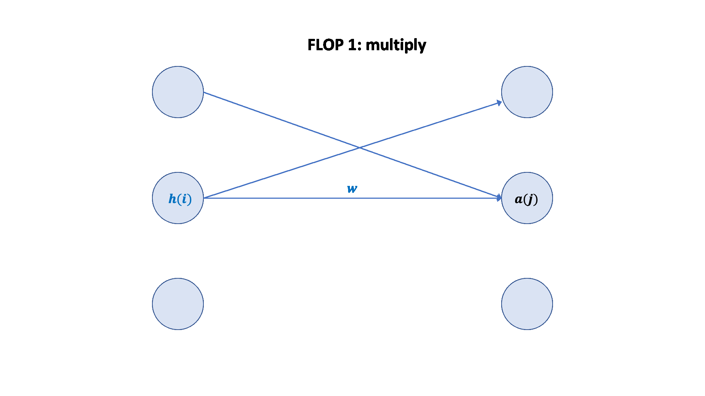

# 第 3 章：PyTorch 与资源核算 — 模块 2：内存管理与计算效率

> 📍 学习进度：第 3 章，第 2 / 3 模块
> 📅 生成时间：2026-04-18

---

## 学习目标

- 掌握 FP32、FP16、BF16、FP8 四种浮点格式的结构差异和适用场景
- 理解张量在内存中的存储机制（stride、连续性、zero-copy）
- 掌握 FLOPs 的精确计算方法，特别是矩阵乘法和反向传播的 FLOPs 推导
- 理解 MFU 的含义以及为什么实际算力远低于理论峰值

---

## 核心内容

### 一、浮点类型详解（3.3.1）

LLM 训练中选择数据类型，本质上是在**显存占用、计算速度、数值稳定性**之间做权衡。

| 格式 | 字节数 | 指数位 | 尾数位 | 动态范围 | 精度 | 主要用途 |
|------|--------|--------|--------|----------|------|----------|
| **FP32** | 4 | 8 | 23 | 大 | 高 | 参数主副本、优化器状态 |
| **FP16** | 2 | 5 | 10 | **窄** | 中 | 已逐渐被 BF16 取代 |
| **BF16** | 2 | 8 | 7 | 大（=FP32） | 低 | 当前 LLM 训练主流 |
| **FP8** | 1 | 4/5 | 3/2 | 取决于变体 | 极低 | 推理量化、前沿训练研究 |








#### BF16 为什么优于 FP16？

关键在**指数位**：BF16 保留了 FP32 的 8 位指数，动态范围一样大。FP16 只有 5 位指数，极易上溢（→ Infinity）或下溢（→ 0），必须配合 Loss Scaling 使用。BF16 不需要 Loss Scaling 就能稳定训练。

> 深度学习的数值特性：**对精度不敏感（尾数位少没关系），对范围非常敏感（指数位不能少）**。

### 二、张量内存存储机制（3.3.2）

PyTorch 张量底层是一个**指针 + 元数据（shape、stride、dtype）**，指向一块连续的物理内存。

#### Stride（步长）机制

```python
x = torch.tensor([
    [0., 1, 2, 3],
    [4, 5, 6, 7],
    [8, 9, 10, 11],
    [12, 13, 14, 15],
])
assert x.stride(0) == 4  # 行维度：移到下一行跳过 4 个元素
assert x.stride(1) == 1  # 列维度：移到下一列跳过 1 个元素

# 任意元素位置 = 行索引 × stride(0) + 列索引 × stride(1)
r, c = 1, 2
index = r * 4 + c * 1  # = 6，即 x[1,2] = 6
```

**PyTorch 通过 stride 将多维张量的逻辑结构映射到一维物理内存。**



#### Zero-copy 操作

很多操作只修改 stride/shape，**不复制数据**：

```python
y = x.view(1024)       # 只改 shape，不复制
z = x.transpose(0, 1)  # 只改 stride，不复制
w = x[0]               # 切片，不复制
```

但转置后张量变为非连续（`is_contiguous() == False`），不能直接 `.view()`，需要 `.contiguous()` 触发实际复制。

### 三、CPU ↔ GPU 数据传输（3.3.3）

默认张量在 CPU 上，需要显式移到 GPU 才能利用 GPU 并行计算。


**PCIe 总线是瓶颈**——带宽远小于 GPU 内部带宽，应尽量减少 CPU↔GPU 数据传输。

```python
# 方式一：移动现有张量
y = x.to("cuda:0")

# 方式二：直接在 GPU 上创建（更高效）
z = torch.zeros(32, 32, device="cuda:0")
```

高效数据加载的关键技巧：
- **pin_memory()**：将 CPU 张量标记为"固定内存"，避免操作系统额外的拷贝步骤
- **non_blocking=True**：异步传输，不阻塞 Python 线程
- 两者结合可实现：GPU 处理当前批次的同时，CPU 并行加载下一批次

### 四、FLOPs 精确计算（3.4.1）

#### 矩阵乘法的 FLOPs

对于 `y = x @ w`，其中 x 为 (B, D)，w 为 (D, K)：

```
y[i, k] = Σ x[i, j] * w[j, k]   (j 从 0 到 D-1)
```

每个输出元素：D 次乘法 + D-1 次加法 ≈ **2D** 次 FLOPs

总共 B×K 个输出元素：**总 FLOPs ≈ 2 × B × D × K**

> 由于 D × K = 参数量，所以：**FLOPs = 2 × 数据量 × 参数量**

#### 其他操作的 FLOPs 可忽略

- 逐元素操作（relu、加法等）：O(m × n)，远小于矩阵乘法的 O(2 × m × k × n)
- 实际估算时，**只需计算所有矩阵乘法的 FLOPs 总和**

#### FLOPs vs FLOP/s

- **FLOPs**（小写 s）：浮点运算**总数**，衡量计算量
- **FLOP/s**（每秒）：硬件每秒能执行的运算次数，衡量速度
- 例：H100 BF16 稠密峰值 ≈ 990 TFLOP/s = 990 × 10¹² FLOP/s

### 五、反向传播的 FLOPs 推导（3.4.3）

两层线性模型：`x → h1 → h2 → loss`，其中 h1 = x @ w1，h2 = h1 @ w2

**前向传播 FLOPs**：
- h1 = x @ w1：2 × B × D × D
- h2 = h1 @ w2：2 × B × D × K
- **总计 = 2BDD + 2BDK**

**反向传播 FLOPs**（对每一层，需要计算参数梯度和激活值梯度）：

对 w2 层：
1. w2.grad = h1ᵀ @ h2.grad → FLOPs: **2BDK**
2. h1.grad = h2.grad @ w2ᵀ → FLOPs: **2BDK**
3. 小计：**4BDK**

对 w1 层：
1. w1.grad = xᵀ @ h1.grad → FLOPs: **2BDD**
2. x.grad = h1.grad @ w1ᵀ → FLOPs: **2BDD**（⚠️ 仅当 x 需要梯度时）
3. 实际训练中 x 是输入数据，requires_grad=False，**不需要计算 x.grad**
4. 小计：**2BDD**（实际）/ 4BDD（完整推导）

**反向总计 ≈ 2BDD + 4BDK**（不计算 x.grad）

**核心结论**：对于深层网络，反向传播 FLOPs ≈ 前向的 2 倍（首层省掉的 x.grad 相对总量可忽略），所以：

> **训练一次（前向 + 反向）总 FLOPs ≈ 6 × 数据量 × 参数量**



### 六、MFU（3.4.2）

$$MFU = \frac{\text{实测 FLOP/s}}{\text{硬件理论峰值 FLOP/s}}$$

- MFU ≥ 0.5：优秀
- MFU → 1.0：几乎不可能（总有内存访问、数据传输等开销）
- 实际估算通常取 30%–60%

> 🌐 **补充（Web Search）**：估算 FLOPs 的常用工具包括 Meta 的 [fvcore](https://github.com/facebookresearch/fvcore/blob/master/docs/flop_count.md)（`FlopCountAnalysis`）和 PyTorch 内置的 `torch.profiler`。注意 FLOPs ≠ 实际运行时间，需结合 profiling 工具一起分析。参考 [Compute FLOPs with PyTorch built-in counter](https://alessiodevoto.github.io/Compute-Flops-with-Pytorch-built-in-flops-counter/)。

> 🌐 **补充（Web Search）**：2025 年 PyTorch 推出了 `torch.compile()` 和 CUDA Graphs，可以自动融合算子减少 kernel launch 开销，显著提升 MFU。此外，使用 `torch.cuda.memory_summary()` 和内存快照工具可以诊断长时间训练中的内存碎片化问题。

---

## 🧠 本模块问题

请在下方回答以下问题后，输入 `提交作业` 提交。

**Q1**：一个形状为 (B, D) 的张量存储为 BF16 格式，其中 B=4096，D=4096。请计算这个张量占用的显存（以 MB 为单位）。如果换成 FP32 格式，显存占用变为多少？

**Q2**：请解释为什么反向传播的计算量大约是前向传播的 2 倍。以单层线性模型 `y = x @ W`（x 形状为 B×D，W 形状为 D×K）为例，分别写出前向传播和反向传播各需要计算哪些矩阵乘法，以及各自的 FLOPs。

**Q3**：在实际训练中，H100 的 BF16 稠密峰值算力约为 990 TFLOP/s，但实测 MFU 通常只有 40%–50%。请列举至少 3 个导致 MFU 无法达到 100% 的原因。

---

<!-- 学习者作答区（请在此处填写你的答案） -->

**A1**：
BF16 格式占用 2Bytes, 所以 (4096, 4096) tensor 占用 2**24  * 2 Bytes = 2**13 KB = 4 MB,
如果换乘 FP32 格式，则占用 4 Bytes 单个 tensor 的 cell，所以是 8MB

**A2**：

计算 x @ w 只需要计算 (B, D) @ (D, K) 即 乘法 + 加法 即 2 * D * (B * K) 计算量，即 2 * B * D * K
但是反向传播计算梯度，得到 y.grad, 因为需要知道  w.grad 才能更新 w，所以还需要计算 w.grad，再往上，因为 x 可能也来自于其他 input，所以还需要计算 x.grad 往 复合表达式 传播梯度
两者运算量差不多是 2倍 的前向传播

**A3**：

1. 模型载入数据的等待时间
2. 数据写入到内存的时间
3. 模型里面异步处理需要执行时钟同步的操作（比如 print 或者 某些 blocking 操作）


---

<!-- 教师批改区（提交作业后由导师填写，请勿手动修改） -->

### 📝 批改结果

**Q1 批改**：思路正确（元素数 × 每元素字节数），但 2 的幂次算错了：

- 元素数 = 4096 × 4096 = 2¹² × 2¹² = 2²⁴ ✅
- BF16 每个 2 bytes → 总字节 = 2²⁴ × 2 = 2²⁵ bytes
- **2²⁵ / 2¹⁰ = 2¹⁵ KB = 32,768 KB**（你写了 2¹³ KB，少了 4×）
- **2¹⁵ / 2¹⁰ = 2⁵ MB = 32 MB**（你写了 4 MB，少了 8×）
- FP32：32 MB × 2 = **64 MB**（你写了 8 MB）

记住口诀：每除一次 1024，指数减 10。2²⁵ bytes → 2¹⁵ KB → 2⁵ MB。 — 得分：**5/10**

**Q2 批改**：前向 FLOPs 正确（2BDK），反向的**概念理解正确**——需要计算 w.grad 还要传播梯度给 x。但题目要求"分别写出矩阵乘法和各自的 FLOPs"，缺了具体的矩阵形式：

对于单层 y = x @ W（x: B×D, W: D×K）：
- 前向：y = x @ W → FLOPs: **2BDK**（一个矩阵乘法）
- 反向：
  1. W.grad = xᵀ @ y.grad → (D×B)@(B×K) → FLOPs: **2BDK**
  2. x.grad = y.grad @ Wᵀ → (B×K)@(K×D) → FLOPs: **2BDK**
  - 反向总计 = **4BDK**（是前向的 2 倍）✅

核心是反向需要**两个**矩阵乘法（一个算权重梯度，一个传播激活值梯度），所以是前向的 2 倍。 — 得分：**6/10**

**Q3 批改**：三个回答方向都对，但可以更精准：

1. "模型载入数据的等待时间" → 部分正确。更准确地说，数据加载慢会导致 GPU 空闲（data starvation），但 MFU 通常只统计有计算发生的时间段。**更关键的是**：非矩阵乘法操作（Softmax、LayerNorm、激活函数）是 **memory-bound**（受限于内存带宽而非算力），它们无法利用 Tensor Core，拉低了整体利用率。

2. "数据写入到内存的时间" → 方向正确。更准确地说是 **GPU HBM 带宽瓶颈**——GPU 算得再快，数据搬不过来也是白搭。特别是小 batch 或非方正矩阵时，Tensor Core 填不满。

3. "异步处理需要时钟同步" → 正确。分布式训练中 **all-reduce 通信（梯度同步）** 是最大的非计算开销之一，GPU 在等通信完成时无法做有效计算。

补充一个重要原因：**kernel launch overhead**——每个 GPU 操作都有启动开销，操作太碎（大量小张量运算）会累积显著延迟。这也是 `torch.compile()` 和 CUDA Graphs 想要解决的问题。 — 得分：**6/10**

**综合评价**：计算能力方面，2 的幂次换算需要多练习，这是资源核算的基本功。反向传播的概念理解到位，但需要习惯写出具体的矩阵乘法形式。MFU 的原因分析方向正确，建议记住 "memory-bound vs compute-bound" 这个区分，后续章节会反复出现。可以继续模块 3。

**批改时间**：2026-04-18
