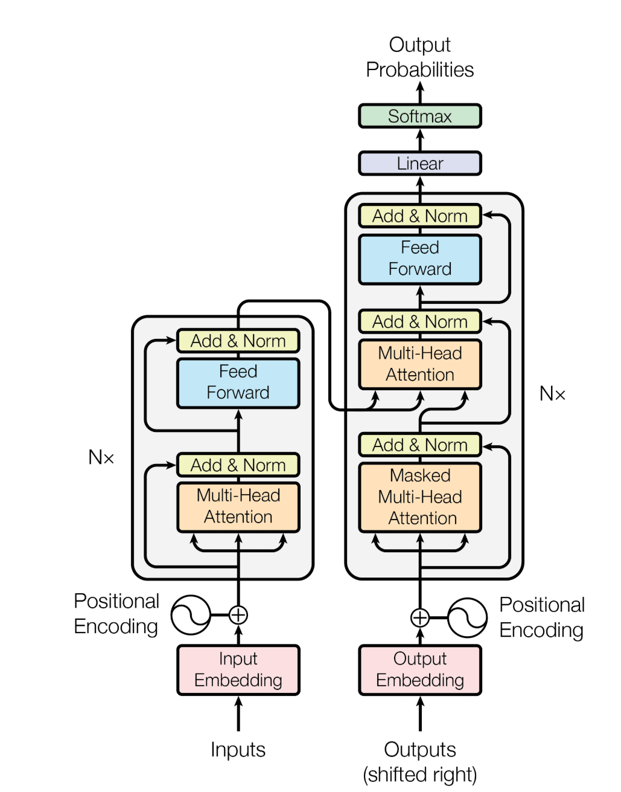
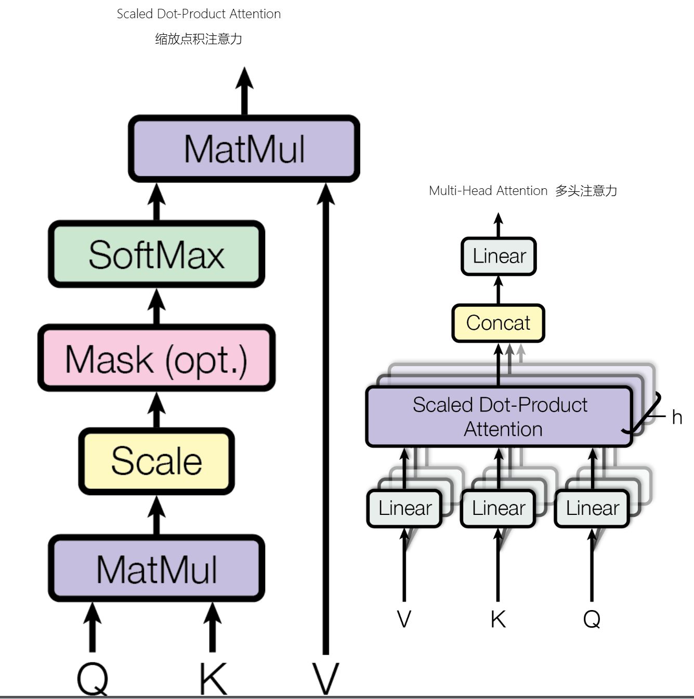
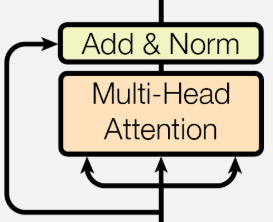
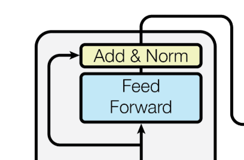

# 第 4 章：语言模型架构和训练的技术细节 — 模块 1：标准 Transformer 架构回顾

> 📍 学习进度：第 4 章，第 1 / 4 模块
> 📅 生成时间：2026-04-20

---

## 学习目标

- 理解 Transformer 的整体架构（编码器-解码器结构）
- 掌握正余弦位置编码的数学原理与作用
- 理解多头注意力机制的计算流程与设计动机
- 掌握层归一化与残差连接的协同工作方式
- 理解前馈网络与激活函数在 Transformer 中的角色

---

## 核心内容

### Transformer 的诞生

2017 年，Google 在论文 [《Attention Is All You Need》](https://arxiv.org/abs/1706.03762) 中提出 Transformer，核心创新是**自注意力机制**（Self-Attention），摒弃了 RNN 和 CNN 结构，实现并行计算并解决长距离依赖问题。



Transformer 由**编码器 Block** 和**解码器 Block** 堆叠 N 层组成。现代大语言模型（如 GPT 系列）通常只使用**解码器**部分。

---

### 一、位置编码（Positional Encoding）

#### 为什么需要位置编码？

Transformer 没有循环或卷积结构，模型本身是**排列不变**的——"我爱你"和"你爱我"会被视为相同的集合。因此必须显式引入位置信息。

#### 正余弦位置编码公式

$$
PE_{(pos,2i)} = \sin\left(\frac{pos}{10000^{2i/d_{\text{model}}}}\right), \quad PE_{(pos,2i+1)} = \cos\left(\frac{pos}{10000^{2i/d_{\text{model}}}}\right)
$$

- $pos$：token 在序列中的位置
- $i$：维度索引（$d_{model}=512$）
- $10000$：基础频率

计算后与词嵌入**直接相加**：$X = Token + PE(pos)$

#### 设计优势

1. **无参高效**：无需额外参数，避免过拟合
2. **数值稳定**：三角函数约束在 $[-1, 1]$ 之间
3. **相对位置感知**：对于偏移量 $k$，$PE(pos+k)$ 可表示为 $PE(pos)$ 的线性变换

> 💡 **补充（Context7 / PyTorch）**：PyTorch 中 `nn.Transformer` 的标准实现使用 `torch.sin` 和 `torch.cos` 生成位置编码。原始论文配置为 $d_{model}=512$，编码器/解码器各 6 层。

---

### 二、多头注意力机制（Multi-Head Attention）



#### 单头注意力的局限

注意力本质是**加权求和**：对于输入 $X$，通过权重矩阵得到 Q、K、V：

$$
Q = XW^Q, \quad K = XW^K, \quad V = XW^V
$$

$$
\text{Attention}(Q, K, V) = \text{softmax}\left(\frac{QK^T}{\sqrt{d_k}}\right)V
$$

单头注意力只能计算一种 Q-K-V 关系，无法同时捕获语法、语义、长程依赖等多种模式。

#### 多头注意力的计算流程

**Step 1：线性投影与切分**

将 $d_{model}$ 维的 Q、K、V 拆分为 $h$ 个头，每个头在 $d_k = d_{model}/h$ 维空间计算：

```python
Q = Q.reshape(batch_size, seq_len, h, d_k)  # [bs, seq_len, h, d_k]
Q = Q.transpose(1, 2)                       # [bs, h, seq_len, d_k]
```

**Step 2：并行计算每个头的注意力**

$$
\text{Head}_i = \text{softmax}\left(\frac{Q_i K_i^T}{\sqrt{d_k}}\right)V_i
$$

**Step 3：拼接与输出投影**

$$
\text{Output} = \text{Concat}(\text{Head}_1, ..., \text{Head}_h) W^O
$$

#### 为什么要除 $\sqrt{d_k}$？

当 $d_k$ 较大时，点积 $QK^T$ 的方差为 $d_k \cdot \text{Var}(q_ik_i)$，除以 $\sqrt{d_k}$ 将分布标准化，避免 softmax 进入梯度饱和区。

#### 原始论文参数

| 参数 | 值 |
|------|-----|
| $d_{model}$ | 512 |
| 头数 $h$ | 8 |
| 每头维度 $d_k$ | 64 |
| 缩放因子 $\sqrt{d_k}$ | 8 |

> 💡 **补充（Context7 / PyTorch）**：PyTorch 提供 `nn.MultiheadAttention` 模块，直接支持多头注意力计算。参数包括 `embed_dim`（对应 $d_{model}$）、`num_heads`、`dropout` 等。

---

### 三、层归一化（LayerNorm）与残差连接



#### 层归一化

对同一层所有神经元进行标准化：

$$
\text{LayerNorm}(v) = \gamma \frac{v - \mu}{\sigma} + \beta
$$

- $\mu$：均值，$\sigma$：标准差
- $\gamma$（缩放）和 $\beta$（平移）是**可学习参数**
- $\varepsilon = 10^{-6}$ 防止除零

**作用**：标准化分布，防止梯度消失/爆炸，加速收敛。

#### 残差连接

$$
\text{Output} = \text{Input} + \text{Layer}(\text{Input})
$$

核心思想：不直接学习映射 $H(x)$，而是学习"残差" $F(x) = H(x) - x$。

- 若某层不需要变换，只需学习 $F(x) \approx 0$，保留输入 $x$
- 极端情况下，即使 Layer 学习效果差，至少保证 Output ≈ Input

**作用**：确保梯度直接回传，提供稳定信息通路。

#### 二者结合（Post-LN，原始论文方案）

$$
X = \text{LayerNorm}(X + \text{Sublayer}(X))
$$

残差连接保证信息流 + LayerNorm 稳定数值 = 深层网络可训练。

---

### 四、前馈网络（Feed Forward）与激活函数



$$
\text{FFN}(x) = \max(0, xW_1 + b_1)W_2 + b_2
$$

**完整流程**：512 维输入 → 线性层(512→2048) → ReLU → 线性层(2048→512) → 输出

关键参数：$d_{ff} = 4 \times d_{model} = 2048$

#### 合格激活函数的三要素

1. **非线性**：多层线性网络退化为单层，非线性使网络能拟合复杂函数
2. **可微性**：支持梯度下降和反向传播（ReLU 在 $x=0$ 不可微，但实践中可用次梯度）
3. **计算高效**：激活函数在训练/推理中被调用数十亿次，计算成本必须可控

> 🌐 **补充（Web Search）**：2025 年，Transformer 架构仍是 LLM 的主流选择，但也面临挑战者——RetNet、Mamba（状态空间模型）、RWKV 等新架构在长序列处理效率上展现出优势。然而，Transformer 生态（硬件优化、分布式训练方案）的成熟度使其短期内难以被替代。当前的研究趋势更多是在 Transformer 基础上进行模块级改进（如 RoPE、SwiGLU、GQA），而非彻底替换架构。

---

## 🧠 本模块问题

请在下方回答以下问题后，输入 `提交作业` 提交。

**Q1**：解释为什么 Transformer 需要位置编码，以及正余弦位置编码如何通过不同频率的正弦/余弦函数来区分不同位置？高频和低频维度分别编码什么信息？

**Q2**：在多头注意力中，为什么需要除以 $\sqrt{d_k}$ 进行缩放？如果去掉这个缩放因子，在 $d_k=64$ 时会出现什么问题？请从方差的角度解释。

**Q3**：残差连接的公式是 $\text{Output} = \text{Input} + \text{Layer}(\text{Input})$。请解释为什么这种设计对训练深层网络至关重要，并说明 LayerNorm 在 Post-LN 方案中与残差连接是如何协同工作的。

---

<!-- 学习者作答区（请在此处填写你的答案） -->

**A1**：
Transformer 的 attention 是通过矩阵运算获得的，而矩阵运算是位置无关的。但是文本语义是位置有关的，某一对词的相对位置发生变化，其语义理解也会发生改变，因此 attention 也应该发生变化。而这种关系只与相对位置有关，与绝对位置无关（语料有长短，但是语料中的 词对 只与相对位置有关）。因此需要 通过不同频率的正弦/余弦 来表示这种 相对位置。

$$
PE_{(pos,2i)} = \sin\left(\frac{pos}{10000^{2i/d_{\text{model}}}}\right), \quad PE_{(pos,2i+1)} = \cos\left(\frac{pos}{10000^{2i/d_{\text{model}}}}\right)
$$

PE_{pos} 和 PE_{pos + N} 的乘积是恒定的，因此能表示这种相对位置关系。

高频应该对应较短距离的关系，低频对应长程的距离关系。


**A2**：

在多头注意力中，除以 sqrt(d_k) 是为了防止 softmax 饱和，得到极端值。 假设数据是服从正态分布的，那么 d_k 维度的数据乘法得到的是 均值为 0 方差为 sqrt(d_k) 的标准分布，所以除以 sqrt(d_k) 是将数据挤压、重新拉回正态分布。


**A3**：

对于深层网络来说，早期没有残差网络，训练会有非常大的困难。 梯度会随着层数消失或者爆炸，并且梯度难以有效回传到低层网络。
而残差网络通过 x_{t+1} = x_t + f(x_t) 学习的是 x_{t+1} 和 x_t 的差值，并且梯度可以直接传导到 低层网络 中，能有效保证梯度回传。
此外，post norm 能保证经过残差网络得到的输出，是符合 norm(0, 1) 的分布，能有效 解决 梯度爆炸/消失 的问题。

---

<!-- 教师批改区（提交作业后由导师填写，请勿手动修改） -->

### 📝 批改结果

**Q1 批改**：

✅ 正确识别了注意力机制是排列不变的，文本语义依赖位置
✅ 高频编码短距离、低频编码长距离的关系理解正确
⚠️ "PE_{pos} 和 PE_{pos + N} 的乘积是恒定的"——表述不够精确。准确地说，是 $PE_{pos+N}$ 可以表示为 $PE_{pos}$ 的**线性变换**（仅依赖于 N），而非乘积恒定
⚠️ "只与相对位置有关，与绝对位置无关"——这更准确地说是 **RoPE** 的特性。正余弦编码本质上是**绝对位置编码**（每个位置分配固定向量），只是它具有相对位置可以被线性表示的**良好性质**
⚠️ 缺少对"无需训练参数"这一优势的提及

— 得分：**7/10**

**Q2 批改**：

✅ 正确理解除以 $\sqrt{d_k}$ 的目的是防止 softmax 饱和
✅ 从方差角度分析方向正确
⚠️ "方差为 $\sqrt{d_k}$"——表述有误。准确地说，点积 $Q \cdot K = \sum q_i k_i$ 的方差为 $d_k$（假设 $q_i, k_i$ 独立且方差为 1），标准差为 $\sqrt{d_k}$。除以 $\sqrt{d_k}$ 是将**标准差**拉回 1
⚠️ "将数据挤压、重新拉回正态分布"——不是"挤压"，而是**缩放**，使数值范围合理，避免 softmax 输入过大导致梯度消失

— 得分：**7/10**

**Q3 批改**：

✅ 正确指出深层网络的梯度消失/爆炸问题
✅ 正确理解残差学习的是差值 $F(x) = H(x) - x$
✅ 正确解释梯度可通过残差路径直接回传
✅ 正确理解 Post-LN 将输出标准化为 $\mathcal{N}(0,1)$ 分布
👍 整体理解扎实，关键点都覆盖到了

— 得分：**8/10**

**综合评价**：对 Transformer 核心组件的理解整体扎实，关键概念掌握良好。需要注意：① 正余弦编码是绝对编码（有良好的相对性质），与 RoPE 的纯粹相对编码有区别；② 方差 vs 标准差的区分要更精确。建议在模块 3 学 RoPE 时回顾这个区别。

**批改时间**：2026-04-20
