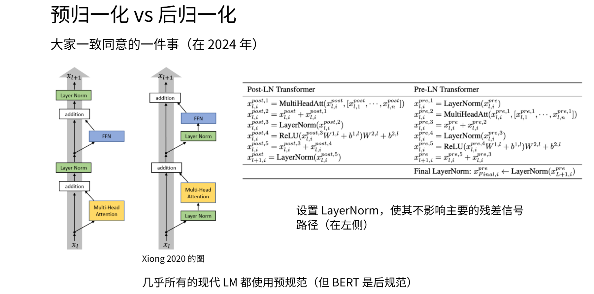
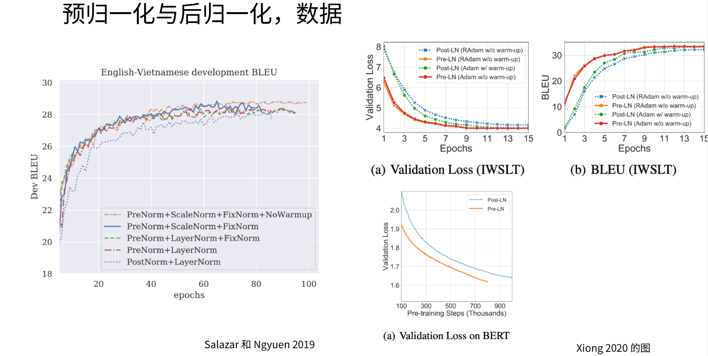
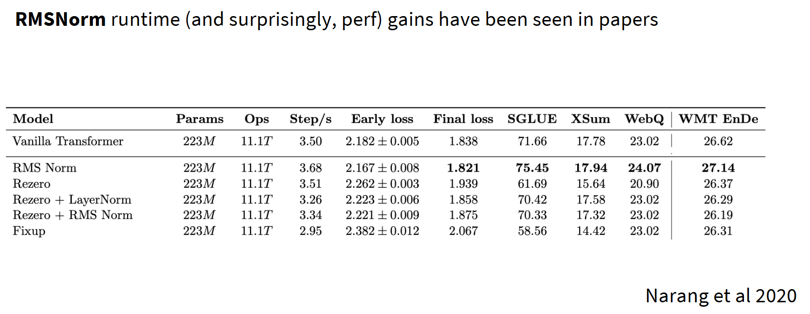
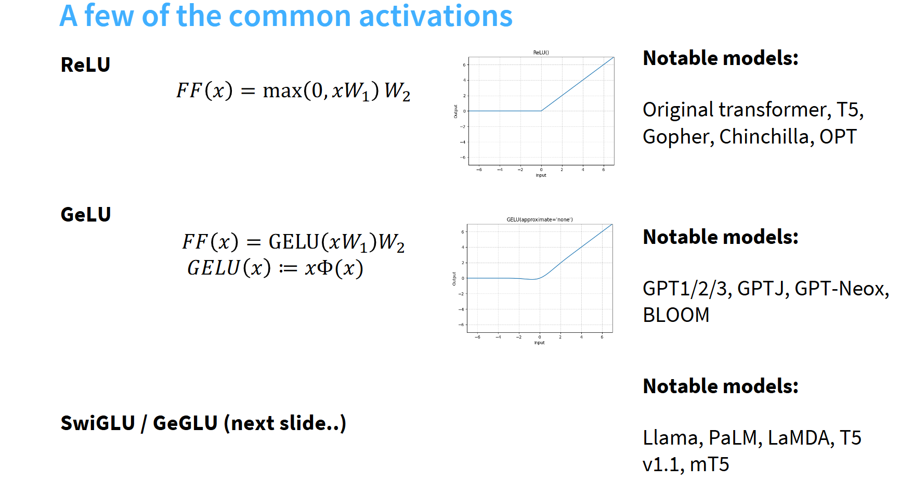
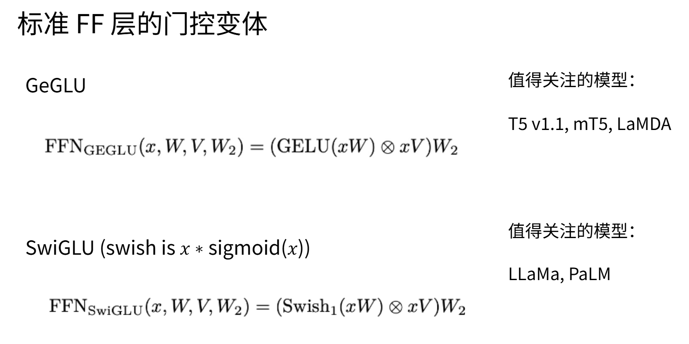
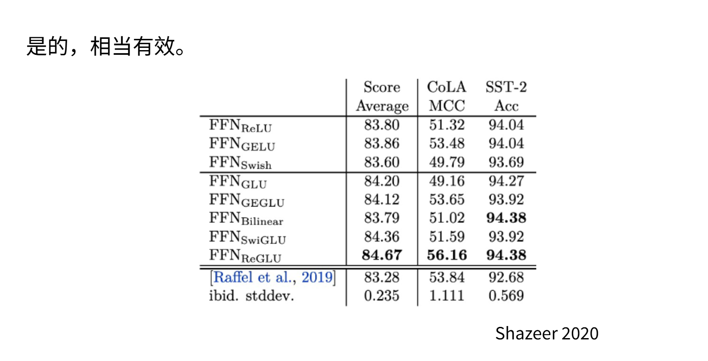
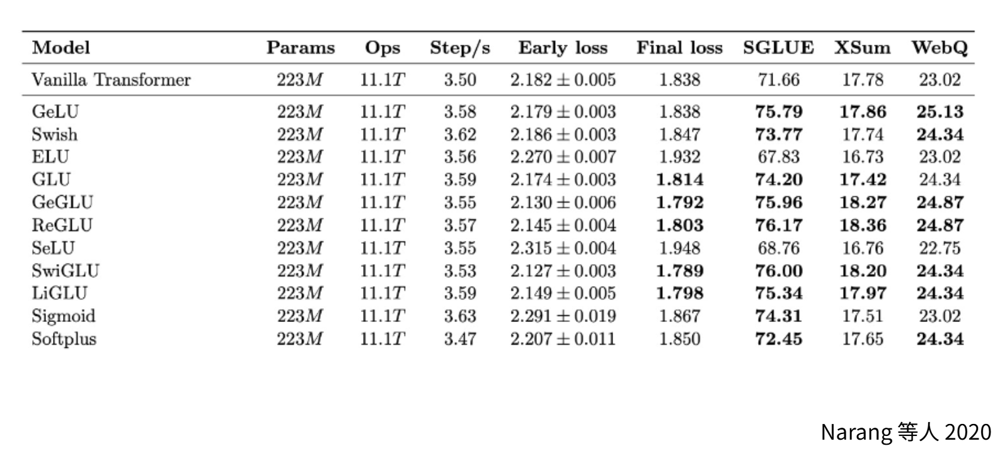

# 第 4 章：语言模型架构和训练的技术细节 — 模块 2：现代变体（归一化与激活函数）

> 📍 学习进度：第 4 章，第 2 / 4 模块
> 📅 生成时间：2026-04-20

---

## 学习目标

- 理解 Post-LN 与 Pre-LN 的区别及 Pre-LN 成为主流的原因
- 掌握 RMSNorm 的公式、优势及被广泛采用的理由
- 理解 FFN 去除偏置项的趋势
- 掌握激活函数的演进路线：ReLU → GeLU → GLU → SwiGLU
- 理解门控线性单元的原理和有效性的实证依据

---

## 核心内容

### 一、归一化的位置之争

#### Post-LN（原始论文方案）

$$X = \text{LayerNorm}(X + \text{Sublayer}(X))$$

子层 → 残差连接 → 层归一化。灰色残差连接流经过每个子组件后都执行 LayerNorm。

#### Pre-LN（现代主流）

$$X = X + \text{Sublayer}(\text{LayerNorm}(X))$$

层归一化 → 子层 → 残差连接。

**Pre-LN 的优势**：
1. **训练更稳定**：无需复杂预热（warmup）
2. **适用于极深网络**：100+ 层也能稳定训练
3. 已成为 GPT-3、PaLM 等大模型的默认配置

**为什么 Pre-LN 更好？** 核心原因是残差连接保持从顶层到底层的**恒等映射通路**，梯度可以直接回传。Pre-LN 不在残差路径中间插入归一化，不干扰这条梯度通路；而 Post-LN 在残差相加后再做归一化，可能导致梯度衰减。

#### "双归一化"（新趋势）

Grok 和 Gemma2 在模块前后**都放置** LayerNorm；OLMo2 仅在前馈网络和多头注意力之后使用 LayerNorm。预归一化的主导地位正在被新变体挑战。

---

### 二、RMSNorm（最受欢迎的简化变体）

原始 LayerNorm 计算均值和标准差**成本高**，RMSNorm 直接**去除均值调整**：

$$\text{LayerNorm}(v) = \gamma \frac{v - \mu}{\sigma} + \beta \quad \Rightarrow \quad \text{RMSNorm}(v) = \gamma \frac{v}{\sqrt{\frac{1}{d}\sum_{i=1}^{d} v_i^2 + \varepsilon}}$$

**去掉了什么**：不减均值、不加偏置 $\beta$。

**为什么有效**：
- 不减均值 → 减少运算操作
- 不加 $\beta$ → 减少需加载的参数量
- **效果与 LayerNorm 相当，但速度更快**

Narang 等人 2020 年的消融实验：基准 Transformer 每秒 3.5 步，RMSNorm 版本达到 3.68 步，且最终损失值更低。

**采用模型**：LLaMA 系列、PaLM、Chinchilla、T5 等几乎所有现代模型。

> 💡 **补充（Context7 / PyTorch）**：PyTorch 从 2.4 版本开始提供 `torch.nn.RMSNorm` 模块，参数包括 `normalized_shape`、`eps`（默认 1e-5）和 `elementwise_affine`（是否使用可学习 $\gamma$）。

---

### 三、前馈网络的简化

原始 FFN：$\text{FFN}(x) = \max(0, xW_1 + b_1)W_2 + b_2$

现代 FFN（非门控版本）：$\text{FFN}(x) = \max(0, xW_1)W_2$

**去除偏置项的理由**（与 RMSNorm 一致）：
- 减少参数量和内存访问
- 实证观察表明去除偏置项能**稳定大型网络的训练**
- 去除偏置项的想法**广泛适用**，许多模型在大多数层根本不使用偏置项

---

### 四、激活函数的演进

#### 1. ReLU → GeLU

**ReLU**：$\text{ReLU}(x) = \max(0, x)$，计算高效，但 $x=0$ 处**不可微**。

**GeLU**（Gaussian Error Linear Unit，高斯误差线性单元）：

$$\text{GeLU}(x) = x \cdot \Phi(x)$$

其中 $\Phi(x)$ 是**标准正态分布的累积分布函数（CDF）**：

$$\Phi(x) = P(X \leq x) = \frac{1}{2}\left[1 + \text{erf}\left(\frac{x}{\sqrt{2}}\right)\right]$$

$\text{erf}$ 是误差函数，$\Phi(x)$ 取值范围 $(0, 1)$，单调递增。

**直觉：用概率做"软开关"**

$\Phi(x)$ 表示随机变量 $X \sim \mathcal{N}(0,1)$ 小于等于 $x$ 的概率：

| $x$ | $\Phi(x)$ | $\text{GeLU}(x) = x \cdot \Phi(x)$ | 效果 |
|:---:|:---------:|:-----------------------------------:|------|
| -3 | 0.001 | ≈ -0.004 | 几乎为 0 |
| -1 | 0.159 | ≈ -0.159 | 被大幅压缩 |
| 0 | 0.50 | = 0 | 一半截断 |
| 1 | 0.841 | ≈ 0.841 | 接近保留原值 |
| 3 | 0.999 | ≈ 2.996 | 几乎不变 |

$x$ 很大时 $\Phi(x) \approx 1$，GeLU ≈ $x$（完全通过）；$x$ 很小时 $\Phi(x) \approx 0$，GeLU ≈ 0（几乎截断）。与 ReLU 的对比：

$$\text{ReLU}(x) = x \cdot \mathbb{1}_{x > 0} \quad (\text{硬开关：大于 0 全通过，否则为 0})$$
$$\text{GeLU}(x) = x \cdot \Phi(x) \quad (\text{软开关：用概率渐变过渡})$$

ReLU 在 $x=0$ 处是**硬切换**（不可微），GeLU 用 $\Phi(x)$ 替代指示函数 $\mathbb{1}_{x>0}$，实现**平滑过渡**。几何上 GeLU 在原点处有微小凸起，正是这个凸起使其处处可微。

**计算优化**：精确计算 $\text{erf}$ 代价高，实践中使用 tanh 近似：

$$\text{GeLU}(x) \approx 0.5 \cdot x \cdot \left(1 + \tanh\left[\sqrt{\frac{2}{\pi}} \cdot (x + 0.044715 \cdot x^3)\right]\right)$$

PyTorch 中 `torch.nn.GELU(approximate='none')` 为精确计算（默认），`approximate='tanh'` 为快速近似。

- 使用模型：GPT-1/2/3、GPT-J、BERT
- 缺点：计算比 ReLU 复杂（需 erf 或 tanh 近似）

#### 2. GLU 家族（2023 年后的主流）

**从 GeLU 到 GLU 的思想演进**：GeLU 用固定的 $\Phi(x)$（正态分布概率）做软开关，效果已比 ReLU 好。那为什么不让"开关"本身也**可学习**？GLU 的核心思想就是用一个**可学习的门控网络** $\sigma(xV)$ 来生成动态开关值，替代 GeLU 中固定的概率函数。

**GLU（门控线性单元，老祖）**：

$$\text{GLU}(x) = (xW) \odot \sigma(xV)$$

理解方式：**"门控 + 内容"双通道机制**
1. **内容通道**：$xW$ 提供原始信息
2. **门控通道**：$\sigma(xV)$ 生成 0-1 之间的"开关"
3. **动态激活**：每个 token 的门控值不同，实现**输入依赖的稀疏性**

像智能百叶窗——不是"全开/全关"，而是根据输入动态调节每片叶片的开度。

#### 门控主流变体

| 变体 | 公式 | 使用模型 |
|------|------|----------|
| **GeGLU** | $(xW) \cdot \text{GELU}(xV)$ | T5、Gemma2/3 |
| **SwiGLU** | $\text{Swish}(xW) \odot (xV)$ | **LLaMA、PaLM、OLMo** |

SwiGLU 基本是当今大多数模型的选择，其中 $\text{Swish}(x) = x \cdot \sigma(\beta x)$，$\beta$ 通常取 1。

#### 门控单元有效吗？

NoamShazeer 原始论文和 Narang 等人 2020 年的消融实验均表明：**GLU 变体持续获得更低损失值**，且结果具有统计显著性。

**但需注意**：GLU 并非必须。GPT-3 使用 ReLU，Nemotron340B 使用平方 ReLU，Falcon211b 使用 ReLU——这些模型性能依然很好。GLU 提供的是**持续但不巨大的性能提升**。

> 🌐 **补充（Web Search）**：2025 年的模型架构对比显示，SwiGLU + RMSNorm + Pre-LN 已成为 LLaMA-like 架构的"标准三件套"，Qwen2.5、DeepSeek-V3、Gemma3 等主流模型均采用此配置。但也有新探索，如 Gemma2 采用双 LayerNorm（前后都加），OLMo2 则在注意力之后也加 LayerNorm。

---

## 🧠 本模块问题

请在下方回答以下问题后，输入 `提交作业` 提交。

**Q1**：Post-LN 和 Pre-LN 的区别是什么？为什么 Pre-LN 更适合训练深层网络？请从梯度传播的角度解释。

**Q2**：RMSNorm 相比标准 LayerNorm 做了什么简化？为什么去掉均值归一化和偏置项后效果依然相当甚至更好？

**Q3**：解释 GLU（门控线性单元）的"门控"机制是如何工作的。为什么 SwiGLU 成为当今大多数模型的首选激活函数，而不是 GeGLU 或普通 GLU？

---

<!-- 学习者作答区（请在此处填写你的答案） -->

**A1**：

Post-LN 是在 残差连接之后，Pre-LN 是在残差连接的 分支上。Pre-LN 更适合训练深层网络是因为 梯度 能通过 残差连接直接回传到低层网络中，能极大得稳定深层网络的梯度回传。

**A2**：

RMSNorm 去掉了 移动平均部分的值，不需要再需要额外变量记录 移动均值和方差，且也不需要减去均值对数据做平移（平移成均值为 0 的数据分布）。因为 学习到的 beta 变量能学到对应的数据变化，做对应的拉伸。而在 attention 后往往是 线性层，数据平移没有那么重要（线性层可以替代），也有可能是激活函数，但是只要保证数据在 饱和区域内，就能让激活函数正确工作。
效果更好可能是因为网络设计进行了简化，数据传导更流畅。

**A3**：
按照教程中的比喻，GLU 相当于卷帘门，通过 (XW).dot(XV) 来控制每个 部分是否能通过 。
SwiGLU 能成为首选，是因为相比 GeGLU 其简单的设计和计算量，而相比较 GLU 则是 Swish 部分更圆滑，在非饱和区域过渡更平滑。

---

<!-- 教师批改区（提交作业后由导师填写，请勿手动修改） -->

### 📝 批改结果

**Q1 批改**：

✅ 正确识别 Post-LN 和 Pre-LN 的位置差异
✅ 正确指出 Pre-LN 有利于梯度回传
⚠️ 表述可以更精确：Pre-LN 的关键不是"在分支上"，而是 **LayerNorm 不在残差主路上**。残差连接本身是一条从顶层直达底层的"高速公路"，Pre-LN 将 LN 放在子层分支内部，**不干扰残差主路的梯度传导**；Post-LN 在残差相加之后再做 LN，梯度必须经过 LN，可能导致衰减

— 得分：**7/10**

**Q2 批改**：

⚠️ **概念混淆**："去掉了移动平均部分的值，不需要额外变量记录移动均值和方差"——这是 **BatchNorm** 的特性（用 running mean/var），不是 LayerNorm/RMSNorm 的。LayerNorm 本身就不使用移动平均，每次对单个样本实时计算统计量
⚠️ "学习到的 beta 变量能学到对应的数据变化"——**RMSNorm 去掉了 β（偏置/平移参数）**，只保留 γ（缩放参数）。所以不存在 β 在学习的情况
✅ "线性层可以替代数据平移"——这个理解是正确的，后续线性层确实可以隐式完成平移功能
⚠️ "效果更好"的原因应更具体：①不减均值→减少运算 ②不加 β→减少参数和内存访问 ③实证效果与 LayerNorm 相当甚至略优

— 得分：**5/10**

**Q3 批改**：

⚠️ "(XW).dot(XV)"——GLU 使用的是**逐元素相乘**（Hadamard 积 ⊙），不是 dot product（点积）。$(xW) \odot \sigma(xV)$ 是对应位置逐个相乘
⚠️ "相比 GeGLU 其简单的设计和计算量"——SwiGLU **并不比 GeGLU 简单**，两者复杂度相当。SwiGLU 成为首选的原因主要是**实证性能更好**（NoamShazeer 和 Narang 的消融实验都证实了这一点），不是因为它更简单
✅ "Swish 部分更圆滑"——方向正确，Swish 的平滑性确实优于 Sigmoid
👍 门控的直觉理解方向正确

— 得分：**6/10**

**综合评价**：18/30。对整体趋势和直觉把握不错，但在细节准确性上需要加强。主要问题：① BatchNorm 的 running stats 和 LayerNorm/RMSNorm 的实时计算不要混淆 ② 逐元素乘 ⊙ 和点积 dot product 的区别 ③ RMSNorm 去掉的是 β（平移），只保留 γ（缩放）。建议回顾 Q2 和教程中 RMSNorm 的公式，确认"去掉了什么、保留了什么"。

**批改时间**：2026-04-20
