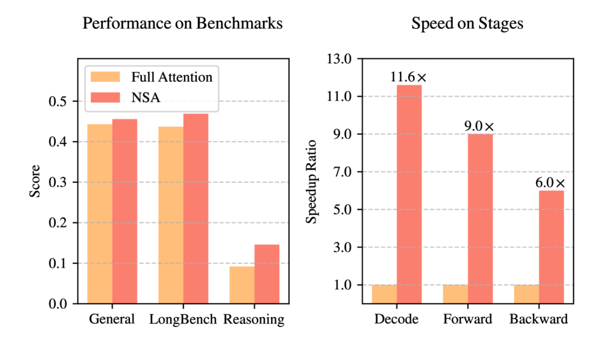

# 第 4 章：语言模型架构和训练的技术细节 — 模块 3：现代变体（位置编码与注意力机制）

> 📍 学习进度：第 4 章，第 3 / 4 模块
> 📅 生成时间：2026-04-20

---

## 学习目标

- 理解绝对位置编码与相对位置编码的本质区别
- 掌握 RoPE（旋转位置编码）的核心原理：旋转矩阵 + 相对位置
- 理解 KV Cache 的作用和必要性
- 区分 MHA、MQA、GQA 的设计思想和权衡
- 了解稀疏注意力、MLA、DSA 等前沿注意力变体

---

## 核心内容

### 一、位置编码：从绝对到相对


#### 绝对位置编码（正弦嵌入）

回顾模块 1 的正弦编码：为每个位置分配**固定向量**，与词嵌入相加。它是**绝对位置感知**的，无法直接建模相对距离，长序列性能会衰减。

#### 相对位置编码 — RoPE（旋转位置编码）

RoPE 不再在底层添加位置向量，而是在**注意力计算中**引入位置信息。由苏剑林 2021 年提出，如今几乎所有先进模型都采用。

**核心思想**：不编码绝对位置，而是对 Q、K 施加旋转变换，使注意力内积**仅依赖相对距离** $m-n$。

---

### 二、RoPE 详解

#### 旋转的基础：二维情况

二维空间中，向量 $\boldsymbol{v}=(x,y)$ 旋转 $\theta$ 角度等价于乘以旋转矩阵：

$$
R(\theta) = \begin{bmatrix} \cos\theta & -\sin\theta \\ \sin\theta & \cos\theta \end{bmatrix}
$$

旋转矩阵的关键性质：$R(a) \cdot R(b)^T = R(a-b)$，即两个不同角度旋转的乘积等价于**角度差**的旋转。

#### RoPE 的数学推导

对位置 $m$ 的 Q 和位置 $n$ 的 K 分别旋转：

$$Q_1 = R(m\theta) \cdot Q, \quad K_1 = R(n\theta) \cdot K$$

计算注意力时：

$$
Q_1 \cdot K_1^T = (R(m\theta) \cdot Q)(R(n\theta) \cdot K)^T = R(m\theta) \cdot R(n\theta)^T \cdot QK^T = R((m-n)\theta) \cdot QK^T
$$

**结果仅包含 $(m-n)$**——即两个 token 的相对位置！这正是我们想要的。

#### 扩展到高维

高维向量按**每两个维度一组**，施加不同频率的旋转：

$$
R(m\theta) = \begin{bmatrix}
\cos(m\theta_0) & -\sin(m\theta_0) & & \\
\sin(m\theta_0) & \cos(m\theta_0) & & \\
& & \cos(m\theta_1) & -\sin(m\theta_1) \\
& & \sin(m\theta_1) & \cos(m\theta_1) \\
& & & \ddots
\end{bmatrix}
$$

频率参数：$\theta_i = 10000^{-2i/d}$，与正弦编码的设计思想一致——低维度高频（捕捉局部信息），高维度低频（捕捉全局信息）。

#### RoPE 的优势

| 优势 | 说明 |
|------|------|
| 显式相对位置 | 内积仅依赖 $m-n$，符合注意力本质 |
| 无参高效 | 零额外参数，计算开销可忽略 |
| 可外推 | 正交旋转可无限延伸（配合扩展算法） |
| 在注意力层操作 | 不在底层加位置向量，而是在每层注意力中引入 |

> 🌐 **补充（Web Search）**：2025 年 RoPE 的外推扩展仍是活跃研究方向。主要方法包括 YaRN（通过温度因子调整注意力分布）、NTK-aware scaling（调整频率基数 θ）等。Qwen2-VL 提出了 M-RoPE（3D 旋转位置编码），将 RoPE 扩展到多模态/视频场景。NeurIPS 2024 有论文分析了 RoPE 中不同频率维度分别编码语法和语义信息的机制。

---

### 三、注意力机制变体

传统 MHA 中每个头有独立的 Q、K、V 矩阵。以下变体都在优化同一个问题：**如何减少 KV Cache 的显存占用**。

#### 1. KV Cache


自回归生成时，每生成一个新 token 需要**重新计算所有历史 token 的 K 和 V**。KV Cache 将历史计算的 K、V **存储**起来，新 token 只需计算自己的 K、V 并拼接到缓存中，避免重复计算。

**逐步生成过程详解**：

```
=== Step 1: 输入 "今天" → 预测 "天气" ===

  输入 tokens: [今, 天]        (prefill 阶段，并行处理所有输入)

  计算:  Q₀ K₀ V₀  Q₁ K₁ V₁
          ↓  ↓  ↓   ↓  ↓  ↓
       ┌─────────────────────┐
       │   Self-Attention     │
       │  Q₀·[K₀,K₁] → V    │
       │  Q₁·[K₀,K₁] → V    │
       └─────────────────────┘

  KV Cache: ┌─────┬─────┐
            │ K₀  │ K₁  │  ← 缓存所有输入 token 的 K
            ├─────┼─────┤
            │ V₀  │ V₁  │  ← 缓存所有输入 token 的 V
            └─────┴─────┘


=== Step 2: 生成 "真" ===

  新输入 token: [真]           (只需要处理 1 个新 token)

  计算:  Q₂ K₂ V₂            ← 只算新 token 的 Q、K、V
          ↓  ↓  ↓
       ┌─────────────────────┐
       │   Self-Attention     │
  Q₂ · │K₀  K₁  K₂│ → V     │  ← K₀,K₁ 从缓存取，K₂ 新算
       │V₀  V₁  V₂│          │  ← V₀,V₁ 从缓存取，V₂ 新算
       └─────────────────────┘

  KV Cache: ┌─────┬─────┬─────┐
            │ K₀  │ K₁  │ K₂  │  ← K₂ 追加到缓存
            ├─────┼─────┼─────┤
            │ V₀  │ V₁  │ V₂  │  ← V₂ 追加到缓存
            └─────┴─────┴─────┘


=== Step 3: 生成 "好" ===

  新输入 token: [好]

  计算:  Q₃ K₃ V₃
          ↓  ↓  ↓
       ┌─────────────────────┐
       │   Self-Attention     │
  Q₃ · │K₀  K₁  K₂  K₃│→V   │  ← K₀,K₁,K₂ 从缓存取，只算 K₃
       │V₀  V₁  V₂  V₃│      │  ← V₀,V₁,V₂ 从缓存取，只算 V₃
       └─────────────────────┘

  KV Cache: ┌─────┬─────┬─────┬─────┐
            │ K₀  │ K₁  │ K₂  │ K₃  │
            ├─────┼─────┼─────┼─────┤
            │ V₀  │ V₁  │ V₂  │ V₃  │
            └─────┴─────┴─────┴─────┘
```

**对比：有/无 KV Cache**

```
【无 KV Cache】每步重算所有 K、V
━━━━━━━━━━━━━━━━━━━━━━━━━━━━━━━━

Step 2: 计算 K₀K₁K₂V₀V₁V₂ + Q₂  → 注意力  → 输出
                 ↑↑↑↑↑↑
                 重复计算！上次已经算过了

Step 3: 计算 K₀K₁K₂K₃V₀V₁V₂V₃ + Q₃ → 注意力 → 输出
                 ↑↑↑↑↑↑↑↑↑↑↑↑
                 越来越多的重复计算

时间复杂度: O(n²)  ← 序列越长越慢


【有 KV Cache】只算新 token 的 K、V
━━━━━━━━━━━━━━━━━━━━━━━━━━━━━━━━

Step 2: 读取 K₀K₁V₀V₁ + 只算 K₂V₂Q₂  → 注意力 → 输出
        缓存命中 ↑↑↑↑    只算新的 ↑↑↑

Step 3: 读取 K₀K₁K₂V₀V₁V₂ + 只算 K₃V₃Q₃ → 注意力 → 输出
        缓存命中 ↑↑↑↑↑↑↑↑    只算新的 ↑↑↑

时间复杂度: O(n)  ← 每步只算 1 个 token
```

**为什么 K、V 值不变？** token $i$ 的隐藏状态 $h_i$ 在前向传播时就已经固定了，后续生成新 token 时不会回头修改 $h_i$（自回归是单向的）。因此 $K_i = W_k \cdot h_i$ 和 $V_i = W_v \cdot h_i$ 的值**永远不变**，缓存一次就够了。

**为什么 Q 不需要缓存？** 每一步只需要**当前 token 的 Q**，之前步骤的 Q 在后续注意力计算中不再参与（注意力是 $Q_t \cdot [K_0,...,K_t]^T$，不需要 $Q_0,...,Q_{t-1}$），所以没有必要存储。

#### 2. MQA（多查询注意力）


**核心改进**：所有头**共享同一个 K、V 矩阵**，每个头只保留独立的 Q。

- 优点：大幅减少 KV Cache 显存
- 缺点：可能过于激进，损失模型表达能力

#### 3. GQA（分组查询注意力）

GQA 取 MHA 和 MQA 的**折中方案**：将头分为若干组，**每组内共享 K、V**，不同组之间独立。

例如 Qwen2-32B 的 KV Cache 显存占用降低至标准 MHA 的 62%。

| 方案 | K/V 矩阵数量 | 表达能力 | KV Cache 大小 |
|------|:-----------:|:-------:|:------------:|
| MHA | h 个（每头独立） | 最强 | 最大 |
| GQA | g 个（g < h，分组共享） | 较强 | 中等 |
| MQA | 1 个（全部共享） | 较弱 | 最小 |

#### 4. 稀疏 / 滑动窗口注意力


不是关注整个序列，而是聚焦于**局部窗口** + 少量全局 token。有效感受野 = 局部范围 × 层数。


最新方案（LLaMA4、Gemma 等）：每 4 个 block 中，1 个用完全自注意力（无位置编码），3 个用带 RoPE 的滑动窗口注意力。兼顾全局信息和局部位置感知。

**全注意力 vs 滑动窗口注意力图解（window_size=3）**：

```
【全注意力 MHA】每个 token 关注所有历史 token
━━━━━━━━━━━━━━━━━━━━━━━━━━━━━━━━━━━━━━━

        t0  t1  t2  t3  t4  t5  t6  t7
t0 ←→ [ ■   ■   ■   ■   ■   ■   ■   ■ ]
t1 ←→ [ ■   ■   ■   ■   ■   ■   ■   ■ ]
t2 ←→ [ ■   ■   ■   ■   ■   ■   ■   ■ ]
t3 ←→ [ ■   ■   ■   ■   ■   ■   ■   ■ ]
t4 ←→ [ ■   ■   ■   ■   ■   ■   ■   ■ ]
t5 ←→ [ ■   ■   ■   ■   ■   ■   ■   ■ ]
t6 ←→ [ ■   ■   ■   ■   ■   ■   ■   ■ ]
t7 ←→ [ ■   ■   ■   ■   ■   ■   ■   ■ ]

复杂度: O(L²)  ← 64 个注意力分数

【滑动窗口注意力】每个 token 只看附近 W 个 token（W=3）
━━━━━━━━━━━━━━━━━━━━━━━━━━━━━━━━━━━━━━━

        t0  t1  t2  t3  t4  t5  t6  t7
t0     [ ■   ·   ·   ·   ·   ·   ·   · ]   只看自己
t1     [ ■   ■   ·   ·   ·   ·   ·   · ]   t0,t1
t2     [ ■   ■   ■   ·   ·   ·   ·   · ]   t0,t1,t2
t3     [ ·   ■   ■   ■   ·   ·   ·   · ]   t1,t2,t3  ← 滑动！
t4     [ ·   ·   ■   ■   ■   ·   ·   · ]   t2,t3,t4
t5     [ ·   ·   ·   ■   ■   ■   ·   · ]   t3,t4,t5
t6     [ ·   ·   ·   ·   ■   ■   ■   · ]   t4,t5,t6
t7     [ ·   ·   ·   ·   ·   ■   ■   ■ ]   t5,t6,t7

复杂度: O(L×W)  ← 22 个注意力分数（减少 65%）
```

**为什么"窗口小"也能看到全局信息？** 多层堆叠后感受野会指数扩大：

```
【感受野扩展】window_size=3, 4 层 Transformer
━━━━━━━━━━━━━━━━━━━━━━━━━━━━━━━━━━━━━━━

Layer 1: 每个 token 看到 3 个邻居
        t3 看到 [t1, t2, t3]

Layer 2: t3 的表征已经融合了 t1,t2,t3 的信息
         t5 看到 [t3, t4, t5]
         → t5 现在间接看到了 t1,t2（通过 t3 的表征）

Layer 3: 继续扩展...
Layer 4: 有效感受野 = 3 × 4 = 12 个 token

具体图示（window_size=3, 4层后 t7 的感受野）:

Layer 1:                t7 看到 [t5, t6, t7]
                          ↓ 表征融合了 t5,t6,t7
Layer 2:             t7 看到 [t5, t6, t7] 的融合表征
                        ↓ 间接获得 t3,t4 的信息
Layer 3:          t7 看到 → 间接获得 t1,t2 的信息
                  ↓
Layer 4:       t7 的有效感受野覆盖了 [t1 ... t7]

                    ← ─── 感受野 ─── →

数学上:  L 层后有效感受野 = window_size × L
```

**实际模型怎么做（LLaMA4 / Gemma 方案）**：

```
【混合注意力块设计】每 4 个 block 为一组
━━━━━━━━━━━━━━━━━━━━━━━━━━━━━━━━━━━━━━━

Block 1: 全局注意力（无 RoPE）
━━━━━━━━━━━━━━━━━━━━━━━━━━━━━━━━

    t0  t1  t2  t3  t4  t5  t6  t7  t8  t9  t10 t11
t0 [ ■   ■   ■   ■   ■   ■   ■   ■   ■   ■   ■   ■ ]
t1 [ ■   ■   ■   ■   ■   ■   ■   ■   ■   ■   ■   ■ ]
...  全部相连，无位置编码 → 天然支持任意距离


Block 2: 滑动窗口注意力（W=4, 带 RoPE）
━━━━━━━━━━━━━━━━━━━━━━━━━━━━━━━━

    ...  t4  t5  t6  t7  t8  t9  t10 t11
         ■   ·   ·   ·   ·   ·   ·   ·   t4: 看左边2个
         ■   ■   ·   ·   ·   ·   ·   ·   t5: 看左边2个
         ■   ■   ■   ·   ·   ·   ·   ·   t6: 看左边2个
         ·   ■   ■   ■   ·   ·   ·   ·   t7: [t5,t6,t7]
         ·   ·   ■   ■   ■   ·   ·   ·   t8: [t6,t7,t8]
         ·   ·   ·   ■   ■   ■   ·   ·   t9: [t7,t8,t9]
         ·   ·   ·   ·   ■   ■   ■   ·   t10:[t8,t9,t10]
         ·   ·   ·   ·   ·   ■   ■   ■   t11:[t9,t10,t11]

    带 RoPE → 局部位置感知精准


Block 3: 滑动窗口注意力（同 Block 2）
━━━━━━━━━━━━━━━━━━━━━━━━━━━━━━━━
    (同上)


Block 4: 滑动窗口注意力（同 Block 2）
━━━━━━━━━━━━━━━━━━━━━━━━━━━━━━━━
    (同上)

然后回到 Block 1（全局注意力）...
```

**为什么这样设计**：

```
全局注意力（每 4 块出现一次）
  ├── 优点: 长距离信息能直接传递，不受窗口限制
  ├── 缺点: O(L²) 计算量，代价高
  └── 策略: 少用，每 4 块才 1 次

滑动窗口（其余 3 块）
  ├── 优点: O(L×W) 计算量，高效
  ├── 缺点: 单层只能看局部
  └── 策略: 多层堆叠扩展感受野

+ 无 RoPE（全局块）→ 不受位置编码的外推限制
+ 有 RoPE（窗口块）→ 局部位置信息精准

  = 兼顾 全局信息 + 局部精准 + 长序列外推
```

#### 5. MLA（DeepSeek 多头潜在注意力）


MLA 通过**低秩联合压缩**显著降低推理时的 KV Cache 需求，在保持性能的同时大幅提升效率。但它不只是"idea 好"，存在几个**非显而易见的技术难点**。

**完整数据流**：

```
输入 x (d_model 维)
  │
  ├──→ W_DKV ──→ c_KV (r 维, r << d)  ← 联合 KV 压缩（推理只缓存这个！）
  │                  ├──→ W_UK ──→ K (d 维)    解压出 K
  │                  └──→ W_UV ──→ V (d 维)    解压出 V
  │
  └──→ W_DQ ──→ c_Q (r' 维)           ← Q 也做了压缩（减少计算量）
                   └──→ W_UQ ──→ Q (d 维)     解压出 Q
```

关键设计：
- **K、V 共享同一个 down projection**：$W_{DKV}$ 得到联合 latent $c_{KV}$，再分别用 $W_{UK}$、$W_{UV}$ 解压
- **Q 也压缩了**：目的是减少计算量（Q 不需要缓存，压缩是为了训练效率）
- **Cache 只存一份** $c_{KV}$，不是分别存压缩的 K 和 V

**对比 MHA vs MLA 的缓存**：

```
【MHA 缓存】每个头独立存 K 和 V
━━━━━━━━━━━━━━━━━━━━━━━━━━━━━━━━

Head 1: K₁(V₁) | K₂(V₂) | K₃(V₃) | ...  每个头 2 × d_v 维
Head 2: K₁(V₁) | K₂(V₂) | K₃(V₃) | ...  每个头 2 × d_v 维
...
Head h: K₁(V₁) | K₂(V₂) | K₃(V₃) | ...  每个头 2 × d_v 维

总缓存: h × 2 × d_v = 很大


【MLA 缓存】只存联合 latent + 小的 rope 部分
━━━━━━━━━━━━━━━━━━━━━━━━━━━━━━━━

c_KV₁ | c_KV₂ | c_KV₃ | ...   ← 共享 latent (r 维)
k_r₁  | k_r₂  | k_r₃  | ...   ← rope 部分 (d_h 维)

总缓存: r + d_h = 很小

DeepSeek-V2: r=512, d_h=128, 而原 MHA 约需 h×2×d_v=2×128×128=32768
             MLA 只需 512+128=640  → 减少约 93%
```

**权衡**：增加了计算量（压缩/解压），但显存比计算时间更珍贵。


**MLA 的核心技术难点：RoPE 兼容性**

MLA 最精妙也最难的部分在于——RoPE 和低秩压缩**天然冲突**。

```
问题:
━━━━━━━━━━━━━━━━━━━━━━━━━━━━━━━━

标准做法:  K = W_UK · c_KV           ← 解压
           K_rope = RoPE(K, pos)     ← 施加旋转位置编码
           缓存 K_rope 供后续使用

问题: RoPE 的结果依赖位置 pos，而位置编码改变了向量值
      → 解压后的 K 不能直接缓存（RoPE 会破坏压缩的优势）
      → 如果缓存 c_KV（压缩态），每次都要解压+旋转，计算量大
      → MLA 的压缩优势就没了！
```

**DeepSeek 的解决方案：拆分 K**

```
K 被拆成两部分:
━━━━━━━━━━━━━━━━━━━━━━━━━━━━━━━━

K = concat(K_compress, K_rope)
      ↑               ↑
      压缩部分         旋转位置部分
      (可缓存)        (不可缓存，但很小)


K_compress = W_UK · c_KV              ← 从 latent 解压，可缓存
K_rope     = RoPE(W_KR · x, pos)      ← 单独的小投影 + RoPE，不压缩

最终 K = concat(K_compress, K_rope)   ← 拼起来用
```

**RoPE 的维度澄清**：RoPE 的旋转矩阵 R **不是**在序列维度 (seq_len) 上操作的，而是在**嵌入维度 (d_k)** 上对每个 token 独立旋转：

```
Q 的形状: (batch, num_heads, seq_len, d_k)
                                        ↑
                                   旋转在这个维度上

对位置 m 的 token:
  Q[m] 是一个 d_k 维向量
  R(mθ) 作用于 d_k 维，不涉及 seq_len

实际实现: 每两个维度一组的 2×2 旋转

d_k = 64 的向量:
dim: [0,1]    [2,3]    [4,5]    ...  [62,63]
     ↕        ↕        ↕              ↕
     2×2      2×2      2×2           2×2
     旋转     旋转     旋转          旋转
     θ₀,m    θ₁,m    θ₂,m         θ₃₁,m
```

**MHA vs MLA 中 RoPE 的维度对比**：

```
【MHA + RoPE】K 的全部维度都过 RoPE
━━━━━━━━━━━━━━━━━━━━━━━━━━━━━━━━━━━━━━━

每个头的 K: d_k 维 (如 128 维)
RoPE 作用在全部 128 维上

K = W_k · x           ← (d_k 维)
K_rope = RoPE(K, pos) ← 全部 d_k 维都旋转

            全部 d_k=128 维
            [■■■■■■■■■■■■■■■■■■■■■■■■■■]
             ↑ 全部过 RoPE ↑


【MLA + RoPE】K 被拆成两部分，只有小部分过 RoPE
━━━━━━━━━━━━━━━━━━━━━━━━━━━━━━━━━━━━━━━

K = concat(K_compress, K_rope)

            K_compress          K_rope
            [■■■■■■■■■■■■■■■][■■■■]
             ↑ 不过 RoPE ↑     ↑ 过 RoPE ↑
             (d_k - d_h)维     d_h 维
             可缓存            不可缓存但很小

例如 DeepSeek-V2:
  d_k = 128, d_h = 32
  K_compress: 96 维 (缓存为 c_KV 的 r=512 维 latent)
  K_rope:     32 维 (直接缓存，只有 32 维)
```

**核心思想**：不把位置信息混入 latent 压缩（否则缓存会被 RoPE 破坏），而是单独开一个小的 $d_h$ 维通道专门承载位置信息。位置信息只占 K 的一小部分，大部分语义信息走 latent 压缩路径。

```
MLA 完整数据流（含 RoPE 拆分）:
━━━━━━━━━━━━━━━━━━━━━━━━━━━━━━━━

              x (d 维)
              │
   ┌──────────┼──────────┐
   ↓          ↓          ↓
 W_DKV      W_KR       W_DQ
   │          │          │
 c_KV      k_rope      c_Q        ← k_rope 很小（d_h 维）
 (r维)     (d_h维)     (r'维)
   │          │          │
 W_UK     RoPE(·)      W_UQ
   │          │          │
 K_comp    k_rope'      Q
 (d维)     (d_h维)      (d维)
   │          │          │
   └──concat──┘          │
        │                │
        K_final          Q_final
        │                │
        └────Attention────┘


缓存: c_KV (r 维) + k_rope (d_h 维)
       ↑ 很小            ↑ 也很小
```

**总结：MLA 不只是 idea 好**：

| 层面 | 难度 | 说明 |
|------|------|------|
| 联合 KV 压缩（idea） | 直觉上不难 | K、V 共享 down projection |
| RoPE 兼容性（技术难点） | 需要精心设计 | 拆分 K，分离位置信息与语义信息 |
| 训练稳定性 | 需要仔细调参 | 低秩压缩可能丢失信息 |
| 工程实现 | 优化密集 | 解压开销与缓存收益的平衡 |

最关键的洞察是：**RoPE 和低秩压缩天然冲突**（旋转操作改变了向量，压缩的优势消失），DeepSeek 通过拆分 K 绕过了这个问题。

#### 6. DSA（DeepSeek Sparse Attention，DeepSeek 稀疏注意力）

**全称**：DeepSeek Sparse Attention，ACL 2025 最佳论文，首次以 DeepSeek 命名技术（之前的 MLA 并不以 DeepSeek 命名）。由 DeepSeek-V3.2-Exp 引入。


**动机：绝大多数历史 token 是无关紧要的**

```
全注意力: 每个 Query 都和所有历史 token 计算注意力
━━━━━━━━━━━━━━━━━━━━━━━━━━━━━━━━━━━━━━━

Query: t_100
历史: [t_0, t_1, t_2, ..., t_99]

t_100 需要和 100 个 token 全算一遍注意力分数？
但实际上:

  t_100: "这座山的海拔为____米"
  t_0~t_95:  "从前有座山，山里有座庙..."（背景故事，与"海拔"几乎无关）
  t_96~t_99: "海拔测量数据显示"（关键上下文！）

真正影响 t_100 预测的只有少数几个 token
→ 绝大多数注意力计算是浪费的
```

**核心思想：先筛选后计算**

传统注意力是"先全部计算，再通过 softmax 加权"；DSA 反过来——先用一个**廉价的方法筛选**出重要 token，再只对这些 token 做**完整的注意力计算**。

```
【全注意力】全部算完再筛选
━━━━━━━━━━━━━━━━━━━━━━━━━━━━━━━

  Query → 计算 Q·K₀, Q·K₁, Q·K₂, ... Q·K₉₉ → softmax → 加权求和
           ↑_____________________________↑
           100 次点积（O(L²)）

【DSA】先筛选再计算
━━━━━━━━━━━━━━━━━━━━━━━━━━━━━━━

  Query → 快速打分 → 选 Top-k → 只对 Top-k 做完整注意力
           (廉价)      ↓
                    [t_96, t_97, t_98, t_99]
                    只算 4 次点积（O(L·k)）
```

**双组件架构**

DSA 由两个核心组件构成：

```
┌─────────────────────────────────────────────────────┐
│                   DSA 完整流程                        │
│                                                      │
│  输入: Query q_t, 历史 Keys [k_0, k_1, ..., k_{t-1}]│
│                                                      │
│  ┌──────────────────────────────┐                    │
│  │ ① Lightning Indexer（闪电索引器）│                   │
│  │                                │                   │
│  │  轻量级注意力网络，快速打分       │                   │
│  │  - 注意力头数 << 主模型头数     │                   │
│  │  - FP8 低精度计算              │                   │
│  │  - 对所有历史 token 扫描一遍    │                   │
│  │                                │                   │
│  │  输出: 每个 token 的重要性分数  │                   │
│  │  score = [0.01, 0.02, ..., 0.85, 0.92, 0.78]     │
│  └──────────────┬───────────────┘                    │
│                 ↓                                     │
│  ┌──────────────────────────────┐                    │
│  │ ② Top-k 选择器                 │                   │
│  │                                │                   │
│  │  基于分数，为每个 Query 动态    │                   │
│  │  选取 Top-k 个 Key             │                   │
│  │  (通常 k=2048, 与 L 无关)      │                   │
│  │                                │                   │
│  │  选中: [t_96, t_97, t_98, t_99, ...]              │
│  └──────────────┬───────────────┘                    │
│                 ↓                                     │
│  ┌──────────────────────────────┐                    │
│  │ ③ 完整注意力计算                │                   │
│  │                                │                   │
│  │  只对选中的 Top-k 个 Key        │                   │
│  │  做标准注意力: softmax(Q·K/V)   │                   │
│  │  使用主模型的全精度和全头数      │                   │
│  └──────────────────────────────┘                    │
│                                                      │
└─────────────────────────────────────────────────────┘
```

**Lightning Indexer 为什么快**

```
与主模型注意力对比:
━━━━━━━━━━━━━━━━━━━━━━━━━━━━━━━━━━━━━━━

              主模型注意力      Lightning Indexer
注意力头数:    32 头            << 32 头（很少）
计算精度:      BF16/FP32        FP8（速度翻倍）
目的:         精确计算注意力    粗略打分排序（不需要精确）
输出:         加权求和的结果    每个历史 token 的分数

→ 用 1/10 的计算量完成"哪些 token 重要"的判断
```

**复杂度对比**

```
序列长度 L = 65536 (64K), Top-k = 2048
━━━━━━━━━━━━━━━━━━━━━━━━━━━━━━━━━━━━━━━

【全注意力】L 个 Query，每个和 L 个 Key 算点积
━━━━━━━━━━━━━━━━━━━━━━━━━━━━━━━━

  单次操作成本: 高（BF16, 32 头, d_k 维点积）
  每个 Query:   O(L) 次高成本点积
  全部 Query:   O(L²) 次高成本点积
  实际:         65536 × 65536 ≈ 43 亿次高成本操作


【DSA 简化理解】分两阶段，廉价筛选 + 精确计算
━━━━━━━━━━━━━━━━━━━━━━━━━━━━━━━━

  ① Indexer: 每个 Query 扫描 L 个 token
     操作量:       O(L²) = 43 亿次
     单次成本:     低（FP8 + 少头数）≈ 高成本的 1/C
     等价高成本:   43 / C 亿次

  ② 精确注意力: 每个 Query 只算 k 个 Key
     操作量:       O(L·k) = 65536 × 2048 ≈ 1.3 亿次
     单次成本:     高（与全注意力相同）
     等价高成本:   1.3 亿次

  总计（等价高成本操作）: 43/C + 1.3 亿次
```

**关键参数 C 的含义**：C 代表 Indexer 相对于全注意力的**单次操作成本压缩比**，取决于具体实现设置（FP8 精度、注意力头数、投影维度等）。C 越大，Indexer 越廉价，总加速越高：

```
C = 3  → (14.3 + 1.3) / 43 = 36%  → 节省 64%  ← 接近论文报告的 60-70%
C = 5  → (8.6 + 1.3) / 43  = 23%  → 节省 77%
C = 10 → (4.3 + 1.3) / 43  = 13%  → 节省 87%
```

**总结**：DSA 的 Indexer 步骤渐近复杂度**仍然是 O(L²)**（每个 Query 都要扫所有历史 token），但它通过 FP8 + 少头数将**单次操作成本压到极低**。真正昂贵的高精度注意力计算从 O(L²) 降到 O(L·k)。加速来自**常数级优化**（Indexer 廉价）+ **渐近级优化**（精确注意力 O(L·k)）的组合。

**可插拔特性**

DSA 的一个独特优势是可以**灵活插入已有模型**：

```
【场景】已有一个训练好的 LLM（未使用 DSA）
━━━━━━━━━━━━━━━━━━━━━━━━━━━━━━━━━━━━━━━

方案: 保留原模型权重不变，在前面插入一个 Lightning Indexer

原始流程:  Query → [全注意力 O(L²)]  → 输出
DSA 流程: Query → [Indexer 打分] → [Top-k 选择] → [稀疏注意力 O(L·k)] → 输出
                     ↑ 新增的轻量模块，只需少量训练即可适配

好处:
  1. 不需要重新训练整个模型
  2. Indexer 很小，训练成本低
  3. 可以"外挂"到任何已有模型上
```



**总结：DSA 的核心创新**

| 层面 | 说明 |
|------|------|
| 核心洞察 | 推理时真正影响预测的历史 token 很少 |
| 实现方式 | 先用廉价 Indexer 打分筛选，再对 Top-k 做精确注意力 |
| 关键参数 | k=2048（与序列长度 L 无关），精确注意力 O(L·k) |
| 工程优化 | Indexer 使用 FP8 低精度 + 少注意力头，极致压缩筛选成本 |
| 可插拔 | 可通过少量训练外挂到已有模型，不需要从头训练 |

> ⚠️ **备注：实际论文 NSA 的架构更严谨**
>
> 上述描述是对 DSA 的简化理解（先筛选后计算的直觉）。实际论文 NSA（Native Sparse Attention, arxiv:2502.11089, ACL 2025 最佳论文）的架构更加完善，采用了**三路径并行 + 门控聚合**的设计，而非单一的 Indexer。
>
> **NSA 的三条注意力路径**：
>
> ```
> 【简化版 DSA】单路径: Indexer 打分 → Top-k → 稀疏注意力
> ━━━━━━━━━━━━━━━━━━━━━━━━━━━━━━━━━━━━━━━━━━━━━━━━━━━━━━━━━━
>
>   Query → [廉价打分] → [选 Top-k] → [精确注意力] → 输出
>
>
> 【实际 NSA】三路径并行 + 门控聚合
> ━━━━━━━━━━━━━━━━━━━━━━━━━━━━━━━━━━━━━━━━━━━━━━━━━━━━━━━━━━
>
>                     ┌→ 路径① Compression ──→ 粗粒度全局扫描
>                     │   (KV 分块压缩, l=32 块大小)
>                     │
>   Query ────────────┼→ 路径② Selection  ────→ 细粒度关键 token
>                     │   (选 n=16 个 l'=64 大小的块)
>                     │
>                     └→ 路径③ Sliding Window → 局部精确上下文
>                         (窗口 w=512)
>
>                        三条路径输出 → Gating（可学习门控聚合）→ 最终输出
> ```
>
> **NSA 论文的关键超参数**：
>
> | 参数 | 值 | 含义 |
> |------|:--:|------|
> | l | 32 | 压缩块大小（每 32 个 token 压缩为 1 个） |
> | d | 16 | 压缩滑动步长 |
> | l' | 64 | 选择块大小 |
> | n | 16 | 选择的块数（含 1 初始块 + 2 局部块） |
> | w | 512 | 滑动窗口大小 |
>
> **NSA 比 DSA 简化版的三个关键改进**：
>
> 1. **可训练的选择机制**：NSA 的 token 选择是**端到端可微分**的（选择分数由模型自己学习），而非外部的廉价 Indexer。这意味着模型在预训练阶段就能学习最优的稀疏模式
>
> 2. **三路径互补**：
>    - Compression 负责**全局粗扫**（O(L/32) 个压缩 token，捕捉全局趋势）
>    - Selection 负责**精细筛选**（O(16×64) 个 token，保留关键细节）
>    - Sliding Window 负责**局部精确**（O(512) 个 token，保证近邻信息无损）
>
> 3. **门控聚合**：三条路径的输出不是简单拼接，而是通过**可学习的门控权重**动态聚合，让模型自己决定每个位置应侧重哪条路径的信息
>
> **NSA 的实际加速比**（64K 序列，A100）：
>
> | 阶段 | 加速比 |
> |------|:------:|
> | 解码 | **11.6×** |
> | 前向传播 | 约 6-9× |
> | 反向传播 | **9.0×** |
>
> 每个 Query 的有效计算量对比：
>
> ```
> 全注意力:        O(L) = O(65536)
> NSA 压缩路径:    O(L/l) = O(65536/32) = O(2048)
> NSA 选择路径:    O(n×l') = O(16×64) = O(1024)
> NSA 窗口路径:    O(w) = O(512)
> NSA 总计:        O(2048 + 1024 + 512) ≈ O(3584)
>
> → 有效计算量: 3584 / 65536 ≈ 5.5% 的全注意力
> → 理论加速: ~18×（实际 9-11.6×，含额外开销）
> ```

> 💡 **补充（Context7 / PyTorch）**：PyTorch 2.x 提供了 `torch.nn.functional.scaled_dot_product_attention`，支持多种注意力后端（Flash Attention、Memory-Efficient Attention、Math），自动选择最优实现。GQA 可通过 `nn.MultiheadAttention(num_heads=..., kdim=..., vdim=...)` 的参数配置实现。

---

## 🧠 本模块问题

请在下方回答以下问题后，输入 `提交作业` 提交。

**Q1**：正弦位置编码是绝对编码，RoPE 是相对编码。请从"位置信息在哪里被引入模型"和"注意力分数依赖什么"两个角度，对比两者的本质区别。

**Q2**：MQA、GQA、MLA 三者都在优化 KV Cache，但策略不同。请分别用一句话概括各自的优化策略，并说明它们的权衡。

**Q3**：RoPE 对 Q 和 K 分别施加 $R(m\theta)$ 和 $R(n\theta)$ 的旋转变换后，为什么注意力分数 $Q_1 K_1^T$ 中只包含相对位置 $(m-n)$？请写出关键推导步骤，并说明旋转矩阵的哪个数学性质使这成为可能。

---

<!-- 学习者作答区（请在此处填写你的答案） -->

**A1**：

正弦位置编码是在 token 输入时直接引进的，是一种绝对位置编码，其注意力分数依赖其在 序列中的 具体位置，以及 相关性
RoPE 是在 attention 部分 对 Q、K 做出的变换，是一种相对位置编码，其注意力分数依赖其在 序列中的相对位置以及 token 的相关性


**A2**：

MQA 是 multi query attention，旨在 所有头通过共享 k、v 矩阵的方式压缩显存占用和降低计算
GQA 是 Grouped Query Attention，是 MQA 和 MHA 的平衡版本，将 head 分成多组，每组内是按照 MQA 来共享 k、v，但是组间不共享，既保留了 MHA的部分特性又能有效降低显存占用和计算
MLA 则是将 QKV 映射到 latent space，通过将 QKV 降秩 cache，来显著降低显存占用，但是 QK 又在后续 uncompression 映射会 d_h 维，没有降低 attention 性能，在有效降低显存占用时，又能保持 attention 的性能


**A3**：

因为旋转矩阵 R(θ)
| cosθ   -sinθ |
| sinθ   cosθ  |
可以表示将一个 二维 vector (x, y) 旋转 θ 角度，得到 R(θ) * (x, y)


因此将 Q (d_h 维度) 按照两两分组，每组旋转 θ 角度，同样可以使用该方式得到

即 (R(mθ)*Q ) * (R(nθ) *K)^t = (R(mθ) * R(nθ)_t) * (Q * K_t) = (R((m-n)θ)) * ( Q * K_t )


---

<!-- 教师批改区（提交作业后由导师填写，请勿手动修改） -->

### 📝 批改结果

**Q1 批改**：

✅ 正确识别正弦编码是绝对编码（在输入时引入），RoPE 是相对编码（在注意力层引入）
✅ 正确指出 RoPE 的注意力分数依赖相对位置
⚠️ 正弦编码的注意力分数**并不依赖绝对位置**——虽然编码本身是绝对位置，但注意力分数 $QK^T$ 反映的是两个 token 之间的相关性，位置编码只是改变了每个 token 的表征。与 RoPE 的关键区别是：正弦编码中注意力分数**隐含**相对位置信息（模型需要自己学），而 RoPE 中注意力分数**显式编码**了相对距离 $(m-n)$
⚠️ 缺少对"位置信息引入位置"的具体说明——正弦编码在**底层嵌入层**（Token Embedding + PE），RoPE 在**每层注意力的 Q/K 投影之后**（修改 Q 和 K 的值）

— 得分：**6/10**

**Q2 批改**：

✅ MQA：共享 K、V，压缩显存和计算——正确
✅ GQA：MQA 和 MHA 的平衡，分组内共享 K、V，组间独立——正确，描述清晰
✅ MLA：映射到 latent space，降秩缓存，解压后不降低注意力性能——方向正确
⚠️ MLA 的关键细节不够准确：MLA 不是"将 QKV 都映射到 latent space 来 cache"——Q 不需要缓存，MLA 缓存的只有 $c_{KV}$（联合 latent）+ 小的 $k_{rope}$。Q 虽然也做了压缩，但目的是减少计算量而非缓存
👍 三个方案的权衡分析得不错

— 得分：**7/10**

**Q3 批改**：

✅ 正确理解旋转矩阵的作用（二维向量旋转 θ 角度）
✅ 正确将 Q 按 d_h 维度两两分组
✅ 推导链条方向正确：$R(m\theta) \cdot Q \cdot (R(n\theta) \cdot K)^T = R(m\theta) \cdot R(n\theta)^T \cdot QK^T$
✅ 最终结果 $R((m-n)\theta)$ 正确
👍 推导过程完整，核心步骤都对

⚠️ 回答中**缺少明确指出使这一切成为可能的数学性质**：旋转矩阵的**正交性** $R(a) \cdot R(b)^T = R(a-b)$ 是关键。这个性质来自 $R(b)^T = R(-b)$（转置等于反向旋转），所以 $R(a) \cdot R(-b) = R(a-b)$（旋转的可加性）。建议把这个性质明确写出来

— 得分：**8/10**

**综合评价**：21/30。对 RoPE 的推导（Q3）掌握最好，MQA/GQA/MLA 的对比（Q2）理解扎实。主要改进点：① 正弦编码虽然是绝对编码，但其注意力分数并不"依赖绝对位置"——需要区分编码方式和注意力计算的结果 ② MLA 缓存的是 $c_{KV}$（联合 latent）而非"QKV 都映射到 latent cache" ③ RoPE 推导中应明确指出**正交性** $R(b)^T = R(-b)$ 是关键数学性质。

**批改时间**：2026-04-21
