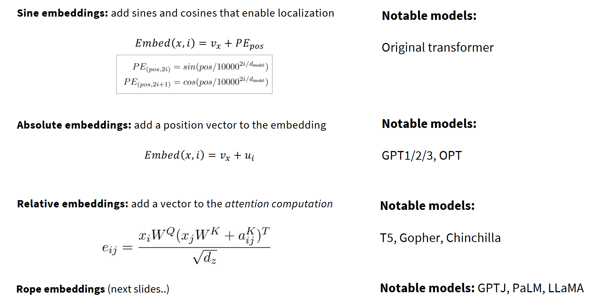
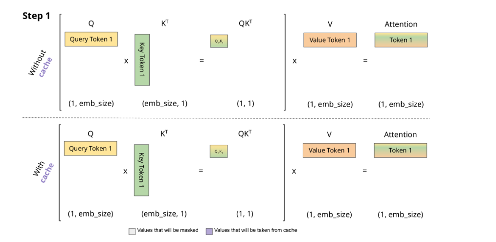
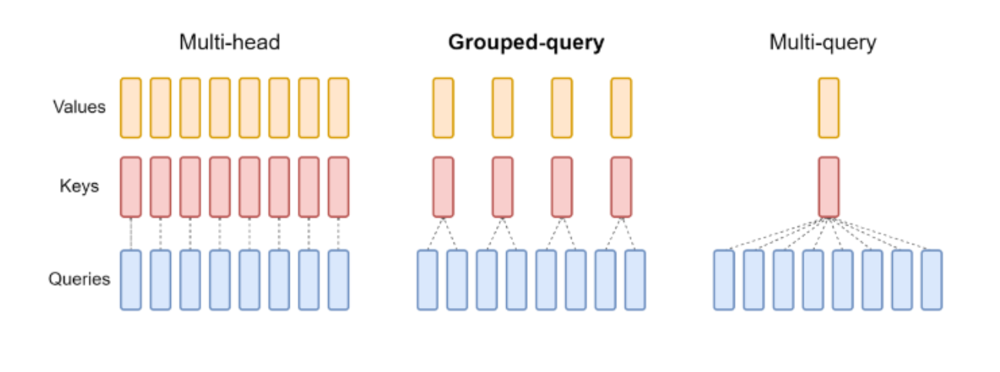
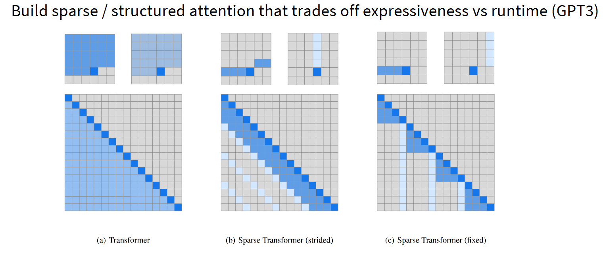
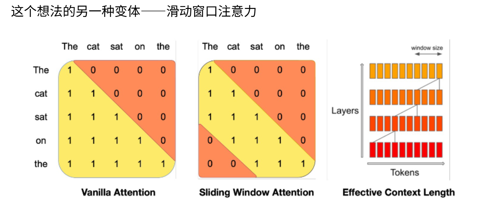
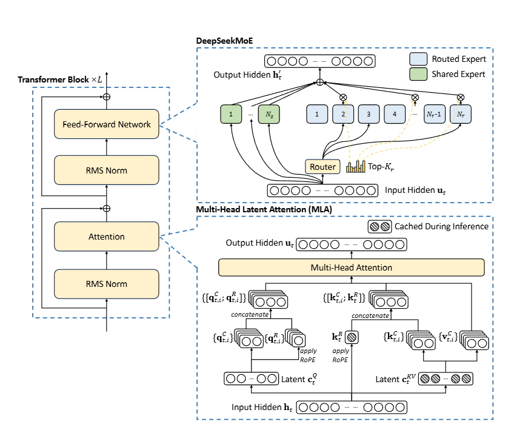
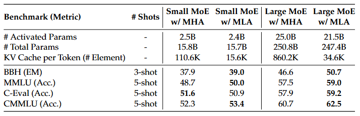
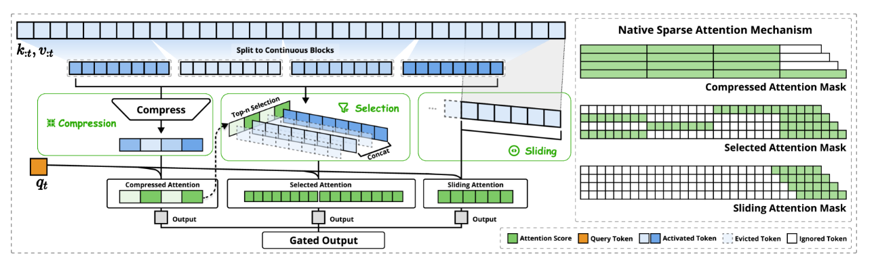

# 第 4 章：语言模型架构和训练的技术细节 — 模块 3：现代变体（位置编码与注意力机制）

> 📍 学习进度：第 4 章，第 3 / 4 模块
> 📅 生成时间：2026-04-20

---

## 学习目标

- 理解绝对位置编码与相对位置编码的本质区别
- 掌握 RoPE（旋转位置编码）的核心原理：旋转矩阵 + 相对位置
- 理解 KV Cache 的作用和必要性
- 区分 MHA、MQA、GQA 的设计思想和权衡
- 了解稀疏注意力、MLA、DSA 等前沿注意力变体

---

## 核心内容

### 一、位置编码：从绝对到相对

#### 绝对位置编码（正弦嵌入）

回顾模块 1 的正弦编码：为每个位置分配**固定向量**，与词嵌入相加。它是**绝对位置感知**的，无法直接建模相对距离，长序列性能会衰减。

#### 相对位置编码 — RoPE（旋转位置编码）

RoPE 不再在底层添加位置向量，而是在**注意力计算中**引入位置信息。由苏剑林 2021 年提出，如今几乎所有先进模型都采用。

**核心思想**：不编码绝对位置，而是对 Q、K 施加旋转变换，使注意力内积**仅依赖相对距离** $m-n$。

---

### 二、RoPE 详解

#### 旋转的基础：二维情况

二维空间中，向量 $\boldsymbol{v}=(x,y)$ 旋转 $\theta$ 角度等价于乘以旋转矩阵：

$$
R(\theta) = \begin{bmatrix} \cos\theta & -\sin\theta \\ \sin\theta & \cos\theta \end{bmatrix}
$$

旋转矩阵的关键性质：$R(a) \cdot R(b)^T = R(a-b)$，即两个不同角度旋转的乘积等价于**角度差**的旋转。

#### RoPE 的数学推导

对位置 $m$ 的 Q 和位置 $n$ 的 K 分别旋转：

$$Q_1 = R(m\theta) \cdot Q, \quad K_1 = R(n\theta) \cdot K$$

计算注意力时：

$$
Q_1 \cdot K_1^T = (R(m\theta) \cdot Q)(R(n\theta) \cdot K)^T = R(m\theta) \cdot R(n\theta)^T \cdot QK^T = R((m-n)\theta) \cdot QK^T
$$

**结果仅包含 $(m-n)$**——即两个 token 的相对位置！这正是我们想要的。

#### 扩展到高维

高维向量按**每两个维度一组**，施加不同频率的旋转：

$$
R(m\theta) = \begin{bmatrix}
\cos(m\theta_0) & -\sin(m\theta_0) & & \\
\sin(m\theta_0) & \cos(m\theta_0) & & \\
& & \cos(m\theta_1) & -\sin(m\theta_1) \\
& & \sin(m\theta_1) & \cos(m\theta_1) \\
& & & \ddots
\end{bmatrix}
$$

频率参数：$\theta_i = 10000^{-2i/d}$，与正弦编码的设计思想一致——低维度高频（捕捉局部信息），高维度低频（捕捉全局信息）。

#### RoPE 的优势

| 优势 | 说明 |
|------|------|
| 显式相对位置 | 内积仅依赖 $m-n$，符合注意力本质 |
| 无参高效 | 零额外参数，计算开销可忽略 |
| 可外推 | 正交旋转可无限延伸（配合扩展算法） |
| 在注意力层操作 | 不在底层加位置向量，而是在每层注意力中引入 |

> 🌐 **补充（Web Search）**：2025 年 RoPE 的外推扩展仍是活跃研究方向。主要方法包括 YaRN（通过温度因子调整注意力分布）、NTK-aware scaling（调整频率基数 θ）等。Qwen2-VL 提出了 M-RoPE（3D 旋转位置编码），将 RoPE 扩展到多模态/视频场景。NeurIPS 2024 有论文分析了 RoPE 中不同频率维度分别编码语法和语义信息的机制。

---

### 三、注意力机制变体

传统 MHA 中每个头有独立的 Q、K、V 矩阵。以下变体都在优化同一个问题：**如何减少 KV Cache 的显存占用**。

#### 1. KV Cache

自回归生成时，每生成一个新 token 需要**重新计算所有历史 token 的 K 和 V**。KV Cache 将历史计算的 K、V **存储**起来，新 token 只需计算自己的 K、V 并拼接到缓存中，避免重复计算。

#### 2. MQA（多查询注意力）

**核心改进**：所有头**共享同一个 K、V 矩阵**，每个头只保留独立的 Q。

- 优点：大幅减少 KV Cache 显存
- 缺点：可能过于激进，损失模型表达能力

#### 3. GQA（分组查询注意力）

GQA 取 MHA 和 MQA 的**折中方案**：将头分为若干组，**每组内共享 K、V**，不同组之间独立。

例如 Qwen2-32B 的 KV Cache 显存占用降低至标准 MHA 的 62%。

| 方案 | K/V 矩阵数量 | 表达能力 | KV Cache 大小 |
|------|:-----------:|:-------:|:------------:|
| MHA | h 个（每头独立） | 最强 | 最大 |
| GQA | g 个（g < h，分组共享） | 较强 | 中等 |
| MQA | 1 个（全部共享） | 较弱 | 最小 |

#### 4. 稀疏 / 滑动窗口注意力

不是关注整个序列，而是聚焦于**局部窗口** + 少量全局 token。有效感受野 = 局部范围 × 层数。

最新方案（LLaMA4、Gemma 等）：每 4 个 block 中，1 个用完全自注意力（无位置编码），3 个用带 RoPE 的滑动窗口注意力。兼顾全局信息和局部位置感知。

#### 5. MLA（DeepSeek 多头潜在注意力）

核心突破：将所有头的 KV **联合压缩**到共享的低维潜在空间。

$$
c_K = x \cdot W_K^{down} \in \mathbb{R}^{L \times r}, \quad c_V = x \cdot W_V^{down} \in \mathbb{R}^{L \times r}
$$

推理时仅缓存压缩后的 $c_K, c_V$（$r \ll d$），KV Cache 减少约 **93%**。需要时再上投影回原始维度。

**权衡**：增加了计算量（压缩/解压），但显存比计算时间更珍贵。

#### 6. DSA（DeepSeek 稀疏注意力，ACL 2025 最佳论文）

核心思想：**先筛选后计算**。

1. **Lightning Indexer**：轻量级网络，以 FP8 低精度快速扫描所有历史 token，计算重要性分数
2. **Top-k 选择器**：每个 Query 动态选取 Top-k 个 Key（通常 k=2048），复杂度从 $O(L^2)$ 降为 $O(L \cdot k)$

**可插拔**：可通过简单训练让未使用 DSA 训练的模型也用上 DSA。

> 💡 **补充（Context7 / PyTorch）**：PyTorch 2.x 提供了 `torch.nn.functional.scaled_dot_product_attention`，支持多种注意力后端（Flash Attention、Memory-Efficient Attention、Math），自动选择最优实现。GQA 可通过 `nn.MultiheadAttention(num_heads=..., kdim=..., vdim=...)` 的参数配置实现。

---

## 🧠 本模块问题

请在下方回答以下问题后，输入 `提交作业` 提交。

**Q1**：正弦位置编码是绝对编码，RoPE 是相对编码。请从"位置信息在哪里被引入模型"和"注意力分数依赖什么"两个角度，对比两者的本质区别。

**Q2**：MQA、GQA、MLA 三者都在优化 KV Cache，但策略不同。请分别用一句话概括各自的优化策略，并说明它们的权衡。

**Q3**：RoPE 对 Q 和 K 分别施加 $R(m\theta)$ 和 $R(n\theta)$ 的旋转变换后，为什么注意力分数 $Q_1 K_1^T$ 中只包含相对位置 $(m-n)$？请写出关键推导步骤，并说明旋转矩阵的哪个数学性质使这成为可能。

---

<!-- 学习者作答区（请在此处填写你的答案） -->

**A1**：

**A2**：

**A3**：

---

<!-- 教师批改区（提交作业后由导师填写，请勿手动修改） -->
