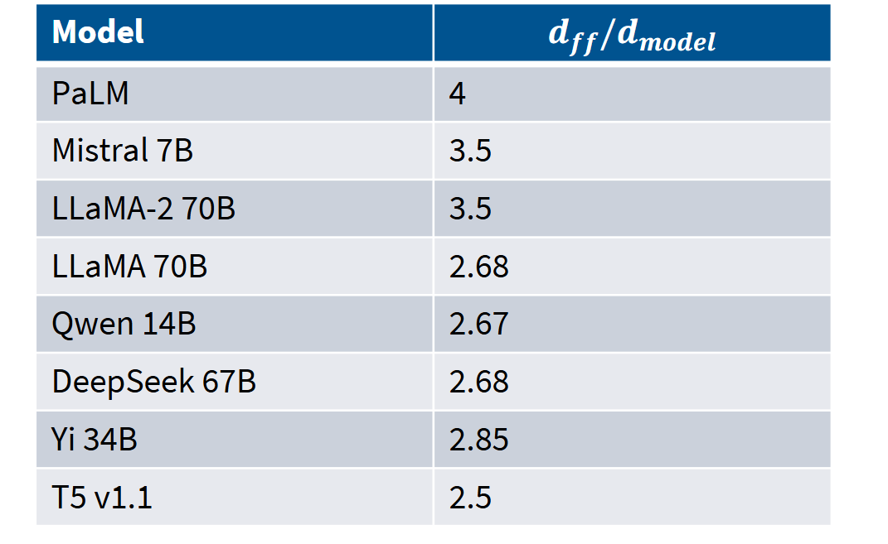
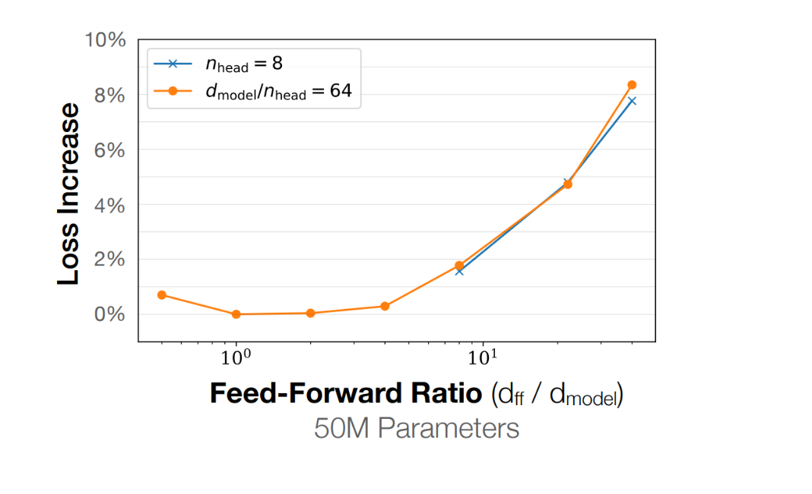
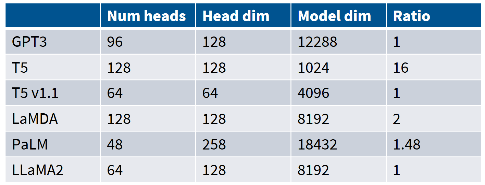
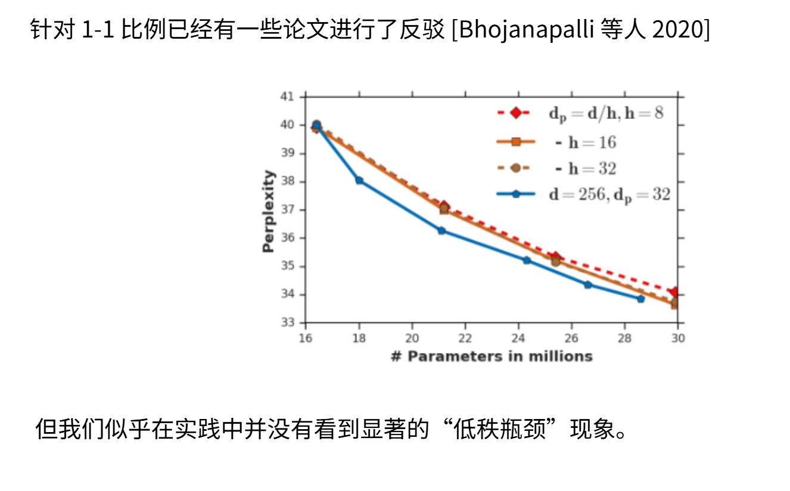
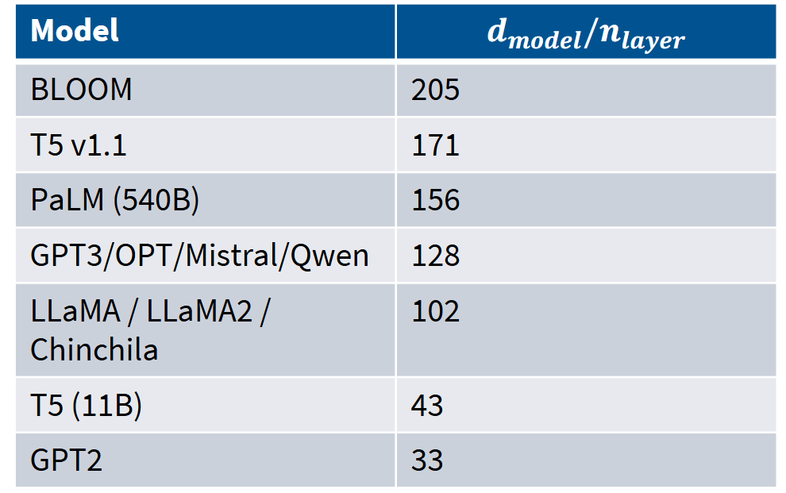
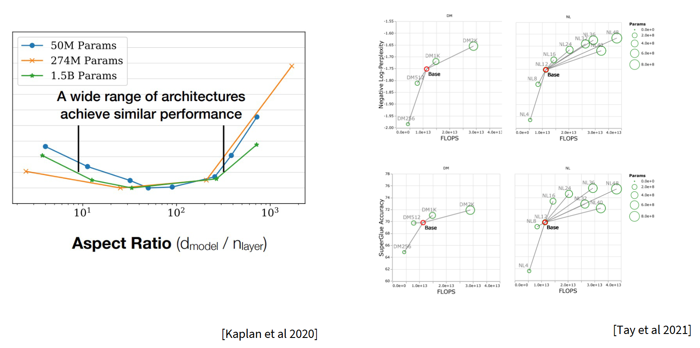
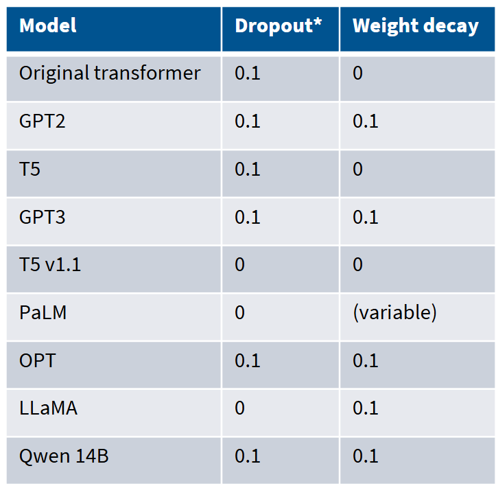
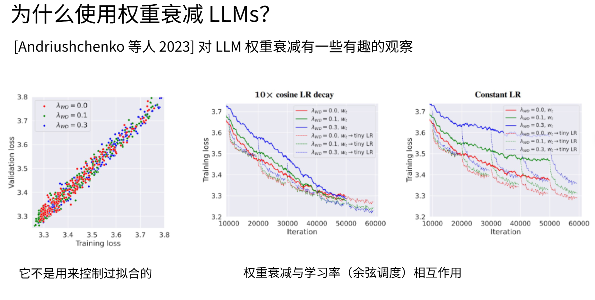
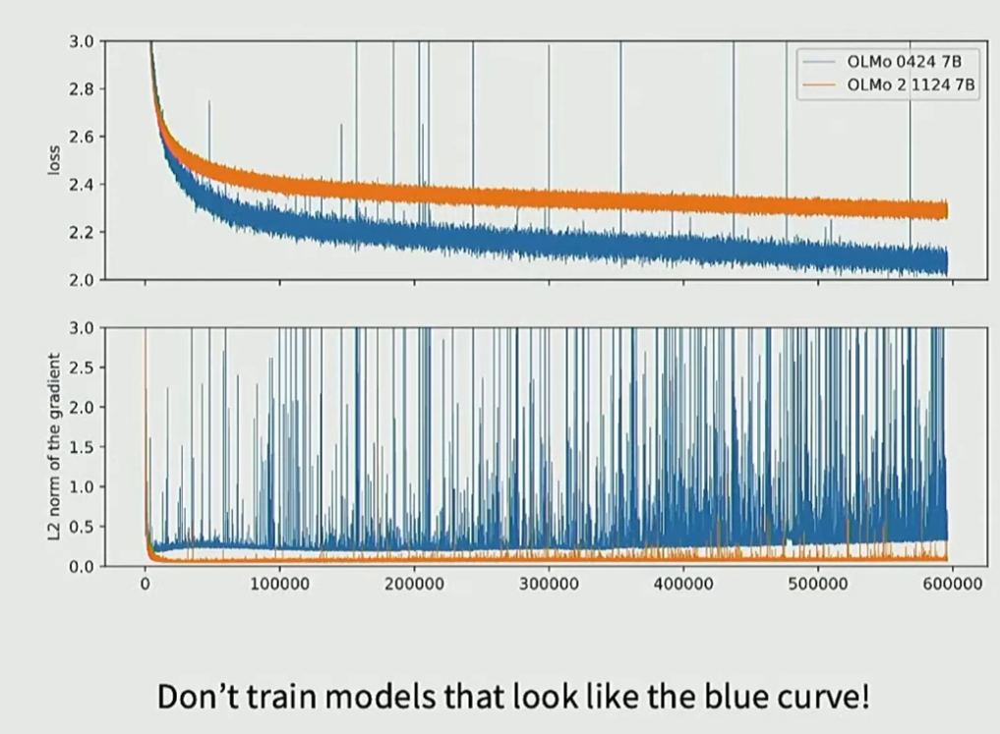

# 第 4 章：语言模型架构和训练的技术细节 — 模块 4：超参数设计与训练稳定性

> 📍 学习进度：第 4 章，第 4 / 4 模块
> 📅 生成时间：2026-04-21

---

## 学习目标

- 掌握 FFN 扩展系数的惯例：ReLU 用 4×，GLU 用 8/3×，理解参数量补偿的数学推导
- 理解注意力头维度的设计共识（头数 × 头维度 ≈ 模型维度）
- 了解宽深比的权衡及 Kaplan 等人的实证研究
- 理解词表大小的发展趋势和影响因素
- 掌握 dropout 和权重衰减在预训练中的反直觉实际作用
- 了解 z-Loss、QK LayerNorm、软截断三种训练稳定性技巧的原理和区别

---

## 核心内容

### 一、前馈网络的扩展系数

FFN 涉及两个超参数：$d_{model}$（输入/输出维度）和 $d_{ff}$（隐藏层维度）。

```
FFN 数据流:
━━━━━━━━━━━━━━━━━━━━━━━━━━━━━━━━

x (d_model 维)
  │
  ↓ W₁ (d_model × d_ff)
h = activation(xW₁)        ← 隐藏层，d_ff 维（扩展）
  │
  ↓ W₂ (d_ff × d_model)
output (d_model 维)         ← 投影回原维度
```

#### 默认惯例：$d_{ff} = 4 \times d_{model}$

原始 Transformer（Vaswani et al., 2017）：$d_{model}=512$，$d_{ff}=2048$。

```
参数量计算（ReLU FFN, 不含偏置）:
━━━━━━━━━━━━━━━━━━━━━━━━━━━━━━━━

W₁: d_model × d_ff = 512 × 2048 = 1,048,576 参数
W₂: d_ff × d_model = 2048 × 512 = 1,048,576 参数
总计: 2,097,152 参数

→ FFN 参数量 = 2 × d_model × d_ff = 2 × d_model × (4 × d_model) = 8 × d_model²
→ 约占 Transformer 每层参数的大部分
```

几乎所有使用 ReLU 类 MLP 的模型都遵循 $d_{ff} = 4 \times d_{model}$。



#### 例外一：GLU 变体调整为 8/3 倍——参数量补偿

**为什么不直接用 4×？** GLU 变体（如 SwiGLU）引入了额外的门控投影 $xV$，参数量增加，需要降低扩展系数来**保持总参数量与 ReLU 版本相当**。

```
参数量对比（假设 d_model = 512）:
━━━━━━━━━━━━━━━━━━━━━━━━━━━━━━━━━━━

ReLU FFN (4×):  W₁: 512×2048 + W₂: 2048×512
                = 1,048,576 + 1,048,576 = 2,097,152

SwiGLU FFN (4×): W_gate: 512×2048 + W_up: 512×2048 + W_down: 2048×512
                  = 1,048,576 + 1,048,576 + 1,048,576 = 3,145,728
                  ↑ 3 个矩阵！比 ReLU 多 50%

SwiGLU FFN (8/3×): W_gate: 512×1365 + W_up: 512×1365 + W_down: 1365×512
                    ≈ 699,000 + 699,000 + 699,000 ≈ 2,097,000
                    ↑ 与 ReLU 参数量相当！
```

推导：设 SwiGLU 的扩展系数为 $k$，3 个矩阵总参数 = $3 \times d_{model} \times (k \times d_{model})$。令其等于 ReLU 的 $2 \times d_{model} \times (4 \times d_{model})$：

$$3k = 8 \Rightarrow k = \frac{8}{3} \approx 2.66$$

LLaMA-1、Qwen、DeepSeek、Yi 等模型大致遵循此设定。也有模型（如 Mistral、PaLM）稍大一些。

#### 例外二：T5 的大胆尝试

T5-11B 的 $d_{ff}/d_{model}$ 比例达到 **64 倍**（$d_{model}=1024$，但 FFN 隐藏层极大），动机是极大化单层矩阵乘法的并行度。但后来 T5v1.1 回调到标准的 2.5 倍 GeGLU——暗示原团队重新评估后认为过大的比例并非性能最优。

#### Kaplan 等人的实证：最优区间很宽



缩放定律论文（Kaplan et al., 2020）研究了 $d_{ff}/d_{model}$ 比例对损失的影响：**存在一个较宽的最优区间**（约 1-10），在此范围内选择都能接近最优。这说明 4× 或 8/3× 并非严格最优值，而是经验共识——**不是铁律，但安全可靠**。

> 💡 **补充（Context7 / PyTorch）**：PyTorch 中 `nn.TransformerEncoderLayer` 的 `dim_feedforward` 参数默认值为 2048，即假设 $d_{model}=512$ 的 4 倍。自定义模型时需根据激活函数类型调整：ReLU 用 4×，SwiGLU 用约 2.66×。

---

### 二、注意力头和模型维度的比例



**行业共识**：$\text{NumHeads} \times \text{HeadDim} \approx \text{ModelDim}$，即比例接近 1。

```
注意力的参数分布:
━━━━━━━━━━━━━━━━━━━━━━━━━━━━━━━━

比例 = 1 时:
  d_model = 4096, num_heads = 32, head_dim = 128
  → 32 × 128 = 4096 = d_model  ✓

  每个头: Q/K/V 各一个 (d_model × head_dim) 投影
  注意力参数: 4 × d_model² (Q,K,V,O 四个矩阵)
  → 与 head 数量无关（数学等价）

比例 = 16 时 (T5):
  d_model = 1024, 但每个头的维度远大于 d_model/h
  → 注意力参数量剧增
```

| 模型 | NumHeads × HeadDim / ModelDim | 备注 |
|------|:----------------------------:|------|
| GPT-3 | 1.0 | 标准配置 |
| PaLM | 1.0 | 标准配置 |
| LLaMA2 | 1.0 | 标准配置 |
| T5 | **16.0** | 唯一主要例外 |

**为什么不偏离 1？** Bhojanapalli 等人（2020）的研究表明：头数不断增加会导致注意力矩阵的**秩降低**，影响表达能力。但实践中比例 1:1 的模型表现都很好——目前没有强烈的理由偏离这个共识。



---

### 三、模型的宽深比



**经验法则**：每层约 128 个隐藏维度。

```
【宽模型】少层 + 大隐藏维度         【深模型】多层 + 小隐藏维度
━━━━━━━━━━━━━━━━━━━━━━━━        ━━━━━━━━━━━━━━━━━━━━━━━━

d_model = 8192                      d_model = 1024
num_layers = 4                       num_layers = 64

┌──────────────┐                     ┌───┐
│   Layer 1    │ ← 宽                │ 1 │
│  (8192 维)   │                     ├───┤
├──────────────┤                     │ 2 │
│   Layer 2    │                     ├───┤
├──────────────┤                     │ 3 │
│   Layer 3    │                     ├───┤
├──────────────┤                     │...│
│   Layer 4    │                     ├───┤
└──────────────┘                     │ 64│
                                     └───┘

适合: 张量并行 (切矩阵到多 GPU)        适合: 流水线并行 (不同层到不同设备)
需要: 高速网络                         网络: 速度要求稍低
```



Kaplan 等人的研究表明，宽深比约 **100** 时损失最低（三个不同规模模型的交叉验证）。

Google 的 E Tay 等人还发现一个**反直觉的结论**：
- 仅看**训练损失**：深度不重要，参数量是唯一关键因素
- 看**下游任务准确率**：相同计算量下，更深的模型可能更好

> 这意味着宽深比的选择**更多取决于工程约束**（网络带宽、GPU 数量、并行策略）而非严格的性能最优。

---

### 四、词表大小

| 时期 | 词表大小 | 代表模型 | 驱动力 |
|------|:--------:|----------|--------|
| 早期单语 | 3-5 万 | GPT-2（50,257）、LLaMA-1（32,000） | 英语为主，够用 |
| 现代多语言 | 10-25 万 | GPT-4（~100,000）、Qwen2.5（151,936）、Command | 多语言、emoji、特殊符号 |

**为什么越来越大？** 模型在实际部署中需要与不同语言的用户交互，处理 emoji 等近乎模态化的内容。大词表对**低资源语言**尤其重要——Cohere 的 Command 系列强调大词表能让非英语语言用更少 token 表示，直接降低推理成本。

**误解澄清**：多语言大词表对英语等高资源语言的性能影响很小。大词表的真正价值在于覆盖长尾语言——如果只做英语，3-5 万词表依然足够。

---

### 五、Dropout 和权重衰减



#### Dropout：现代预训练几乎不用

预训练通常只进行 1 个 epoch（数据量太大甚至无法完整遍历），**单轮训练几乎不可能过拟合**。所以：

- 早期模型（如 BERT、GPT-2）使用 dropout
- 现代模型（除 Qwen 外）**不再使用 dropout**
- 仅依赖权重衰减

#### 权重衰减：反直觉的真正作用

**直觉理解（错误的）**：权重衰减防止过拟合 → 预训练不会过拟合 → 不需要权重衰减

**实际情况**：实验证明有无权重衰减**不影响过拟合程度**（训练损失和验证损失的比例不变）。那为什么还要用？

```
权重衰减的真实机制:
━━━━━━━━━━━━━━━━━━━━━━━━━━━━━━━━

训练初期（高学习率）:
  权重衰减 → 模型难以快速学习 → 损失下降慢

训练末期（学习率趋近于零）:
  学习率下降 → 优化器的"冲力"减弱
  权重衰减 → 与冷却的学习率产生特殊交互
  → 产生"隐性加速"效应 → 损失快速下降

最终结果: 更低的训练损失（不是验证损失！）
```



Andriushhenko 等人的实验清晰展示了这个效应：高权重衰减的模型初始进展慢（高学习率阶段被压制），但随着学习率降低（余弦冷却），损失迅速优化。

**关键结论**：权重衰减在预训练中的作用是**优化辅助**，不是正则化。它与学习率调度（特别是余弦衰减）产生协同效应，最终得到更优的模型。

---

### 六、训练稳定性

#### 问题：Transformer 训练为什么会崩溃？



OLMo2 论文揭示了一个令人触目惊心的现象：损失曲线看似正常，但**梯度范数图布满尖峰、完全失控**。蓝色曲线（不稳定）的梯度范数爆炸，最终导致训练中断。

**罪魁祸首是 softmax**——Transformer 中有两个 softmax，都是高风险区：

```
Transformer 中的两个 softmax:
━━━━━━━━━━━━━━━━━━━━━━━━━━━━━━━━

① 自注意力 softmax:
   logits = QK^T / √d_k
   问题: QK^T 可能极大 → softmax 饱和 → 梯度消失

② 输出层 softmax:
   logits = xW_vocab  (通常词表 10万+，logits 值范围巨大)
   问题: logits 爆炸 → 交叉熵损失不稳定 → 训练崩溃

softmax 本身的问题:
  - exp() 指数运算 → 数值爆炸
  - 除以 Z = Σexp(z_i) → 除零风险
  - 梯度: softmax'(x) = softmax(x) · (1 - softmax(x))
          当某个值接近 1 时，其他值的梯度趋近 0 → 梯度消失
```

#### 6.1 z-Loss（解决输出层 softmax）

Google 在 PaLM（Chowdhery et al., 2022）中提出并命名，但思想可追溯至更早的机器翻译研究。

$$\mathcal{L}_{total} = \mathcal{L}_{CE} + \lambda \cdot \log^2 Z$$

其中 $Z = \sum_{i=1}^{V} \exp(z_i)$，$\lambda = 10^{-4}$（PaLM 使用的值）。

```
z-Loss 如何工作:
━━━━━━━━━━━━━━━━━━━━━━━━━━━━━━━━

当 Z 很大时: log²Z 很大 → 增加损失 → 梯度推动模型减小 Z
当 Z ≈ 1 时: log²Z ≈ 0 → 几乎不增加损失 → softmax 处于理想状态

效果: 将 softmax 归一化因子 Z 约束在合理范围内
      防止 logits 爆炸/消失

采用模型: PaLM, Baichuan2, DCLM, OLMo2
```

#### 6.2 QK LayerNorm（解决注意力层 softmax）

在计算注意力之前，让 Q 和 K 先通过 LayerNorm：

```
标准流程:                          QK LayerNorm 流程:
━━━━━━━━━━━━━━━━━━━━━━━━━━━━      ━━━━━━━━━━━━━━━━━━━━━━━━━━━━

Q = W_q(x)                        Q = LayerNorm(W_q(x))
K = W_k(x)                        K = LayerNorm(W_k(x))
logits = QK^T / √d_k              logits = QK^T / √d_k
              ↓                                    ↓
        可能数值爆炸                          数值范围可控
```

**思路区别**：z-Loss 控制 softmax 的**分母**（归一化因子 Z），QK LayerNorm 控制 softmax 的**分子**（logits 的输入范围）。两者从不同角度解决稳定性问题。

来源：最初来自视觉/多模态模型（Dehghani et al., 2023），后被 HuggingFace 的 Chameleon/Idefics 采用，现已扩展到 Gemma2、DCLM、OLMo2。

**推理时 LayerNorm 仍保留**：因为它已经学习了 $\gamma$ 参数，移除会破坏模型对激活值的处理。

#### 6.3 软截断（Soft Clipping）——效果存疑

$$\text{logits}_{clipped} = \text{cap} \cdot \tanh(\text{logits} / \text{cap})$$

```
软截断如何工作 (cap = 30):
━━━━━━━━━━━━━━━━━━━━━━━━━━━━━━━━

logits = 50  → tanh(50/30) = tanh(1.67) ≈ 0.93 → 30 × 0.93 = 27.9  ← 被压缩
logits = 30  → tanh(30/30) = tanh(1.0)  ≈ 0.76 → 30 × 0.76 = 22.9
logits = 5   → tanh(5/30)  = tanh(0.17) ≈ 0.17 → 30 × 0.17 = 5.0   ← 几乎不变

范围: (-∞, +∞) → (-30, +30)
```

Gemma2、OLMo2 采用此方案。但 NVIDIA 团队的消融实验显示：**基线困惑度 11.19，使用软截断反而变差**，而 QK 归一化却能提升效果。目前尚未广泛流行。

#### 三种稳定性技巧对比

| 技巧 | 解决哪个 softmax | 思路 | 采用模型 | 效果 |
|------|:---------------:|------|---------|:----:|
| z-Loss | 输出层 | 约束归一化因子 Z | PaLM, OLMo2 | ✅ 确定 |
| QK LayerNorm | 注意力层 | 控制输入 logits 范围 | Gemma2, OLMo2 | ✅ 确定 |
| 软截断 | 注意力层 | tanh 压缩极端 logits | Gemma2 | ⚠️ 存疑 |

> 🌐 **补充（Web Search）**：2025 年 OLMo2 的训练报告详细记录了稳定性技巧的消融实验，显示**组合使用 z-Loss + QK LayerNorm**效果最佳。层归一化在 Transformer 中的应用范围正在不断扩大——从模块前端（Pre-LN），到模块前后（双 LN），再到 Q/K 分量中（QK-LN），每次扩展都几乎不影响性能却显著提升训练稳定性。

---

## 🧠 本模块问题

请在下方回答以下问题后，输入 `提交作业` 提交。

**Q1**：为什么使用 GLU 激活函数时，FFN 的扩展系数从 4× 降低到约 8/3×（≈2.66×）？请从参数量的角度解释，写出 ReLU FFN 和 SwiGLU FFN 的参数量对比。

**Q2**：预训练中权重衰减的目的**不是**防止过拟合，那它的实际作用是什么？请解释权重衰减与学习率调度之间的交互效应，以及为什么这个发现是反直觉的。

**Q3**：z-Loss 和 QK LayerNorm 分别解决 Transformer 中哪个 softmax 的稳定性问题？它们各自的解决思路有什么不同？为什么说两者是互补的？

---

<!-- 学习者作答区（请在此处填写你的答案） -->

**A1**：

ReLU 是没有可学习变量的，而 SwiGLU 有可学习的参数。


**A2**：

在训练末期，学习率非常低的时候能继续收敛。
权重衰减在早期学习率比较大的时候，没有实际作用，但是当学习率后期非常低的时候（基本为 0），能有效地替代梯度更新。


**A3**：

z-loss 解决了 softmax 极值（过饱和）的问题，如果输出 z logit 某个值非常大，过饱和，容易过拟合。
layernorm 通过将 输入的 Q、K 归一化，让其输入能稳定在一定范围内，不会突然造成输出结果某个值爆炸。
一个保证输入一个保证输出，所以是互补的。


---

<!-- 教师批改区（提交作业后由导师填写，请勿手动修改） -->

### 📝 批改结果

**Q1 批改**：

✅ 正确识别了根本原因：SwiGLU 引入额外的门控投影 $W_{gate}$（可学习参数），ReLU 没有，所以参数量增长，需要降低扩展系数来补偿。逻辑链条正确。
⚠️ 缺少具体的参数量计算推导（如 ReLU: $2 \times d \times 4d = 8d^2$，SwiGLU(8/3×): $3 \times d \times \frac{8}{3}d = 8d^2$）

— 得分：**7/10**（修正后）

```
ReLU (4×):  2 × d_model × d_ff = 2 × d × 4d = 8d²
SwiGLU (4×): 3 × d_model × d_ff = 3 × d × 4d = 12d²  ← 多 50%!
SwiGLU (8/3×): 3 × d_model × d_ff = 3 × d × (8/3)d = 8d²  ← 与 ReLU 相当
```

— 得分：**3/10**

**Q2 批改**：

⚠️ "权重衰减在早期学习率比较大的时候没有实际作用"——**说反了**。衰减项 = $lr \times \lambda \times w$，所以早期 lr 高时衰减项反而**最强**（压制权重增长），末期 lr → 0 时衰减项也 → 0（几乎不作用）。
⚠️ "能有效地替代梯度更新"——权重衰减不是替代梯度更新，它始终是**附加在梯度更新之上**的额外项。
⚠️ 优点是抓住了"末期收敛加速"的现象，但因果方向反了。正确的叙述：早期衰减强（压制参数空间），使参数保持在较小区间，为末期的精细调整创造了良好条件——**早期付学费换末期加速**。

— 得分：**4/10**

**Q3 批改**：

✅ z-loss 解决 softmax 过饱和问题——方向正确
✅ LayerNorm 稳定 Q、K 输入范围——正确
✅ "一个保证输入一个保证输出"——直觉方向对
⚠️ z-loss 的具体机制不是"防止过拟合"（z-loss 添加在**训练损失**上，不影响过拟合），而是防止 softmax 的**归一化因子 Z** 过大或过小，使 softmax 保持数值稳定
⚠️ 没有明确指出两者分别对应 Transformer 中的**哪个** softmax：z-loss → 输出层 softmax（词表分类），QK LayerNorm → 注意力层 softmax（$QK^T$）

— 得分：**6/10**

**综合评价**：17/30（修正后）。本模块得分偏低，主要需加强：

1. **Q1**：逻辑正确，补充具体参数量计算：ReLU $2d \times 4d = 8d^2$，SwiGLU(4×) $3d \times 4d = 12d^2$（多 50%），SwiGLU(8/3×) $3d \times \frac{8}{3}d = 8d^2$（与 ReLU 相当）
2. **Q2**：权重衰减 = $lr \times \lambda \times w$，lr 和衰减力度**正相关**（不是反相关）。早期 lr 高→衰减强→压制权重；末期 lr 低→衰减弱→但参数空间已被整理好
3. **Q3**：区分 Transformer 的两个 softmax（注意力层 vs 输出层），z-loss 约束归一化因子 Z，QK-LN 约束输入 logits 范围

**批改时间**：2026-04-21
